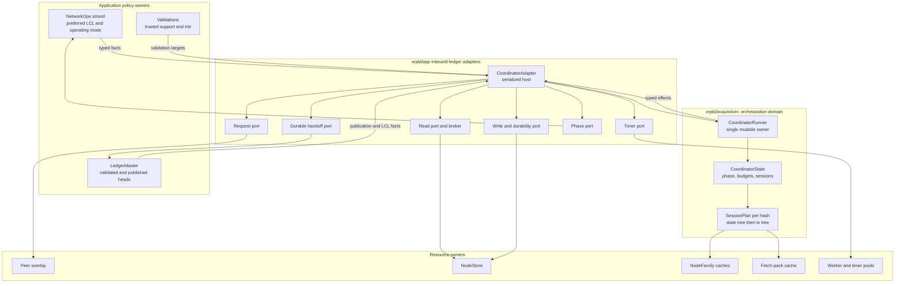
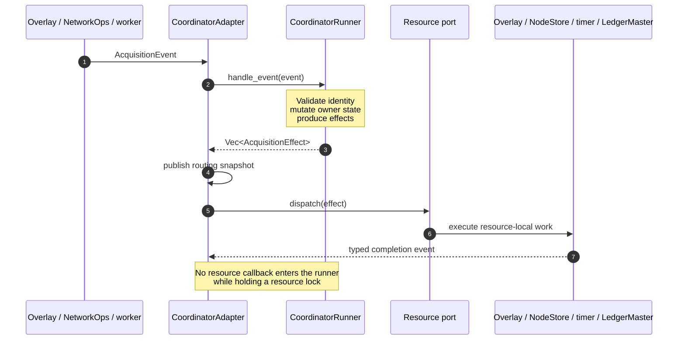
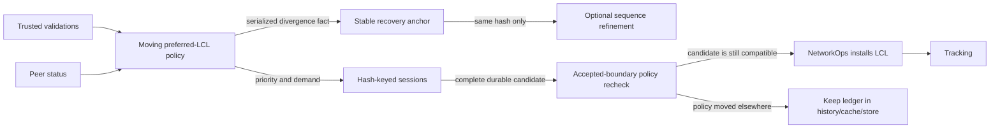
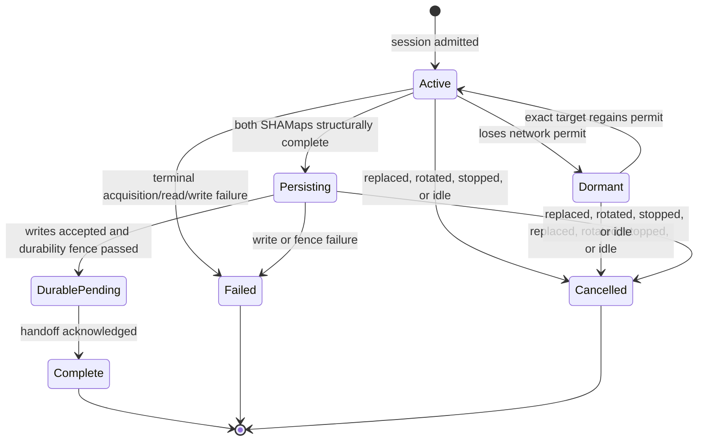
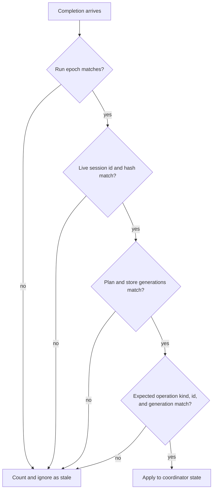
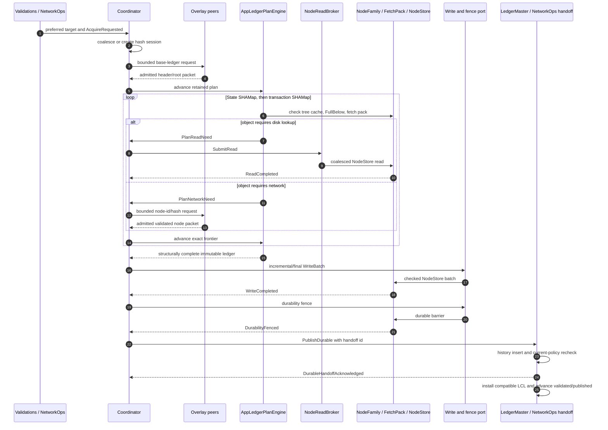
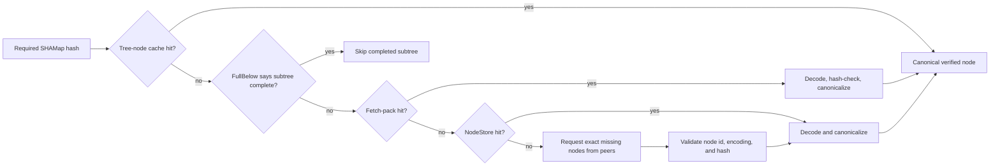
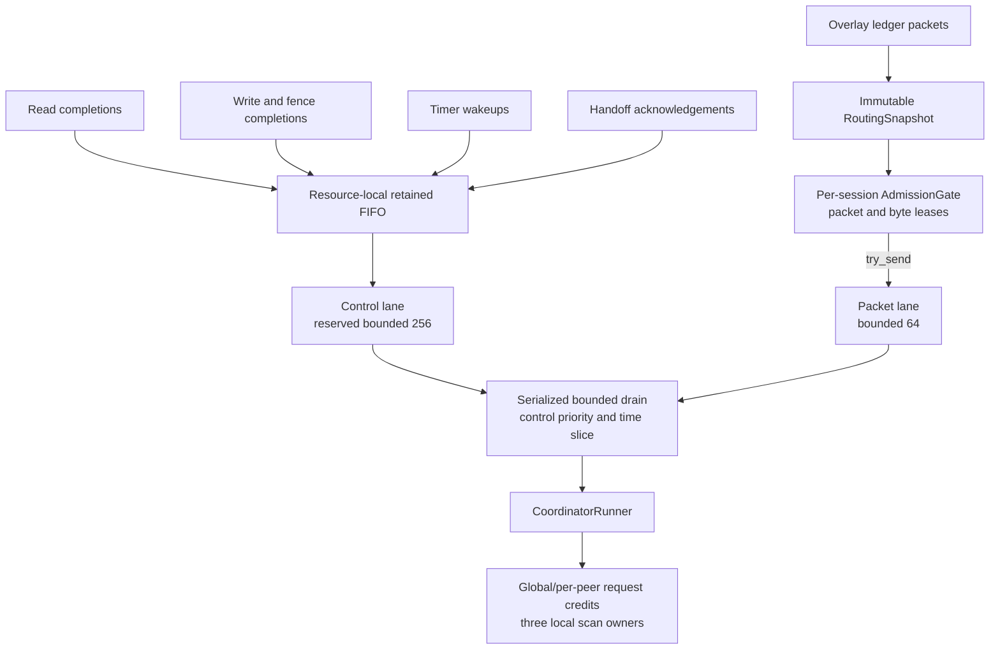
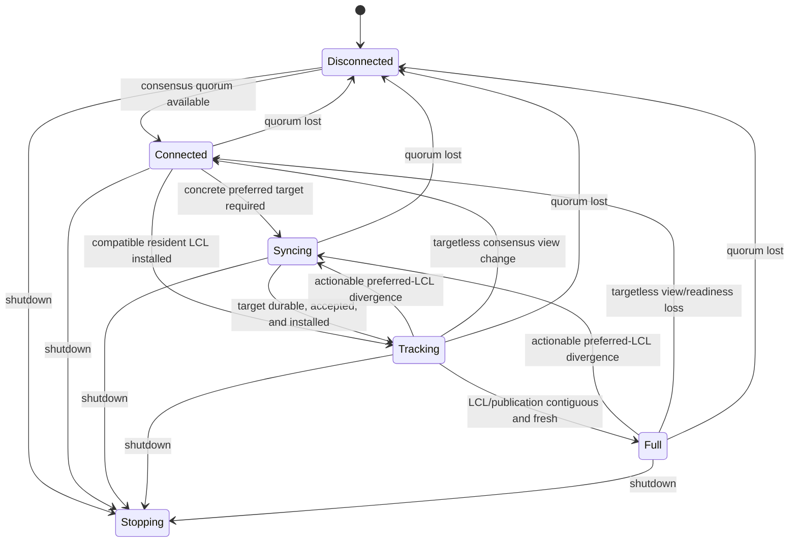

# Acquisition architecture

This document describes how Quaxar acquires a complete XRP Ledger from peers,
why `xrpld/acquisition` is the orchestration boundary, and how that boundary is
wired into the application. It documents the production design implemented by
the typed coordinator and the adapters in
`xrpld/app/src/ledger/inbound_ledgers/`.

For operator-visible states and diagnostics, see [SYNCING.md](SYNCING.md). For
the wider process, consensus, transaction, and storage architecture, see
[ARCHITECTURE.md](ARCHITECTURE.md).

## Why acquisition has a coordinator

Acquiring a ledger is not one network request. It is a distributed workflow
that must coordinate:

- a moving preferred-ledger policy;
- one coalesced session per ledger hash;
- state-map and transaction-map traversal;
- cache, fetch-pack, and NodeStore reads;
- validated peer replies and retry timers;
- bounded writes and a final durability fence;
- exact completion delivery to LedgerMaster and NetworkOps;
- cancellation, database rotation, shutdown, and late completions;
- the public `disconnected`, `connected`, `syncing`, `tracking`, and `full`
  lifecycle.

If each callback owned part of that lifecycle, a late read, timer, peer packet,
or write could revive a cancelled session or install a ledger selected by stale
policy. Quaxar therefore uses one `CoordinatorRunner` as the mutable owner of
the acquisition domain. Everything else is either an input fact or an output
port.

The crate is intentionally below `xrpld/app`: it depends on ledger-domain
types, but not on overlay, NetworkOps, LedgerMaster, JobQueue, or concrete
storage implementations. This makes the state machine deterministic and keeps
resource locks outside its ownership boundary.



## Ownership model

| State or resource | Sole mutable owner | Other components may do |
| --- | --- | --- |
| Acquisition service phase | `CoordinatorRunner` | Submit facts; observe snapshots |
| Per-hash session lifecycle | `CoordinatorRunner` | Execute exact operations named by effects |
| Preferred-LCL policy and LCL switch | NetworkOps strand | Coordinator records policy facts; never installs an arbitrary ledger |
| Validated and published heads | LedgerMaster | Coordinator hands off a durable complete ledger |
| SHAMap traversal plan | Coordinator-owned `SessionPlan` using the app `TreeEngine` | Brokers perform requested reads/writes |
| Peer connections and sends | Overlay | Coordinator chooses bounded requests through a port |
| Physical NodeStore reads | `NodeReadBroker` and NodeStore | Coordinator receives `ReadCompleted` |
| Physical NodeStore writes | write port and NodeStore | Coordinator receives write and fence completions |
| Admission accounting | Immutable route `AdmissionGate` | Overlay reserves and settles exact leases |
| Shared immutable nodes | NodeFamily caches, fetch pack, and NodeStore | Any later session may reuse verified nodes |

The coordinator is an orchestrator, not an I/O executor. `handle_event` mutates
owned state and returns effects. Ports execute those effects only after the
owner call returns, then send typed completion events back to the owner.



## Crate and adapter responsibilities

### `xrpld/acquisition`

The crate contains the pure orchestration model:

- `event.rs`: every fact the owner may consume;
- `effect.rs`: the complete typed output surface;
- `runner.rs`: coordinator state, budgets, scheduling, and session ownership;
- `phase.rs`: legal service-phase transitions;
- `session.rs`: legal per-session transitions;
- `plan.rs`: retained mailbox, traversal frontier, read/network needs, and
  persistence intent;
- `identity.rs`: exact session and operation generations;
- `ingress.rs`: admission leases and immutable routing snapshots;
- `io.rs`, `peer.rs`, and `timer.rs`: typed resource requests/completions;
- `handoff.rs`: durable-ledger delivery and acknowledgement;
- `port.rs`: dependency-inversion boundary used by application adapters;
- `shadow.rs`: optional read-only comparison runner; never a second owner.

### `xrpld/app/src/ledger/inbound_ledgers`

The application side supplies production resources:

- `registry.rs`: global hash-keyed service, demand coalescing, failure cooldown,
  and coordinator assembly;
- `coordinator_adapter.rs`: serialized runner host, bounded control and packet
  lanes, immutable route publication, and effect dispatch;
- `coordinator_engine.rs`: app `TreeEngine` that acquires the state tree and
  then transaction tree using shared caches and `InboundLedgerLocal`;
- `read_broker.rs`: bounded, coalesced and priority-aware NodeStore reads;
- `coordinator_ports.rs`: NodeStore writes, durability fences, timers, phase
  publication, and cancellation fan-out;
- `coordinator_handoff.rs`: idempotent delivery into the
  LedgerMaster/NetworkOps accepted boundary;
- `worker_pool.rs`: bounded ledger-data and timer work;
- `wire_ledger_node.rs`: validated conversion of wire node identifiers and
  payloads.

The similarly named `InboundLedgersLocal` in `mod.rs` is only an RPC resumable
request cache. It is not the network acquisition registry and must not be
merged into this lifecycle.

## Demand, preference, and the recovery anchor

Three identities are deliberately separate:

1. **Moving preferred policy**: NetworkOps and validations continually select
   the best ledger for the current network view.
2. **Stable recovery anchor**: while syncing, the coordinator retains one
   target whose completion and installation can finish the current recovery.
3. **Per-hash sessions**: independent ledger hashes can be acquired and reused
   without replacing the stable anchor.

This prevents a network tip that advances every few seconds from resetting the
only tree that is close to completion.



A `ConsensusViewChange` is mode-only. It can demote Tracking or Full to
Connected, but it does not mint or pin an acquisition target. The serialized
`checkLastClosedLedger` path emits the actionable `PreferredLclDivergence` and
separate acquisition demand.

## Per-hash session lifecycle

There is at most one live session identity for a target hash. Multiple callers
coalesce demand onto it. Consensus/recovery priority may promote an existing
generic session without discarding its plan.



`DurablePending` cannot be cancelled: at that point the durable result is
committed to delivery and the recipient deduplicates by `DurableHandoffId`.
Likewise, `Complete` is reachable only after the durability fence and handoff
acknowledgement.

## Exact identity and stale completion rejection

A hash alone is not sufficient callback identity. Every external operation
carries:

```text
SessionRef = run epoch + session id + target hash + plan epoch + store generation
OperationRef = SessionRef + operation kind + operation id + operation generation
```

The coordinator accepts a completion only when the entire identity matches the
current in-flight operation. Replacing a session, retargeting a plan, rotating
NodeStore, or restarting the service changes a generation, making old network,
read, write, timer, CPU, and handoff callbacks stale by construction.



## End-to-end current-ledger acquisition



The state and transaction roots must both match their ledger header before
structural completion. A completed ledger is useful but not automatically the
LCL: NetworkOps rechecks current policy at the accepted boundary.

## Node lookup and reuse

The plan checks cheap shared resident sources before asking peers:



Session cleanup releases lifecycle ownership, mailboxes, timers, and the exact
frontier. It does not erase immutable verified nodes already admitted to the
shared tree cache, fetch pack, FullBelow cache, or NodeStore. This is why weak
or incomplete work can accelerate a later session without keeping a stale
session alive forever.

## Backpressure and scheduling

The adapter uses separate lanes so data floods cannot displace terminal facts:



Important bounds include:

- a packet lane separate from lifecycle/control completions;
- per-route packet and byte leases that remain charged until settlement;
- retained resource-local completion FIFOs when the control lane is full;
- bounded control waves and a wall-clock owner slice;
- a global three-owner local-scan limit;
- bounded reads, mailbox packets/bytes, retained network frontier, and
  outbound global/per-peer credits;
- request batch sizes matching the relevant `rippled` paths.

The coordinator owns the policy and accounting, while worker pools and brokers
own physical concurrency. This avoids unbounded per-session thread creation.

## Service phase versus session phase

The service phase describes whether the node is current. A session phase
describes one hash acquisition. They are not coupled one-to-one: History and
Generic sessions can run while the service remains Full, and a completed
nonpreferred session does not promote the service.



`start_valid` can deliberately use a zero consensus-peer threshold. In that
mode transport connectivity still pauses/resumes acquisition and removes peer
ids, but does not force a service-mode demotion.

## Durability and handoff

Structural completion, persistence, durability, delivery, installation, and
publication are distinct gates:

```mermaid
flowchart LR
    STRUCT[Both maps structurally complete] --> WRITE[All required node writes accepted]
    WRITE --> FENCE[Durability fence passed]
    FENCE --> DELIVER[Durable handoff delivered]
    DELIVER --> ACK[Recipient acknowledged exact handoff]
    ACK --> POLICY[Current preferred-policy check]
    POLICY --> INSTALL[Compatible LCL installation]
    INSTALL --> PUBLISH[Validated and published advancement]
```



The durability fence is the storage adapter's completion barrier; it is not a
promise that every individual node write called `fsync` independently. A
failed write or fence produces no normal adoptable ledger. If handoff delivery
is temporarily full, the coordinator retains the exact handoff and retries it
with one exact timer; recipient-side ids make the retry idempotent.

## History and validation acquisition

- Current consensus/recovery work has priority over history.
- History acquisition is phase-neutral once an LCL is installed.
- The history floor is derived from the canonical application LCL and the
  configured fetch depth, not from a secondary stale ledger slot.
- A trusted validator waiter is replaced by its newer validation. Late
  completion of the older hash stays reusable but cannot restore superseded
  validation-trie support.
- Removing an unacquired newer waiter does not erase the signer's older
  acquired resident support; removal is hash-exact.

## Shutdown and database rotation

`Shutdown` first moves the coordinator to `Stopping`, invalidates active
sessions, stops new effects, and makes later completions stale. App shutdown
then stops overlay producers and worker/timer producers before storage and
shared caches are released.

When NodeStore rotates, `StoreGeneration` changes. Every old `SessionRef` then
fails the generation check. Cached immutable nodes remain reusable, but an
operation tied to the retired physical generation cannot mutate the new
session state.

## Observability

Use these views together:

- `server_info.state_accounting`: public operating-mode durations and
  transitions;
- `fetch_info.info.coordinator.phase`: the coordinator's LCL and published
  identities;
- session details: reason, target, lifecycle, plan turns, pending reads,
  packets, peers, and persistence state;
- read-broker and worker-pool snapshots: bounded queue/admission pressure;
- `last_recovery_lcl_decision`: why a preferred candidate was adopted,
  deferred, or ignored;
- `complete_ledgers`, validated sequence, and repeated publication samples:
  proof of real chain advancement.

One Full sample, rising RAM, or NodeStore writes alone do not prove sync. See
[SYNCING.md](SYNCING.md) for the completion checklist.

## Change checklist

Before changing acquisition behavior, verify all of these invariants:

1. `CoordinatorRunner` remains the only acquisition lifecycle writer.
2. Ports execute effects after owner mutation and never call back under a
   resource lock.
3. Every asynchronous completion carries an exact `OperationRef`.
4. One live session is coalesced per hash; moving preference does not reset the
   stable recovery anchor.
5. Session cancellation cannot erase reusable immutable cache/storage data.
6. Structural completion cannot bypass writes, the durability fence, handoff,
   or the accepted-boundary policy check.
7. Packet pressure cannot consume control-completion capacity.
8. Current-ledger work remains ahead of History work.
9. A service-mode transition is justified by a serialized fact, not by a
   background cache or I/O callback.
10. The corresponding `rippled` owner and call order were compared, not only
    an isolated helper function.
