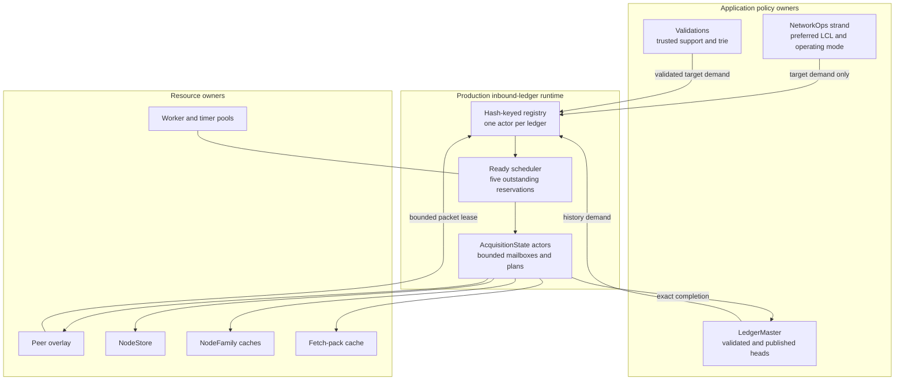
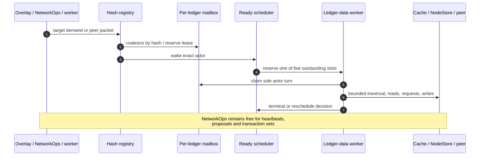
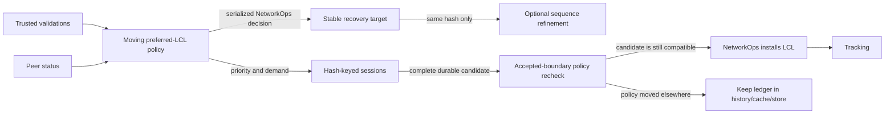
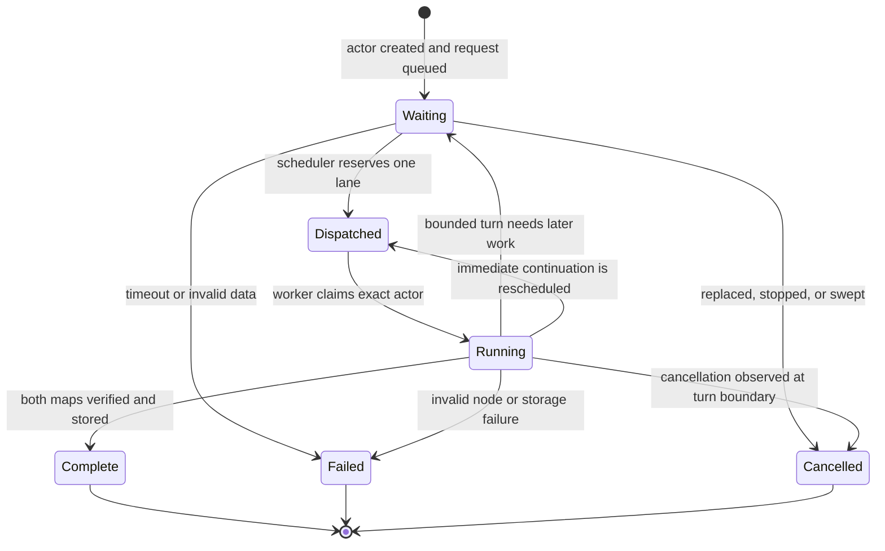
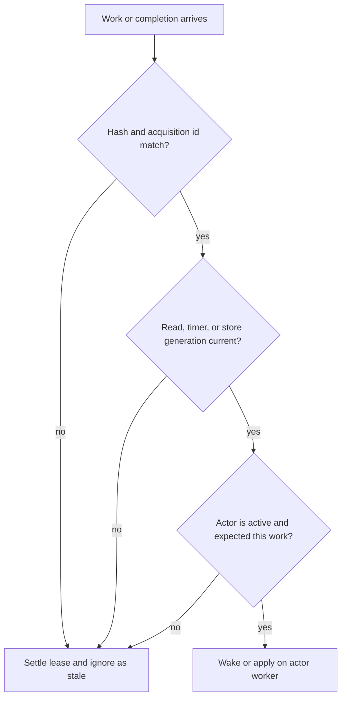
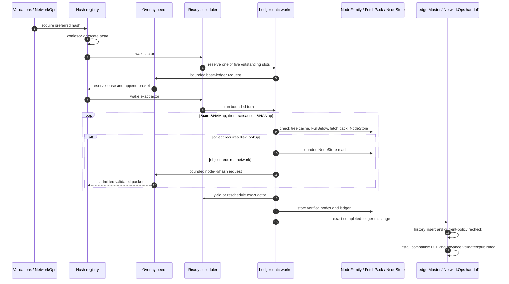
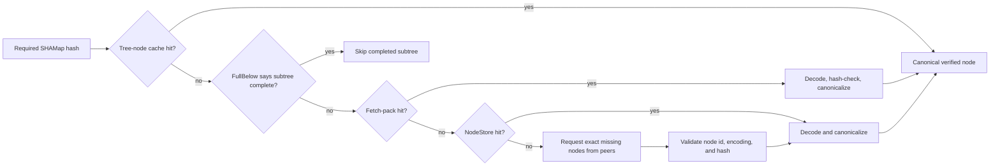
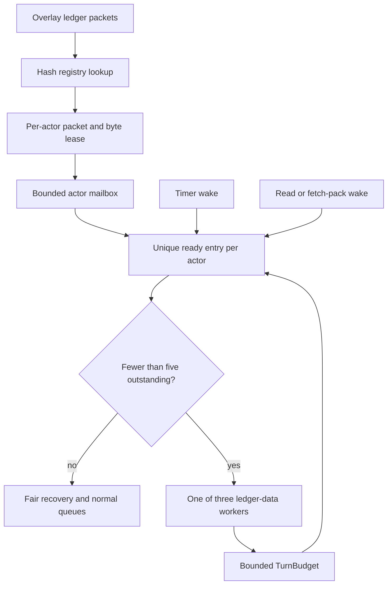
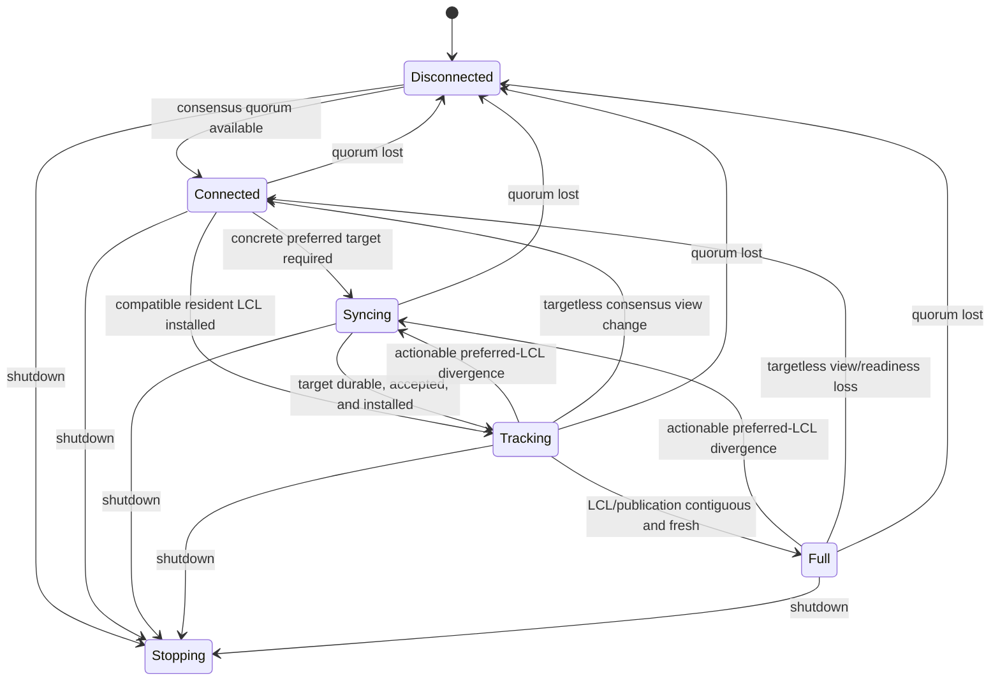
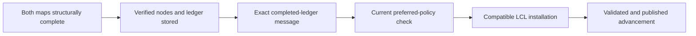

# Acquisition architecture

This document describes how Quaxar acquires a complete XRP Ledger from peers,
how its hash-keyed acquisition actors are scheduled, and how the pure
`xrpld/acquisition` coordinator is used as a parity model. Production execution
lives in `xrpld/app/src/ledger/inbound_ledgers/` and follows rippled's
`InboundLedger`/`JtLedgerData` isolation boundary.

For operator-visible states and diagnostics, see [SYNCING.md](SYNCING.md). For
the wider process, consensus, transaction, and storage architecture, see
[ARCHITECTURE.md](ARCHITECTURE.md).

## Production ownership and the coordinator model

Acquiring a ledger is not one network request. It is a distributed workflow
that must coordinate:

- a moving preferred-ledger policy;
- one coalesced session per ledger hash;
- state-map and transaction-map traversal;
- cache, fetch-pack, and NodeStore reads;
- validated peer replies and retry timers;
- bounded writes and a final durability fence;
- exact completion delivery to LedgerMaster and NetworkOps;
- cancellation, database rotation, shutdown, and late completions;
- the public `disconnected`, `connected`, `syncing`, `tracking`, and `full`
  lifecycle.

If each callback owned part of that lifecycle, a late read, timer, peer packet,
or write could revive a cancelled session or install a ledger selected by stale
policy. Production therefore gives each ledger hash one `AcquisitionState`
actor. The registry coalesces demand by hash, and that actor alone mutates its
mailbox, tree plan, retry, storage, and terminal state. A global ready scheduler
admits five outstanding actor turns while three ledger-data workers may run,
matching rippled's separate timeout-admission and JobQueue limits.

`xrpld/acquisition::CoordinatorRunner` remains the deterministic typed
event/effect model and parity harness. It is not installed into the production
NetworkOps strand. Advancing a coordinator `SessionPlan` there would make
resident-tree scan time part of consensus latency.

The crate is intentionally below `xrpld/app`: it depends on ledger-domain
types, but not on overlay, NetworkOps, LedgerMaster, JobQueue, or concrete
storage implementations. This makes the state machine deterministic and keeps
resource locks outside its ownership boundary.



## Ownership model

| State or resource | Sole mutable owner | Other components may do |
| --- | --- | --- |
| Acquisition service phase | NetworkOps strand | Registry reports results; it does not own public mode |
| Per-hash session lifecycle | One `AcquisitionState` actor | Registry coalesces demand and routes bounded packets |
| Preferred-LCL policy and LCL switch | NetworkOps strand | Acquisition never installs an arbitrary ledger |
| Validated and published heads | LedgerMaster | Actors deliver a complete ledger by exact hash |
| SHAMap traversal plan | Worker-owned actor plan | Shared stores provide verified nodes |
| Peer connections and sends | Overlay | Actor selects bounded requests through its peer set |
| Physical NodeStore reads and writes | Actor worker and NodeStore | Scheduler wakes exact actors for subsequent turns |
| Admission accounting | Per-actor packet and byte leases | Overlay reserves and settles exact leases |
| Shared immutable nodes | NodeFamily caches, fetch pack, and NodeStore | Any later session may reuse verified nodes |

NetworkOps is neither an acquisition orchestrator nor an I/O executor. It may
select a target and enqueue demand, but it never advances a SHAMap plan.



## Crate and adapter responsibilities

### `xrpld/acquisition`

The crate contains the pure coordinator model used by deterministic parity
tests and future non-consensus-thread adapters:

- `event.rs`: every fact the owner may consume;
- `effect.rs`: the complete typed output surface;
- `runner.rs`: coordinator state, budgets, scheduling, and session ownership;
- `phase.rs`: legal service-phase transitions;
- `session.rs`: legal per-session transitions;
- `plan.rs`: retained mailbox, traversal frontier, read/network needs, and
  persistence intent;
- `identity.rs`: exact session and operation generations;
- `ingress.rs`: admission leases and immutable routing snapshots;
- `io.rs`, `peer.rs`, and `timer.rs`: typed resource requests/completions;
- `handoff.rs`: durable-ledger delivery and acknowledgement;
- `port.rs`: dependency-inversion boundary used by application adapters;
- `shadow.rs`: optional read-only comparison runner; never a second owner.

### `xrpld/app/src/ledger/inbound_ledgers`

The application side supplies the production runtime:

- `registry.rs`: global hash-keyed service, demand coalescing, failure cooldown,
  and completion delivery;
- `acquisition.rs`: sole mutable per-hash actor, bounded mailbox, retained tree
  plan, retry, storage, and terminal state;
- `scheduler.rs`: unique per-hash ready admission and five-outstanding fairness;
- `coordinator_adapter.rs`, `coordinator_engine.rs`,
  `coordinator_ports.rs`, and `coordinator_handoff.rs`: deterministic
  coordinator parity harness, not a production NetworkOps executor;
- `read_broker.rs`: bounded, coalesced and priority-aware NodeStore reads;
- `worker_pool.rs`: bounded ledger-data and timer work;
- `wire_ledger_node.rs`: validated conversion of wire node identifiers and
  payloads.

The similarly named `InboundLedgersLocal` in `mod.rs` is only an RPC resumable
request cache. It is not the network acquisition registry and must not be
merged into this lifecycle.

## Demand, preference, and the recovery anchor

Three identities are deliberately separate:

1. **Moving preferred policy**: NetworkOps and validations continually select
   the best ledger for the current network view.
2. **Stable recovery decision**: while syncing, NetworkOps retains the target
   whose completion and installation can finish the current recovery.
3. **Per-hash sessions**: independent ledger hashes can be acquired and reused
   without replacing the stable anchor.

This prevents a network tip that advances every few seconds from resetting the
only tree that is close to completion.



A `ConsensusViewChange` is mode-only. It can demote Tracking or Full to
Connected, but it does not mint or pin an acquisition target. The serialized
`checkLastClosedLedger` path emits the actionable `PreferredLclDivergence` and
separate acquisition demand.

## Per-hash session lifecycle

There is at most one live session identity for a target hash. Multiple callers
coalesce demand onto it. Consensus/recovery priority may promote an existing
generic session without discarding its plan.



Only one scheduler entry for an `(ledger hash, acquisition id)` can be running.
Wakes arriving during a turn are coalesced and cause one later turn rather than
concurrent mutation.

## Exact identity and stale completion rejection

A hash alone is not sufficient callback identity. Production actor work uses:

```text
AcquisitionKey = target hash + acquisition id
ReadTicket = AcquisitionKey + read generation + requested node identity
PacketLease = AcquisitionKey + reserved packet and byte charge
```

The actor accepts work only when the complete identity still names the live
acquisition. Replacement, cancellation, NodeStore rotation, or restart makes
old packet, timer, read, and worker callbacks stale by construction.



## End-to-end current-ledger acquisition



The state and transaction roots must both match their ledger header before
structural completion. A completed ledger is useful but not automatically the
LCL: NetworkOps rechecks current policy at the accepted boundary.

## Node lookup and reuse

The plan checks cheap shared resident sources before asking peers:



Session cleanup releases lifecycle ownership, mailboxes, timers, and the exact
frontier. It does not erase immutable verified nodes already admitted to the
shared tree cache, fetch pack, FullBelow cache, or NodeStore. This is why weak
or incomplete work can accelerate a later session without keeping a stale
session alive forever.

## Backpressure and scheduling

The production actor path separates packet admission from execution so a data
flood cannot monopolize NetworkOps:



Important bounds include:

- per-actor packet and byte leases that remain charged until settlement;
- exactly one running turn for each acquisition identity;
- five global outstanding reservations and three running workers, with
  recovery/normal fairness;
- a wall-clock `TurnBudget` consulted during SHAMap traversal;
- bounded reads, mailbox packets/bytes, and network request batches;
- request batch sizes matching the relevant `rippled` paths.

NetworkOps owns preferred-ledger and public-mode policy. The registry and actors
own acquisition lifecycle, while the worker pool owns physical concurrency.
No per-session thread is created.

## Service phase versus session phase

The service phase describes whether the node is current. A session phase
describes one hash acquisition. They are not coupled one-to-one: History and
Generic sessions can run while the service remains Full, and a completed
nonpreferred session does not promote the service.



`start_valid` can deliberately use a zero consensus-peer threshold. In that
mode transport connectivity still pauses/resumes acquisition and removes peer
ids, but does not force a service-mode demotion.

## Durability and handoff

Structural completion, persistence, durability, delivery, installation, and
publication are distinct gates:



Storage failure produces no normal adoptable ledger. Completion delivery names
the exact hash and acquisition id; LedgerMaster and NetworkOps still recheck
current policy before installation or publication.

## History and validation acquisition

- Current consensus/recovery work has priority over history.
- History acquisition is phase-neutral once an LCL is installed.
- The history floor is derived from the canonical application LCL and the
  configured fetch depth, not from a secondary stale ledger slot.
- A trusted validator waiter is replaced by its newer validation. Late
  completion of the older hash stays reusable but cannot restore superseded
  validation-trie support.
- Removing an unacquired newer waiter does not erase the signer's older
  acquired resident support; removal is hash-exact.

## Shutdown and database rotation

Shutdown marks the registry stopping, cancels actor and scheduler identities,
and makes later callbacks stale. App shutdown then stops overlay producers and
worker/timer producers before storage and shared caches are released.

When NodeStore rotates, active acquisitions are invalidated or restarted at the
new storage boundary. Cached immutable nodes remain reusable, but work tied to
the retired physical store cannot complete a new actor.

## Observability

Use these views together:

- `server_info.state_accounting`: public operating-mode durations and
  transitions;
- actor details: reason, target, lifecycle, plan turns, pending reads,
  packets, peers, and persistence state;
- read-broker and worker-pool snapshots: bounded queue/admission pressure;
- `last_recovery_lcl_decision`: why a preferred candidate was adopted,
  deferred, or ignored;
- `complete_ledgers`, validated sequence, and repeated publication samples:
  proof of real chain advancement.

One Full sample, rising RAM, or NodeStore writes alone do not prove sync. See
[SYNCING.md](SYNCING.md) for the completion checklist.

## Change checklist

Before changing acquisition behavior, verify all of these invariants:

1. NetworkOps never executes a SHAMap traversal or acquisition plan turn.
2. One actor is the only mutable owner for each acquisition identity.
3. Every asynchronous callback carries the exact acquisition identity and
   generation needed to reject stale work.
4. One live actor is coalesced per hash; moving preference does not reset the
   stable recovery anchor.
5. Session cancellation cannot erase reusable immutable cache/storage data.
6. Structural completion cannot bypass storage, exact completion delivery, or
   the accepted-boundary policy check.
7. Packet pressure cannot bypass mailbox packet/byte limits.
8. Current-ledger work remains ahead of History work.
9. Only the NetworkOps strand writes public service mode.
10. The corresponding `rippled` owner and call order were compared, not only
    an isolated helper function.
