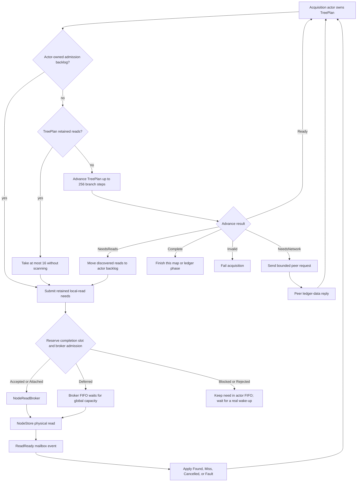
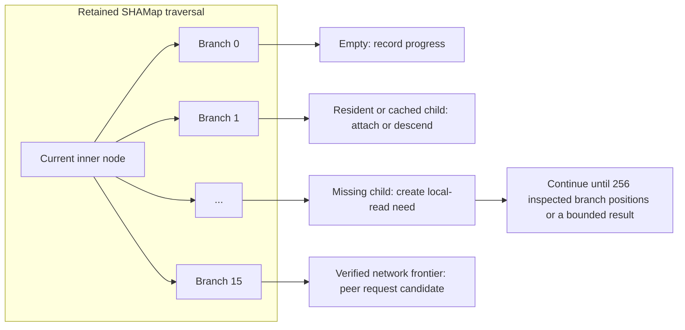
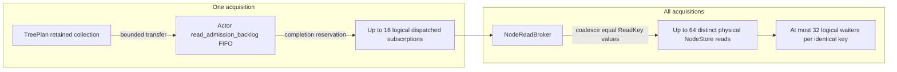
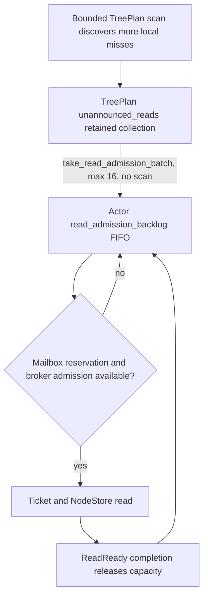
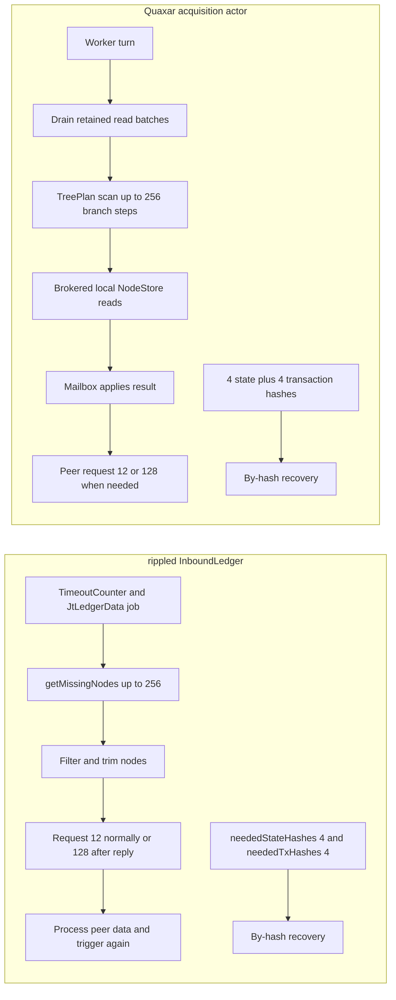
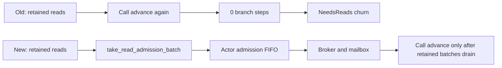

# Inbound Ledger Acquisition: Quaxar and rippled

This reference explains how Quaxar acquires a ledger's SHAMap data, where local NodeStore reads and peer requests fit, and how the current design compares with rippled. It is deliberately visual and uses the implementation's current limits rather than treating all acquisition work as one queue.

> **Short version:** `256` is a bounded CPU tree-scan slice; `16` is the per-acquisition local-read completion pipeline depth; `64` is the process-wide cap on *distinct physical* NodeStore reads. They control different resources.

## Vocabulary

A ledger's account-state map and transaction map are **SHAMaps**: authenticated radix trees with up to 16 child branches at an inner node. A tree plan retains traversal state while it fills missing nodes from the local NodeStore or from peers.

| Term | Plain-English meaning |
| --- | --- |
| **Branch step** | Inspect one child branch position of the retained SHAMap traversal. It can find an empty branch, an already-resident child, a missing child needing a local read, or an inner child worth descending into. It is **not** one database read or peer request. |
| **TreePlan** | Quaxar's retained SHAMap missing-node traversal and its pending local/network work. |
| **Actor** | The per-acquisition coordinator. It owns the TreePlan while deciding what to scan, what to submit locally, and when to request peers. |
| **Read ticket** | A logical subscription to one local read result. Multiple tickets can share one physical read. |
| **Physical read** | One distinct NodeStore request dispatched by `NodeReadBroker`; it may notify multiple logical waiters. |
| **Completion reservation** | Capacity reserved before a broker ticket is accepted so a `ReadReady` mailbox result has somewhere to go. |
| **Runnable frontier** | Retained CPU traversal work that can progress now. Work waiting only for a disk completion or peer reply is intentionally not runnable. |

## End-to-end view



The first two decisions are important. Before a new tree scan, the actor prioritizes work it already owns: it retries its own admission backlog first; when that backlog is empty, it transfers TreePlan's retained reads. Each route returns before scanning, which prevents an actor turn from scanning zero branches merely to receive another already-discovered local-read batch.

## The SHAMap scan: why 256 branch steps



Quaxar gives one actor CPU turn at most **256 branch selections**. A step says that traversal inspected or recorded a branch position; it does **not** say that 256 missing nodes were found, 256 local reads ran, or 256 network nodes were requested. A scan can therefore make useful progress through empty, cached, inner, missing-local, and missing-network branches without producing a proportional number of I/O operations.

The value preserves the same primary missing-node discovery budget used by rippled. In rippled, `kMissingNodesFind = 256` is passed to both state and transaction `getMissingNodes` calls. Quaxar preserves the slice idea while exposing the retained traversal and its outcomes explicitly.

**Anchors:** Quaxar `xrpld/app/src/ledger/inbound_ledgers/acquisition.rs:73-74`; `xrpld/ledger/src/acquisition/ledger_fetcher.rs:190-211`; `xrpl/shamap/src/owners/sync.rs:2977-2984,3036`; rippled `src/xrpld/app/ledger/detail/InboundLedger.cpp:63,618,687`.

## Quaxar's local-read pipeline

```mermaid
sequenceDiagram
    participant T as TreePlan
    participant A as Acquisition actor
    participant B as NodeReadBroker
    participant S as NodeStore
    participant M as Actor mailbox

    T->>A: retained ReadNeed batch, maximum 16
    A->>A: reserve one completion slot
    A->>B: request hash, ledger sequence, plan
    alt global capacity and per-acquisition capacity available
        B->>S: dispatch distinct physical read
        S-->>B: Found or Miss
        B-->>M: ReadReady for each subscriber
        M->>A: apply_read_result
    else same key already has an active ticket
        B-->>A: Attached to existing logical ticket
    else queued behind global capacity
        B-->>A: Deferred logical ticket
    else reservation or admission is unavailable
        A->>A: retain need in actor FIFO; do not spin
    end
```

### Limits and ownership

| Limit | Scope and meaning | Why it exists |
| --- | --- | --- |
| **256 branch steps** | One TreePlan CPU scan turn. | Bounds CPU work and gives other acquisitions a chance to run. |
| **16 new reads per turn** | A TreePlan may announce at most 16 newly discovered read needs in a scan. | Binds discovery to manageable completion handling. |
| **16 per acquisition** | Maximum dispatched logical read subscriptions attributable to one acquisition; the actor also reserves completion delivery capacity before requesting a ticket. | Keeps one ledger acquisition from filling all completion capacity. |
| **64 global** | Maximum distinct physical NodeStore reads across all inbound acquisitions. | Bounds process-wide storage pressure and I/O queueing. |
| **32 waiters per key** | Maximum acquisition/plan subscriptions sharing one read key. | Allows useful coalescing while bounding fan-out and bookkeeping. |

The two `16` values deliberately align, but they protect different boundaries: TreePlan discovers at most 16 new local needs per scan, while the actor/broker permits at most 16 dispatched logical completions for an acquisition. A single logical ticket may share a physical read with other waiters, so `16` is an asynchronous local-read pipeline depth, **not** a promise of 16 independent disk reads.



`ReadAdmission` makes the pressure state explicit:

| Broker result | Meaning | Actor response |
| --- | --- | --- |
| `Accepted` | The ticket's read is admitted for dispatch. | Keep its ticket and wait for `ReadReady`. |
| `Deferred` | The logical ticket is recorded, but the distinct read waits in broker FIFO capacity. | Keep its ticket; no busy retry. |
| `Attached` | This acquisition/plan already has a ticket for that key. | Reuse the existing logical ticket; no new physical work. |
| `Rejected` | The broker is stopped or an admission bound cannot accept the subscription. | Release the reservation; retain retryable work in the actor FIFO, or terminate on stop. |

The broker's global cap counts **distinct dispatched flights**, not subscriptions. It uses an internal FIFO and only dispatches a queued key when every subscriber remains under its per-acquisition allowance. This creates bounded sharing and fairness rather than giving a hot acquisition unrestricted access to storage.

**Anchors:** actor shape and backlog `xrpld/app/src/ledger/inbound_ledgers/acquisition.rs:729-752`; direct read-completion handling `:2728-2788`; backlog admission `:2810-2887`; broker limits `xrpld/app/src/ledger/inbound_ledgers/read_broker.rs:16-20`; outcomes `:120-126`; request/admission `:262-358`; global FIFO dispatch `:585-641`; TreePlan forwarding `xrpld/ledger/src/acquisition/ledger_fetcher.rs:172-215`; underlying retained-read transfer `xrpl/shamap/src/owners/sync.rs:2977-2984,3324-3344`.

## The two retained work queues

There are two intentional layers of retained local-read work. They solve different backpressure problems.



1. **TreePlan's `unannounced_reads`** retains discovered hashes that did not fit the current bounded emitted batch. `take_read_admission_batch` transfers a bounded batch **without advancing the traversal**.
2. **The actor's `read_admission_backlog` FIFO** owns needs transferred out of TreePlan but not yet admitted because its completion mailbox reservation or broker gate is full.

A real completion or another legitimate trigger drains the actor FIFO. Waiting local I/O is not treated as a runnable CPU frontier, so the actor does not self-schedule empty turns.

## Local miss to peer request

A successful NodeStore result is decoded and attached to the plan. A local `Miss` leaves the verified missing edge available for network recovery; the acquisition then requests appropriate ledger data from peers. Peer request size is a networking limit, not a NodeStore limit:

| Peer-request policy | Quaxar behavior | rippled behavior |
| --- | --- | --- |
| Normal request | Up to **12** node IDs. | `kReqNodes = 12`. |
| Request after a useful peer reply | Up to **128** node IDs. | `kReqNodesReply = 128` when reason is `Reply`. |
| Aggressive by-hash recovery | Up to **4** state hashes and **4** transaction hashes. | `neededStateHashes(4, ...)` and `neededTxHashes(4, ...)`. |

These are behavioral policy-parity points. They are separate from the 16/64 local-read controls.

**Anchors:** rippled constants and job setup `src/xrpld/app/ledger/detail/InboundLedger.cpp:63-81`; request clipping `:764-767`; by-hash recovery `:980-992`. Quaxar's peer and local outcomes are selected by the TreePlan actor at `xrpld/app/src/ledger/inbound_ledgers/acquisition.rs:2890-3087`.

## Quaxar and rippled: what each actually does



| Area | rippled | Quaxar | Relationship |
| --- | --- | --- | --- |
| Acquisition scheduling | `InboundLedger` derives from `TimeoutCounter`; its constructor supplies a `JtLedgerData` job limit of 5. | Registry runs `WORKER_COUNT = 3`; its worker pool limits live `JtLedgerData`-equivalent jobs to 5. | **Policy parity** for the job limit; implementation boundaries differ. |
| Missing-node discovery | Calls state/transaction `getMissingNodes(256, filter)`. | Retained `TreePlan::advance(256, 16, ...)` produces `Ready`, local reads, network needs, completion, or invalidity. | Same 256-scale scan budget; Quaxar makes retained turn outcomes explicit. |
| Local store filtering and I/O | The inspected `InboundLedger` path supplies SHAMap sync filters, filters node IDs, and requests peers. | Actor explicitly reserves completion capacity and uses `NodeReadBroker` to coalesce and limit NodeStore reads. | Quaxar has an explicit actor/broker/mailbox local-I/O pipeline. |
| Peer batching | Trims requests to 12 normally or 128 after a reply. | Uses the same normal/reply request policy. | **Policy parity.** |
| Aggressive by-hash fallback | Emits up to 4 state plus 4 transaction hashes. | Uses the same state/transaction recovery policy. | **Policy parity.** |
| Explicit read limits in inspected path | No equivalent explicit `16 per acquisition / 64 global` asynchronous completion-reservation broker was exposed in the inspected `InboundLedger` path. | 16 logical per acquisition, 64 physical global, 32 waiters per key. | An architectural difference, not a claim that either implementation is faster. |

Do not over-read the last row: it does **not** claim rippled has no I/O controls elsewhere. It says that the inspected `InboundLedger` source path does not expose Quaxar's particular explicit broker and mailbox-reservation model.

**Anchors:** Quaxar workers `xrpld/app/src/ledger/inbound_ledgers/registry.rs:53,670`; worker-pool job cap `xrpld/app/src/ledger/inbound_ledgers/worker_pool.rs:15,305-326,339-345`; rippled `InboundLedger.cpp:63-81,618-687,764-767,980-992` and declarations in `src/xrpld/app/ledger/InboundLedger.h:146-149`.

## Why keep 16 per acquisition and 64 global today

`16 / 64` is a deliberately layered choice:

- With unique hashes, up to four acquisitions can each use their 16 logical slots before reaching the 64-read physical process cap. This is a fairness target, not a guarantee: duplicate-key coalescing and current work shape affect the exact distribution.
- The global 64 cap prevents local storage pressure from multiplying with the number of active acquisitions.
- A larger per-acquisition value would let fewer acquisitions consume the full global physical-read budget. At 32, two busy acquisitions can fill 64; at 64, one busy acquisition can do so.
- Raising completion reservations also raises mailbox delivery, node decoding, queueing, and worker-service pressure. It helps only if local-read concurrency is the bottleneck and NuDB, CPU, workers, and queues can service more reads without harming completion latency.

Therefore, do **not** infer from a historical high scan count that `16` should immediately become `32` or `64`. High `Deferred` or `slot_full` counts prove demand exceeded a gate; they do not prove that a wider gate reduces end-to-end ledger completion time.

Keep the current operational settings unchanged:

```text
per acquisition logical local-read depth = 16
global distinct physical NodeStore reads = 64
worker count = 3
ledger-data job limit = 5
```

A controlled experiment, not a production recommendation, can compare `16/64` with `24/96` and `32/128`. Hold the database snapshot, target ledger, peer environment, `WORKER_COUNT = 3`, and `LEDGER_DATA_JOB_LIMIT = 5` constant. Measure ledger completion time, useful verified nodes/second, branch steps/second, NodeStore read latency and I/O utilization, peer responses/timeouts, worker queue wait, and broker deferred depth/completion rate. Do not claim performance parity without matched controlled benchmarks.

## Zero-branch `NeedsReads` churn: final remediation

### The former failure mode

A 256-branch scan could discover more than the first 16 local reads it was allowed to emit. TreePlan retained the remainder internally. Later actor turns called `TreePlan::advance` only to retrieve another internal batch, so the turn could report `NeedsReads` after **zero** branch steps. Under pressure this created useless rescheduling and scan churn.

### The fix

`MissingNodeContinuation::take_unannounced_reads` now exposes a bounded, non-scanning transfer. `TreePlan::take_read_admission_batch` forwards it. At the start of `process_tree_plan_turn`, Quaxar drains the actor FIFO first, then transfers up to 16 retained TreePlan reads, and only then calls `advance`.



This is a scheduling correction, not a larger read limit. It keeps the original 256/16/64 limits and removes the empty scan path.

The dedicated regression test is `retained_tree_read_batches_drain_without_another_branch_scan` at `xrpld/app/src/ledger/inbound_ledgers/acquisition.rs:3509-3572`. The underlying non-scanning transfer is at `xrpl/shamap/src/owners/sync.rs:3324-3344`; its actor fast path is at `xrpld/app/src/ledger/inbound_ledgers/acquisition.rs:2890-2906`.

### Recorded live evidence

The final remediation is deployed in commit `32b5ed321606cc3f9b104e3fce4e4c5aec45d980` (`fix(acquisition): drain retained read batches`). In the recorded five-second live `fetch_info` differential:

| Metric | Prior FIFO build `83ab998` | Final `32b5ed3` | Interpretation |
| --- | ---: | ---: | --- |
| State scans | 43,779 | 489 | 98.9% fewer actor scan turns. |
| Zero-branch scan rows | 1 | 0 | Eliminated in the sampled interval. |
| Zero-branch scans | 4,059 | 0 | Eliminated in the sampled interval. |
| Branch steps per scan | 142.7 | 255.5 | Turns nearly consumed the full useful 256-step budget. |
| Broker rejections | 0 | 0 | No rejection path observed in the sample. |

The branch-step totals differed after restart and under a different workload, so they are **not** a throughput comparison. The supported operational conclusion is narrower: every observed final scan made useful branch progress, and the pathological zero-branch `NeedsReads` churn was eliminated.

## Source-anchor index

Line numbers below were verified against the current Quaxar worktree and the adjacent local rippled checkout when this document was added. They are implementation anchors, not permanent APIs; update them if surrounding source moves.

| Subject | Verified source anchor |
| --- | --- |
| Quaxar actor turn limits | `xrpld/app/src/ledger/inbound_ledgers/acquisition.rs:73-74` |
| Actor plan, tickets, and admission backlog | `xrpld/app/src/ledger/inbound_ledgers/acquisition.rs:729-752` |
| Read completion mailbox to TreePlan application | `xrpld/app/src/ledger/inbound_ledgers/acquisition.rs:2728-2788` |
| Direct backlog admission and reservation behavior | `xrpld/app/src/ledger/inbound_ledgers/acquisition.rs:2810-2887` |
| Retained reads drained before `advance` | `xrpld/app/src/ledger/inbound_ledgers/acquisition.rs:2890-2916` |
| Regression test for non-scanning retained-batch drain | `xrpld/app/src/ledger/inbound_ledgers/acquisition.rs:3509-3572` |
| Broker read caps and admission outcomes | `xrpld/app/src/ledger/inbound_ledgers/read_broker.rs:16-20,120-126,262-358,585-641` |
| TreePlan retained-read forwarding | `xrpld/ledger/src/acquisition/ledger_fetcher.rs:172-215` |
| SHAMap runnable frontier, advance, apply, and retained transfer | `xrpl/shamap/src/owners/sync.rs:2977-2984,3036,3168,3324-3344` |
| Quaxar worker and job caps | `xrpld/app/src/ledger/inbound_ledgers/registry.rs:53,670`; `xrpld/app/src/ledger/inbound_ledgers/worker_pool.rs:15,305-326,339-345` |
| rippled limits and job cap | `rippled/src/xrpld/app/ledger/detail/InboundLedger.cpp:63-81` |
| rippled 256-node state and transaction scans | `rippled/src/xrpld/app/ledger/detail/InboundLedger.cpp:618,687` |
| rippled normal/reply peer request sizes | `rippled/src/xrpld/app/ledger/detail/InboundLedger.cpp:764-767` |
| rippled four-state/four-transaction by-hash recovery | `rippled/src/xrpld/app/ledger/detail/InboundLedger.cpp:980-992` |
| rippled needed-hash declarations | `rippled/src/xrpld/app/ledger/InboundLedger.h:146-149` |
