# Quaxar Complete Lifecycle — Single Connected Flow

This document traces the implemented Quaxar node from bootstrap to `FULL` operation. It follows the structure of `RIPPLED_COMPLETE_FLOW.md`, but names the Rust runtime owners and records status inline: ✅ is source-confirmed parity with the corresponding rippled behavior; ⚠️ is a real, currently verified divergence. The only acquisition divergences identified by the paired audits are the missing `FEE_INVALID_DATA` charge and the disabled/incompletely scheduled replay feature. Architecture being Rust/Tokio rather than C++/Beast is not itself treated as a protocol divergence.

```mermaid
flowchart TD
    START([Process starts]) --> BOOT[Bootstrap application root\nload config, storage, validator state, ports]
    BOOT --> OVERLAY[AppOverlayRuntime::start\nbind peer listener when not server-owned\nspawn live PeerFinder]
    BOOT --> CONS[run_start_mode_consensus_loop\ncreate shared InboundLedgers\nspawn NetworkOpsStrand]
    BOOT --> NNL[Normal/network startup:\nneed_network_ledger = true]

    OVERLAY --> PF[PeerFinder loop: every 1 second\nrefresh peer count and mode\nexpire live cache, ingest endpoints\nprocess connection outcomes]
    PF --> DIAL_DUE{10-second dial cadence\nand outbound slots available?}
    DIAL_DUE -->|yes| FIXED[Resolve/retry fixed peers\nthen select livecache or bootcache candidates]
    DIAL_DUE -->|no| PF
    FIXED --> CONNECT[Overlay connect: capacity and duplicate checks\nTCP -> TLS -> signed HTTP upgrade]
    CONNECT --> HSGATE{Handshake, network, self,\nprotocol and activation valid?}
    HSGATE -->|no| PF
    HSGATE -->|yes| ACTIVATE[Activate PeerImp\nattach session and resource consumer\nstart one 60-second peer timer]
    ACTIVATE --> MODE_CONN{At least one active peer?}
    MODE_CONN -->|yes| CONNECTED[operating mode = CONNECTED]
    MODE_CONN -->|no| PF

    OVERLAY --> INBOUND[Inbound TLS/HTTP handoff]
    INBOUND --> IN_GATE{IP, duplicate, directional\ncapacity and signed-handshake checks pass?}
    IN_GATE -->|no| PF
    IN_GATE -->|yes| ACTIVATE

    ACTIVATE --> PEER_TIMER[PeerImp timer: every 60 seconds]
    PEER_TIMER --> SENDQ{Queue >=128 for\n4 consecutive timer checks?}
    SENDQ -->|yes| DEACT[Request session stop; deactivate peer]
    SENDQ -->|no| USEFUL{Outbound peer Diverged >300s\nor Unknown >600s?}
    USEFUL -->|yes| DEACT
    USEFUL -->|no| PING{Outstanding ping exists?}
    PING -->|yes| DEACT
    PING -->|no| SENDPING[Send cookie-bound TMPing] --> PEER_TIMER
    DEACT --> PF

    CONS --> ROUND[Start consensus immediately\nfrom current closed ledger]
    ROUND --> HEART[Strand heartbeat: one second\nJtNetopTimer -> strand command]
    CONNECTED --> HEART
    HEART --> CONSROUND[OPEN -> ESTABLISH -> ACCEPTED]
    CONSROUND --> ACCEPT[JtAccept handoff; strand executes accepted ledger]
    ACCEPT --> CYCLE[Cycle peer status for obsolete parent LCL]
    CYCLE --> PREFERRED[Select preferred LCL from\ntrusted validation and peer evidence]
    PREFERRED --> SAME{Preferred LCL equals\ncurrent LCL?}
    SAME -->|yes| ADVANCE[checkAccept -> tryAdvance\npublication and guarded history backfill]
    SAME -->|no| RESIDENT{Preferred ledger resident, complete,\ncurrent and compatible?}
    RESIDENT -->|yes| SWITCH[switch_last_closed_ledger\nclear need_network_ledger\nrebuild open ledger\nbroadcast switched status]
    RESIDENT -->|no| ACQUIRE[InboundLedgers acquire\nreason = Consensus; begin recovery round]

    subgraph IL[Inbound ledger acquisition — registry-coalesced by hash]
        direction TB
        ACQUIRE --> REG{Existing entry or\n5-minute failure cooldown?}
        REG -->|existing| JOIN[Reuse/update registry entry]
        REG -->|cooldown| WAITREC[Remain in recovery]
        REG -->|new| INIT[check local DB/fetch pack\nadd 5 peers when none, else 3\nqueue worker timeout]
        JOIN --> DATAWAIT[Wait for data or timer]
        INIT --> ADDED{Reason is HISTORY?}
        ADDED -->|no| ADDEDREQ[Trigger Added on newly selected peers]
        ADDED -->|yes| DATAWAIT
        ADDEDREQ --> DATAWAIT

        DATAWAIT --> HDR{Header known?}
        HDR -->|no| BASE[Send liBASE, blind depth 0\nhash always; seq only when known]
        BASE --> RECV[Receive TMLedgerData\ncoalesce into worker data drain]
        HDR -->|yes| MAPS{State map complete?}
        MAPS -->|no| SCAN[Detached state scan: find <=256 missing nodes]
        SCAN --> FILTER[Fresh hashes first; suppress all-duplicate\nsets except Timeout; remember requested nodes]
        FILTER --> DEPTH[Timeout/Added/Blind depth 0\nReply depth 1; high-latency reply depth 2]
        DEPTH --> REQUEST[Request state nodes; reply path may select <=6 useful peers]
        REQUEST --> RECV
        MAPS -->|yes| TXMAP{Transaction map complete\nor zero transaction root?}
        TXMAP -->|no| TXREQ[Find/request tx nodes] --> RECV
        TXMAP -->|yes| VERIFY[Verify completed maps and ledger header]

        RECV --> VALID{Packet/node accepted?}
        VALID -->|yes| REPLY[Account useful nodes; trigger Reply] --> MAPS
        VALID -->|malformed| MALFORMED[Charge FEE_MALFORMED_REQUEST] --> DATAWAIT
        VALID -->|invalid node/root| INVALID[⚠️ FEE_INVALID_DATA is not charged] --> DATAWAIT

        DATAWAIT --> TIMER[3-second timer enqueues worker only]
        TIMER --> PROGRESS{Progress since prior timeout?}
        PROGRESS -->|yes| REARM[Re-arm timer] --> DATAWAIT
        PROGRESS -->|no| NOPROG[Increment timeout; clear recent request state\nre-arm by-hash latch]
        NOPROG --> MAX{Timeouts >6?}
        MAX -->|yes| FAIL[Record one 5-minute failure cooldown]
        MAX -->|no| ORDER{HISTORY reason?}
        ORDER -->|no| TIMEOUTREQ[Trigger Timeout, then add peers/Added]
        ORDER -->|yes| HISTADD[Add peers without Added, then Trigger Timeout]
        TIMEOUTREQ --> BYHASH{Timeouts >4 and latch set?}
        HISTADD --> BYHASH
        BYHASH -->|yes| OBJ[Broadcast one TMGetObjectByHash\n<=4 state + <=4 tx needed hashes\nclear one-shot latch]
        BYHASH -->|no| HDR
        OBJ --> HDR
        VERIFY --> COMPLETE[Set immutable/full; finalization guard\ncache completion and wake strand]
    end

    COMPLETE --> ADVANCE
    FAIL --> WAITREC
    WAITREC --> HEART
    SWITCH --> ADVANCE
    ADVANCE --> PROMOTE{Accepted pass had no LCL change\nand recovery flag is clear?}
    PROMOTE -->|no| NEXT[Continue/restart appropriate round] --> HEART
    PROMOTE -->|yes| TRACK[mode = TRACKING]
    TRACK --> FRESH{LCL close time +\n2 x resolution is still future?}
    FRESH -->|yes| FULL[mode = FULL]
    FRESH -->|no| NEXT
    FULL --> NEXT
    FULL --> FINAL([FULL: consensus proposing, validation,\npublication, peer service and eligible history backfill])
```



The PeerFinder task performs its internal maintenance every second and attempts ordinary outbound connection selection on its ten-second cadence. The bootstrap housekeeping task broadcasts endpoint advertisements every 15 seconds; this chart intentionally shows the implemented cadence rather than treating it as an acquisition result. The strand begins consensus from the available closed ledger even while `need_network_ledger` is true; that flag blocks ordinary recovery promotion, not consensus scheduling.

---

## State Machine Diagram

```mermaid
stateDiagram-v2
    [*] --> DISCONNECTED: startup with no active peers
    DISCONNECTED --> CONNECTED: active peer count reaches 1

    CONNECTED --> TRACKING: Accepted pass; no LCL change;\nneed_network_ledger is false
    SYNCING --> TRACKING: Accepted pass; no LCL change;\nneed_network_ledger is false
    CONNECTED --> FULL: same Accepted pass promotes through TRACKING\nand LCL freshness gate passes
    TRACKING --> FULL: Accepted pass and LCL freshness gate passes

    TRACKING --> CONNECTED: differing preferred LCL
    FULL --> CONNECTED: differing preferred LCL
    CONNECTED --> SYNCING: recovery state reported by NetworkOps
    SYNCING --> CONNECTED: recovery state changes while peers remain

    CONNECTED --> DISCONNECTED: active peers below 1
    SYNCING --> DISCONNECTED: active peers below 1
    TRACKING --> DISCONNECTED: active peers below 1
    FULL --> DISCONNECTED: active peers below 1

    note right of TRACKING
        A missing preferred LCL starts a Consensus
        acquisition and blocks ordinary promotion.
        switch_last_closed_ledger clears the flag only
        after a real admissible LCL installation.
    end note

    note right of FULL
        FULL enables proposing in the next round.
        It does not suspend peer health, validation,
        LCL reconciliation, or history guards.
    end note
```



✅ The mode rules are enforced by the owned `NetworkOpsStrand`: peer loss demotes to `DISCONNECTED`; only an `Accepted` no-change pass can promote; a differing preferred LCL demotes `TRACKING`/`FULL` before acquisition or switching (`xrpld/app/src/network/network_ops_strand.rs:497-522, 696-774, 923-1104, 1171-1220`).

---

## Key Constants & Thresholds

All entries below are source-confirmed values that match the rippled counterpart. The Quaxar column is deliberately a file:line reference so the table can be checked against the active Rust implementation.

| Constant / behavior | Value | Quaxar file:line | rippled parity |
|---|---:|---|---|
| PeerFinder maintenance tick | 1 s | `app/src/runtime/overlay_runtime.rs:807-815` | ✅ Overlay once-per-second cadence |
| Autonomous dial selection cadence | 10 s | `app/src/runtime/overlay_runtime.rs:856-911` | ✅ implementation-specific scheduling around equivalent PeerFinder selection |
| Max concurrent connect attempts | 20 | `app/src/runtime/overlay_runtime.rs:38, 889-892` | ✅ `kMaxConnectAttempts` |
| Bootcache persistence cooldown | 60 s | `app/src/runtime/overlay_runtime.rs:42, 298-311` | ✅ |
| Livecache TTL / recent-attempt squelch | 30 s / 60 s | `app/src/runtime/overlay_runtime.rs:43-44` | ✅ |
| Default peer limits, total / inbound / outbound | 21 / 11 / 10 | `app/src/runtime/overlay_runtime.rs:1226-1232` tests | ✅ |
| Minimum active peers for `CONNECTED` | 1 | `app/src/network/network_ops_strand.rs:497-515` | ✅ default min-peer threshold |
| Per-peer lifecycle timer | 60 s | `overlay/src/peer/peer_imp.rs:246-264` | ✅ `kPeerTimerInterval` |
| Target / drop send queue | 128 / 192 | `overlay/src/peer/peer_imp.rs:25-27, 335-354`; `overlay/src/tuning.rs` | ✅ |
| Sustained large queue threshold | 4 timer intervals | `overlay/src/peer/peer_imp.rs:335-354`; `overlay/src/tuning.rs` | ✅ `kSendqIntervals` |
| Converged / diverged ledger distance | <24 / >128 | `overlay/src/peer/peer_imp.rs:574-587`; `overlay/src/tuning.rs` | ✅ |
| Outbound usefulness timeout, diverged / unknown | 300 s / 600 s | `overlay/src/peer/peer_imp.rs:358-378`; `overlay/src/tuning.rs` | ✅ |
| Idle-peer check cadence | 4 s | `app/src/bootstrap/bootstrap.rs:1164-1172` | ✅ `kCheckIdlePeers` |
| Inbound ledger acquire timeout | 3 s | `app/src/ledger/inbound_ledgers/acquisition.rs:34, 597-613` | ✅ `kLedgerAcquireTimeout` |
| Initial / additional ledger-acquisition peers | 5 / 3 | `app/src/ledger/inbound_ledgers/acquisition.rs:32-33, 1151-1167` | ✅ exact parity; not a divergence |
| No-progress retry max / aggressive threshold | >6 / >4 | `ledger/src/acquisition/ledger_fetcher.rs:59-60, 3339-3343` | ✅ |
| Missing-node discovery / normal request / reply request | 256 / 12 / 128 | `ledger/src/acquisition/ledger_fetcher.rs:61-63, 2366, 2440-2444` | ✅ |
| Max nodes processed from one inbound packet step | 128 | `ledger/src/acquisition/ledger_fetcher.rs:46` | ✅ |
| Query depth, blind-added-timeout / reply / high-latency reply | 0 / 1 / 2 | `ledger/src/acquisition/ledger_fetcher.rs:2311-2318` | ✅ |
| Query type becomes indirect | after first timeout | `ledger/src/acquisition/ledger_fetcher.rs:2319-2323` | ✅ |
| Useful reply-peer sample cap | 6 | `ledger/src/acquisition/ledger_fetcher.rs:43, 1201, 1411` | ✅ |
| By-hash needed state / tx cap | 4 / 4 | `ledger/src/acquisition/ledger_fetcher.rs:41-42, 3569-3580` | ✅ exact parity; not a divergence |
| Ledger-data job admission limit | 5 | `app/src/ledger/inbound_ledgers/worker_pool.rs:15, 308-316` | ✅ `JtLedgerData` limit |
| Acquisition worker count | 64 | `app/src/ledger/inbound_ledgers/registry.rs:52` | ✅ bounded Rust worker realization |
| Registry sweep idle timeout | 60 s | `app/src/ledger/inbound_ledgers/registry.rs:40, 914-933` | ✅ |
| Recent-failure cooldown | 5 min | `app/src/ledger/inbound_ledgers/registry.rs:35, 679-688` | ✅ |
| Tx-set acquisition initial peers | 2 | `ledger/src/acquisition/inbound_transactions.rs:11` | ✅ |
| Tx-set normal / maximum timeouts | 4 / 20 | `ledger/src/acquisition/transaction_acquire.rs:16-17, 113-124` | ✅ |
| Replay subtask timeout count | 10 | `ledger/src/acquisition/skip_list_acquire.rs:10, 106-111` | ✅ count; cadence caveat in section 8 |
| Replay no-feature peer fallback | 2 peers | `ledger/src/acquisition/skip_list_acquire.rs:11, 189-200` | ✅ fallback threshold |
| Replay task cap / size | 10 tasks / 256 ledgers | `ledger/src/history_runtime/replayer.rs:15-16, 44-57` | ✅ |
| Replay task timeout cap | `max(10, 2 × ledgers)` | `ledger/src/history_runtime/replay_task.rs:9-10, 106-110` | ✅ |
| History retry / stale fetch-pack request | 200 ms / 1 s | `app/src/network/network_ops_strand.rs:39-42` | ✅ |
| History validated-age / NodeStore write-load gate | <60 s / <8192 | `app/src/network/network_ops_strand.rs:1250-1265` | ✅ |
| `FULL` freshness condition | now < LCL close + 2×resolution | `app/src/network/network_ops_strand.rs:1201-1213` | ✅ |
| Compression payload eligibility / plain-compressed header | >70 bytes / 6-10 bytes | `overlay/src/transport/message.rs:553-585`; `overlay/src/transport/compression.rs:1-10` | ✅ |
| Maximum wire or decompressed message | 64 MiB | `overlay/src/transport/message.rs:14, 482-506` | ✅ |

⚠️ Replay **timer durations** are intentionally absent from this matching table: Quaxar does not currently provide rippled’s 250 ms subtask, 1 s fallback, and 500 ms parent-task cadence in the replay subtree. See supplemental section 8.

---

## End-to-End Sequence Timeline

```mermaid
sequenceDiagram
    participant Boot as Bootstrap/MainRuntime
    participant PF as Live PeerFinder
    participant P as PeerImp session
    participant S as NetworkOpsStrand
    participant I as InboundLedgers
    participant L as LedgerMaster/ApplicationRoot
    participant R as Remote peer

    Note over Boot,R: Startup
    Boot->>PF: start overlay listener and PeerFinder task
    Boot->>S: create shared inbound registry and start strand
    S->>S: start consensus on current closed ledger
    PF->>PF: every 1 s maintain caches, endpoints, peer count
    PF->>R: on dial turn, TCP -> TLS -> signed HTTP upgrade
    R-->>PF: verified response
    PF->>P: activate, attach session, start 60 s timer
    PF->>S: peer count permits CONNECTED

    Note over S,R: Consensus and preferred-LCL decision
    S->>S: one-second heartbeat -> OPEN/ESTABLISH/ACCEPTED
    S->>S: JtAccept command executes accepted ledger
    S->>P: cycle obsolete parent-LCL reports
    S->>S: select preferred LCL from validations and peer reports
    alt preferred LCL absent locally
        S->>I: acquire_closed_ledger_async(hash, Consensus)
        I->>R: liBASE request, then state/tx node requests
        loop packet receipt or 3-second worker timeout
            R-->>I: TMLedgerData
            I->>I: coalesced data drain; validate/add nodes; trigger reply
        end
        I-->>S: completed ledger is recoverable in registry and wakes strand
        S->>L: cache completed ledger, checkAccept, tryAdvance
    else admissible LCL is resident
        S->>L: switch LCL, rebuild open ledger, clear recovery flag
        S->>R: status change carrying installed LCL
    end

    Note over S,L: Promotion and steady state
    S->>L: publish consecutive quorum-backed ledgers
    S->>S: no-change Accepted pass -> TRACKING
    S->>S: fresh LCL -> FULL
    P->>R: every 60 s send ping or remove unhealthy peer
```

✅ Completion is durable before its channel notification is relied on: the registry keeps completed acquisition state for bounded polling/recovery, then the strand caches it, invokes `check_accept_hash_seq`, and advances publication (`xrpld/app/src/ledger/inbound_ledgers/acquisition.rs:2038-2063`; `xrpld/app/src/network/network_ops_strand.rs:600-696`).

---

## Critical Path Summary

```text
bootstrap -> overlay PeerFinder + NetworkOpsStrand -> active peer -> CONNECTED
  -> consensus Accepted -> preferred LCL
  -> acquire missing Consensus ledger -> header -> state map -> tx map
  -> immutable completed ledger -> cache/checkAccept/tryAdvance
  -> switch LCL clears need_network_ledger (or publication clears it)
  -> Accepted no-change pass -> TRACKING -> fresh LCL -> FULL
```

The acquisition timer and recovery logic do not promise a fixed throughput or completion time. Node-store performance, peer availability, valid responses, map shape, cached nodes, and peer scoring determine actual progress. A completed acquisition can survive transient notification-channel pressure because the registry retains its terminal result.

---

# Supplemental Lifecycle Behavior

## 1. Connection admission, directional capacity, and PeerFinder

✅ Quaxar owns a live PeerFinder loop that loads/persists bootcache, expires livecache entries, processes endpoint advertisements, tracks recent attempts, retries fixed peers, and selects bootcache/livecache dials within the 20-attempt budget (`xrpld/app/src/runtime/overlay_runtime.rs:38-44, 759-938`). Inbound and outbound sessions converge only after TLS, signed HTTP upgrade, identity, network, self, duplicate, IP, and capacity checks in the overlay implementation. `peer_private` prevents autonomous bootcache dialing while fixed peers remain separately retried.

The Rust runtime exposes the same practical distinction between connection attempts and active peers: a failed or redirected dial updates bootcache state, while only a successfully activated peer contributes to active-peer counts. The source uses Tokio tasks and active-map bookkeeping rather than rippled’s C++ slot objects, but the capacity and admission contract is maintained.

## 2. Peer protocol start, status, tracking, and health timer

✅ Activation attaches the session, installs the resource consumer, and arms exactly one 60-second lifecycle timer. The timer disconnects on sustained queue pressure, expired outbound usefulness, or a missed cookie-bound pong; otherwise it sends a fresh `TMPing` (`xrpld/overlay/src/peer/peer_imp.rs:246-264, 335-407`).

✅ `PeerImp` stores closed/previous ledger hashes and validated ledger ranges. It classifies peers as converged below 24 ledgers apart and diverged above 128; the middle interval retains the current classification. Converged range information is used by acquisition routing (`xrpld/overlay/src/peer/peer_imp.rs:472-587, 768-844`).

## 3. Manifests, validator lists, trust, and quorum

✅ Bootstrap wires validator-list configuration before the consensus runtime and initializes trusted keys from configured lists/sites (`xrpld/app/src/bootstrap/bootstrap.rs:663-815`). The housekeeping path drains accepted manifests, applies them to the shared manifest cache, and relays only newly accepted entries to other peers (`bootstrap.rs:1229-1272`). A manifest establishes key mapping; trusted validator status remains a ValidatorList/quorum concern.

✅ Consensus and strand validation paths query trusted validations and apply Negative UNL filtering before quorum-sensitive work. A completed candidate is not made validated merely by acquisition; it must reach the normal `check_accept_hash_seq` validation path (`xrpld/app/src/consensus/rcl_consensus.rs:706-755`; `xrpld/app/src/network/network_ops_strand.rs:1108-1146`).

## 4. Open ledger and transaction relay

✅ A successful preferred-LCL switch clears recovery only after the LCL is admitted, processes transaction-queue work, rebuilds the open ledger at the next sequence, records the closed ledger, broadcasts the switched status, and starts the replacement consensus round (`xrpld/app/src/network/network_ops_strand.rs:1072-1104`). A normal no-change completion likewise begins the next round against the current LCL.

✅ Transaction relay is staged through the overlay router, JobQueue, and NetworkOps paths. The router supports direct transactions and negotiated reduce-relay batches; relay-history/suppression prevents immediate reflection. The split Rust ownership is intentional and does not remove the normal queueing and filtering lifecycle (`xrpld/overlay/src/runtime/overlay_impl.rs:684-690, 992-1012, 2117-2131`; `xrpld/app/src/bootstrap/bootstrap.rs:931-970`).

## 5. Candidate transaction-set acquisition

✅ Missing transaction sets enter `InboundTransactions`, begin with two peers, use the normal/max 4/20 timeout thresholds, validate incoming SHAMap data, and report completed sets to the owned strand. The bounded completion channel has a durable pending-completion recovery path so a full channel does not lose a completed set (`xrpld/ledger/src/acquisition/inbound_transactions.rs:11-12, 134-197`; `transaction_acquire.rs:16-17, 101-124`; `app/src/network/network_ops_strand.rs:552-602`).

## 6. Accepted phase, preferred LCL, and mode promotion

✅ Preferred-LCL reconciliation is performed only at the `Accepted` boundary. Before selection, peers still reporting the obsolete parent have their status cycled. The strand adds the local LCL to peer counts only while at least `TRACKING`, uses trusted-validation preference plus peer evidence, and does not install a missing/incomplete/incompatible candidate (`xrpld/app/src/network/network_ops_strand.rs:696-774, 820-1044`).

✅ A missing preferred LCL is requested with `AcquireReason::Consensus`; repeated requests coalesce by hash in the registry. A switch clears `need_network_ledger`; separately, publication of a validated ledger can clear it. Promotion is limited to a captured no-change accepted pass, then moves `CONNECTED`/`SYNCING` to `TRACKING` and a fresh LCL to `FULL` (`network_ops_strand.rs:1030-1104, 1171-1220`).

## 7. Ledger validation, publication, and history backfill

✅ `check_accept_and_advance` checks the closed candidate, advances consecutive quorum-backed cached ledgers, publishes in order, updates complete-ledger status, and guards history acquisition. History requires recovery to be clear, acceptable fee load, publication caught up to validation, validated age under 60 seconds, NodeStore write load under 8192, configured history eligibility, and an exact historical hash (`xrpld/app/src/network/network_ops_strand.rs:1108-1269`).

✅ `AcquireReason::History` is not used as a substitute for missing current-network recovery. The strand’s history guard blocks it while `need_network_ledger` is true, preserving priority for consensus/network acquisition (`xrpld/app/src/network/network_ops_strand.rs:1250-1265`).

## 8. Ledger replay and replay acquisition

⚠️ Quaxar ports replay task counts, limits, fallback bookkeeping, and delta/skip-list ownership, but does not define or drive rippled’s replay timer cadence: 250 ms subtask, 1 s fallback after two no-feature peers, and 500 ms parent task. The Rust subtasks expose `invoke_on_timer`; a driver must supply cadence (`xrpld/ledger/src/acquisition/skip_list_acquire.rs:10-11, 94-117, 189-200`; `delta_acquire.rs:118-134`; `history_runtime/replay_task.rs:183-210`). This does **not** block ordinary full-ledger sync.

⚠️ The overlay handshake currently advertises `ledger_replay = false`, so peers cannot negotiate replay on the wire. Operational replay falls back to generic full-ledger acquisition (`xrpld/overlay/src/runtime/overlay_impl.rs:1599-1608, 2587`). This is also non-blocking for standard Consensus/Generic/History sync because those use the implemented inbound-ledger acquisition path.

## 9. Resource charging and malformed data

✅ Peer charges are delegated through the Resource Manager; a `Drop` disposition triggers one session-stop request, while the peer retains diagnostic charge records (`xrpld/overlay/src/peer/peer_imp.rs:858-888`). Inbound acquisition separately charges `FEE_MALFORMED_REQUEST` for empty headers/nodes, invalid headers, and missing node IDs (`xrpld/app/src/ledger/inbound_ledgers/acquisition.rs:1358-1379`).

⚠️ Quaxar does **not** charge the distinct `resource::FEE_INVALID_DATA` category for a syntactically well-formed but invalid account-state root, transaction root, or node insertion. The audited acquisition charge site currently uses only `FEE_MALFORMED_REQUEST`; rippled distinguishes invalid data from malformed containers. This is an accounting/peer-penalty gap, not a blocker for normal synchronization (`xrpld/app/src/ledger/inbound_ledgers/acquisition.rs:1358-1379`).

## 10. Application housekeeping and endpoint exchange

✅ The bootstrap housekeeping loop ticks registry/transaction-acquisition work, sweeps tree and full-below caches at the configured node-size cadence, clears relay history, checks peer tracking, performs four-second idle-peer checks, drains manifests and validator lists, and stops with the runtime (`xrpld/app/src/bootstrap/bootstrap.rs:1110-1296`).

✅ Endpoint advertisements are built from the listener and current peer set and sent to active peers. The implementation uses a 15-second broadcast cadence in the bootstrap loop (`xrpld/app/src/bootstrap/bootstrap.rs:1179-1227`); this document reports that actual cadence without inferring an acquisition defect.

## 11. Compression, framing, and feature negotiation

✅ Compression is negotiated per peer, used only when enabled and beneficial, and uses the protocol’s plain/compressed framing rules. The message path skips small payloads, preserves uncompressed data when compression does not help, and rejects malformed/non-negotiated/oversized compressed traffic (`xrpld/overlay/src/runtime/overlay_impl.rs:2577-2599`; `xrpld/overlay/src/transport/message.rs:462-506, 553-624`; `compression.rs:1-43`).

## 12. Peer deactivation and ownership cleanup

✅ Session teardown is idempotent. A requested disconnect signals the watch channel; session close removes active/public-key ownership and stops the lifecycle timer so capacity and peer maps are released before reuse (`xrpld/overlay/src/transport/session.rs:121-161, 188-337`; `xrpld/overlay/src/peer/peer_imp.rs:768-781`; `xrpld/overlay/src/runtime/overlay_impl.rs:1740-1775`).

## 13. Acquisition registry, coalescing, failure, and sweep

✅ The registry has one active acquisition per hash, deliberately coalescing different callers/reasons to the current entry just as the reference registry coalesces `InboundLedger` by hash. It updates an initially unknown sequence when appropriate rather than launching competing duplicate work (`xrpld/app/src/ledger/inbound_ledgers/registry.rs:659-807`).

✅ Failure is an aged five-minute cooldown independent of object lifetime; sweep removes idle entries after 60 seconds and marks stopped state. A delayed stale callback is guarded by acquisition identity so an old acquisition cannot impose a hash-wide cooldown on a replacement (`registry.rs:35, 40, 215-254, 914-933`).

## 14. Inbound serving, fetch packs, and stale data

✅ The application serves `TMGetLedger` base, state, transaction, and transaction-set requests through the JobQueue/inline candidate path, uses fat leaves for state/transaction responses, honors soft/hard reply caps, and bounds requested depth to three (`xrpld/app/src/bootstrap/bootstrap.rs:1298-1511`).

✅ Unroutable state-node packets are stashed in the fetch pack, preserving usable content rather than discarding it; fetch-pack/object routes cache structurally valid replies and wake waiting consumers where appropriate (`xrpld/app/src/ledger/inbound_ledgers/acquisition.rs:2066-2087`; `xrpld/app/src/bootstrap/bootstrap.rs:817-905`).

## 15. Source ownership map

✅ Runtime startup and PeerFinder: `xrpld/app/src/runtime/overlay_runtime.rs`.

✅ Bootstrap assembly, router installation, housekeeping, endpoint broadcast, data serving: `xrpld/app/src/bootstrap/bootstrap.rs`.

✅ Per-peer health timer, tracking, send queue, resource disposition: `xrpld/overlay/src/peer/peer_imp.rs`.

✅ Owned consensus mutation, Accepted-phase LCL reconciliation, validation/publication/history, mode promotion: `xrpld/app/src/network/network_ops_strand.rs`.

✅ Per-hash acquisition lifecycle, timer-to-worker handoff, terminal guard, packet processing: `xrpld/app/src/ledger/inbound_ledgers/acquisition.rs`.

✅ Planner and SHAMap node protocol rules: `xrpld/ledger/src/acquisition/ledger_fetcher.rs`.

---

# Acquisition Internals — Complete Trigger, Filter, Receive, and Finish Cycle

The following numbered ledger-acquisition items are all **confirmed parity** with rippled. They include the values and lifecycle semantics that must not be shown as divergences. The explicit ⚠️ items in supplemental sections 8 and 9 are separate gaps, not exceptions to this 25-item confirmed set.

## A. Startup, timing, registry, and worker admission

1. ✅ **Main acquisition timer is 3 seconds.** `ACQUIRE_TIMEOUT = 3s`; it is armed after work and the timer callback only queues worker recovery (`app/src/ledger/inbound_ledgers/acquisition.rs:34, 568-614`).
2. ✅ **Peer expansion is exactly start 5, then add 3.** `add_peers` selects 5 when the live peer set is empty and 3 otherwise (`acquisition.rs:32-33, 1151-1167`). These are exact rippled values, not a Quaxar-only setting.
3. ✅ **No-progress limits are exact:** acquisition fails only when timeouts exceed 6; aggressive probing begins only after timeouts exceed 4 (`ledger/src/acquisition/ledger_fetcher.rs:59-60, 2282-2291, 3339-3343`).
4. ✅ **Node discovery and request bounds are exact:** discover up to 256 missing nodes; request 12 for blind/added/timeout work and 128 for reply work (`ledger_fetcher.rs:61-63, 2366, 2440-2444`).
5. ✅ **A packet processing step is bounded at 128 nodes.** `INBOUND_LEDGER_MAX_PACKET_NODES_PER_STEP = 128` (`ledger_fetcher.rs:46`).
6. ✅ **Useful reply peers are bounded at six.** Peer scores are pruned/sampled before reply-triggered requests (`ledger_fetcher.rs:43, 1201, 1229, 1260, 1411, 3438-3456`).
7. ✅ **Ledger-data worker admission is capped at five.** A rejected timeout admission re-arms the timer rather than executing recovery inline or dropping it (`app/src/ledger/inbound_ledgers/worker_pool.rs:15, 37-53, 308-316`; `acquisition.rs:568-595`).
8. ✅ **The generic timeout interval invariant is preserved.** `TimeoutCounter` requires `10 ms < interval < 30 s`; the 3-second acquisition interval is valid (`ledger/src/domain/timeout_counter.rs:103-106`).
9. ✅ **Failure cooldown is five minutes.** New work for the failed hash is refused during that window (`app/src/ledger/inbound_ledgers/registry.rs:35, 679-688, 1116-1132`).
10. ✅ **Idle registry sweep is one minute, not five minutes.** Five minutes applies only to failure cooldown (`app/src/ledger/inbound_ledgers/registry.rs:40, 914-933`).
11. ✅ **Failure is recorded as a time-based cooldown entry, not merely a counter.** Completion/failure identity guards preserve the first relevant failure and avoid stale callback races (`registry.rs:215-254, 1116-1123`).

## B. Trigger construction and peer targeting

12. ✅ **Replay task parameter limits are ported:** subtask maximum timeouts 10, no-feature fallback threshold 2, replay task cap 10, max task size 256, and task timeout bound `max(10, 2×N)` (`ledger/src/acquisition/skip_list_acquire.rs:10-11, 106-111, 189-200`; `history_runtime/replayer.rs:15-16`; `history_runtime/replay_task.rs:9-10, 106-110`). The separate cadence/wire limitations are called out above.
13. ✅ **Query depth is exact:** `Blind`, `Added`, and `Timeout` use depth 0; `Reply` uses 1; high-latency reply uses 2 (`ledger/src/acquisition/ledger_fetcher.rs:2311-2318`).
14. ✅ **Indirect query type begins only after the first timeout.** `timeouts > 0` selects `TM_QUERY_INDIRECT` (`ledger_fetcher.rs:2319-2323`).
15. ✅ **The aggressive by-hash latch is implemented as a true one-shot.** A no-progress timeout re-arms `by_hash`; after the threshold probe is emitted, the planner clears it so the following timeout does not repeat the same broadcast until another no-progress turn re-arms it (`app/src/ledger/inbound_ledgers/acquisition.rs:1409-1420`; `ledger/src/acquisition/ledger_fetcher.rs:2282-2291, 2719-2727`).
16. ✅ **Aggressive by-hash probes preserve per-type 4/4 caps.** Needed state hashes and transaction hashes are independently capped at four, and one request contains a single compatible object type (`ledger/src/acquisition/ledger_fetcher.rs:41-42, 3354-3375, 3569-3580`).
17. ✅ **Header and root short-circuits match reference semantics.** A zero transaction root completes transaction acquisition without fetch; state/header planning retains its validation and completion behavior rather than treating all zero roots alike (`ledger/src/acquisition/ledger_fetcher.rs` planner state and `app/src/ledger/inbound_ledgers/acquisition.rs:1728-1755` test fixture).
18. ✅ **`runData` is coalesced and drain-then-sample.** `data_job_queued` ensures one worker drains buffered packets repeatedly, then reply selection occurs after processing rather than one job per arrival (`app/src/ledger/inbound_ledgers/acquisition.rs:534-566, 1242-1356`).
19. ✅ **Stale state-node data is retained in fetch-pack storage.** Unroutable state packets are decoded and stashed for later use (`acquisition.rs:2066-2087`).
20. ✅ **Successful local/completed ledgers are finalized immutable and routed to storage/cache completion.** The terminal path syncs storage, makes the ledger immutable/full, records it exactly once, and wakes the consumer (`acquisition.rs:2038-2063`).

## C. Receive, timeout ordering, and terminal transition

21. ✅ **HISTORY and non-HISTORY timeout ordering is exact.** Non-HISTORY triggers `Timeout` on tracked peers before adding peers and triggering `Added`; HISTORY adds peers without `Added`, then fans out `Timeout` (`app/src/ledger/inbound_ledgers/acquisition.rs:1203-1207, 1409-1444`).
22. ✅ **Timers never run acquisition mutation inline.** The timer service callback queues a timeout job; worker admission controls execution and re-arm behavior (`acquisition.rs:568-614`; `worker_pool.rs:92-124`).
23. ✅ **Replay fallback state is present.** Two no-feature peers latch fallback to generic full-ledger acquisition in both skip-list and delta paths (`ledger/src/acquisition/skip_list_acquire.rs:189-200`; `delta_acquire.rs:261-273`).
24. ✅ **Transaction-set acquisition parameters match:** start with two peers, normal timeout threshold four, fail only above twenty; `still_need` can revive a needed set (`ledger/src/acquisition/inbound_transactions.rs:11`; `transaction_acquire.rs:16-17, 101-124, 225-232`).
25. ✅ **Malformed packet charging is implemented.** Empty header, empty node list, invalid header, and missing node ID map to `FEE_MALFORMED_REQUEST` with source-peer context (`app/src/ledger/inbound_ledgers/acquisition.rs:1358-1379`). This confirmed malformed category is distinct from the ⚠️ missing invalid-data category described in supplemental section 9.

### Complete cycle narrative

1. The registry deduplicates the target hash and checks the five-minute failure cooldown. A new per-hash state first checks local storage/fetch packs, refreshes the live overlay peer source, selects five or three peers, and starts the worker/timer lifecycle.
2. Before a header exists, the planner emits a blind `liBASE` request: query depth zero, target hash always included, target sequence only when known. Once the header is validated, the transaction root can short-circuit when zero, while state and non-empty transaction maps proceed independently.
3. State discovery runs outside the acquisition mutex by leasing the ledger for a detached scan. It identifies up to 256 missing nodes, restores the ledger, then filters candidates: fresh hashes first; all-duplicate sets are suppressed except on timeout; sent hashes become recent; and timeout recovery resets duplicate suppression. Query depth follows the 0/1/2 policy.
4. Incoming `TMLedgerData` is coalesced by acquisition. A worker drains packets, validates the header/root/node path, keeps valid earlier work if a later node is bad, records useful-node statistics, samples usable peers, and issues reply-triggered follow-up requests. Malformed containers are charged `FEE_MALFORMED_REQUEST`; the separate invalid-root/node charge remains the identified gap.
5. Every three seconds, a timer queues—not executes—recovery. Progress merely re-arms. No progress increments timeouts, rechecks local data, re-arms the by-hash latch, then follows the reason-sensitive trigger/add order. After timeout four, the one-shot object-by-hash fallback can broadcast a bounded 4-state/4-tx probe; after timeout six, the next no-progress decision fails and records cooldown.
6. When both maps are complete and ledger validation succeeds, a finalization atomic guard ensures exactly one completion owner. It makes the ledger immutable/full, stores/caches the result, preserves it in registry state even if the wakeup channel is unavailable, and lets the strand run `checkAccept` and `tryAdvance`. A later Accepted-phase preferred-LCL decision determines whether that completed ledger becomes the installed LCL.
