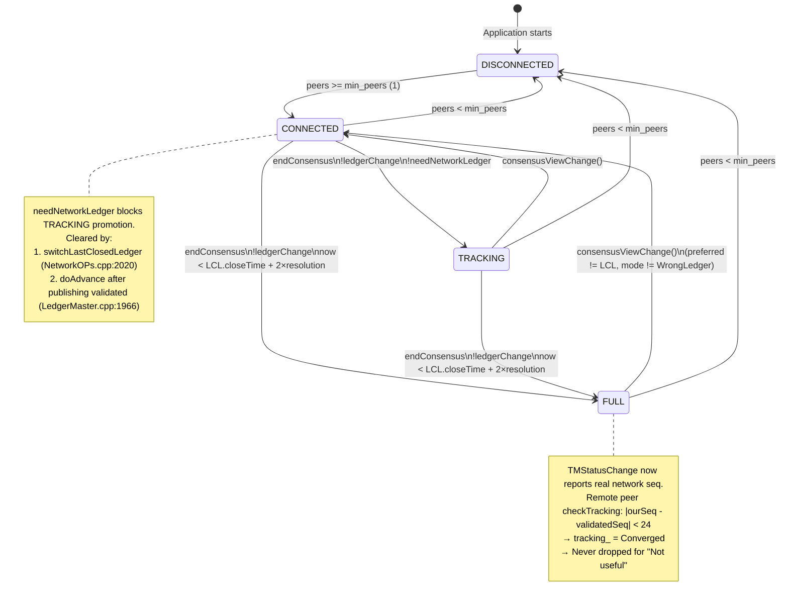
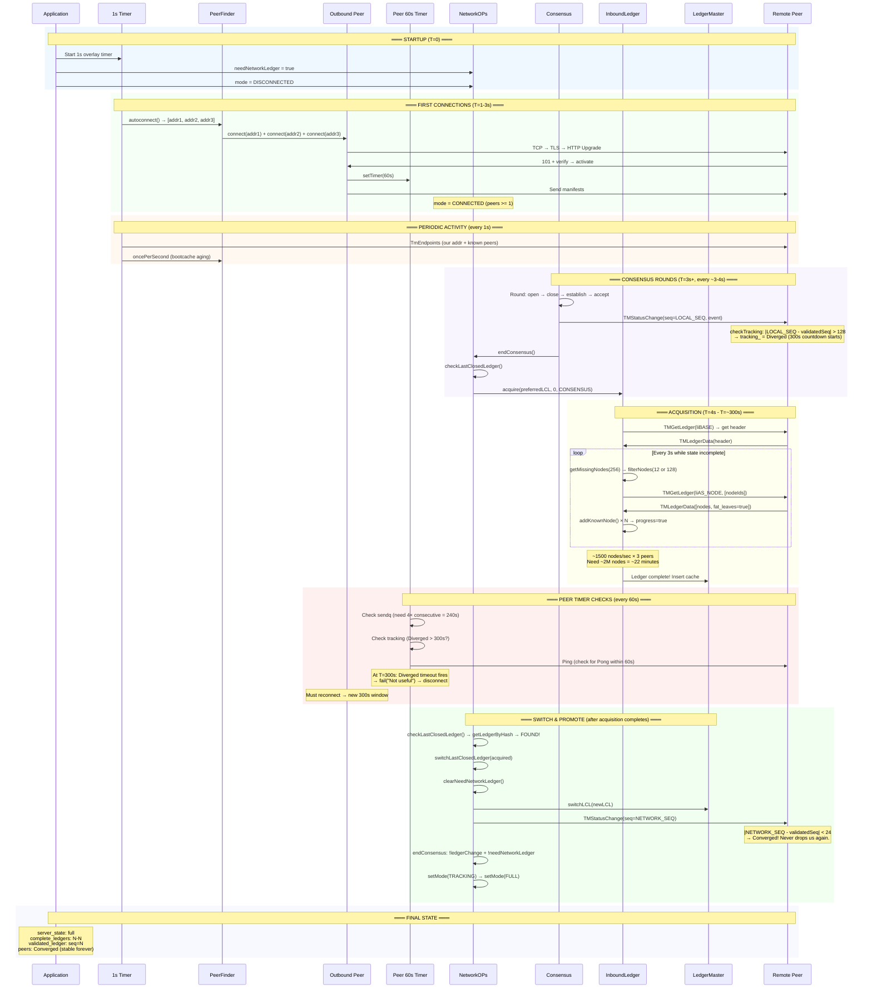
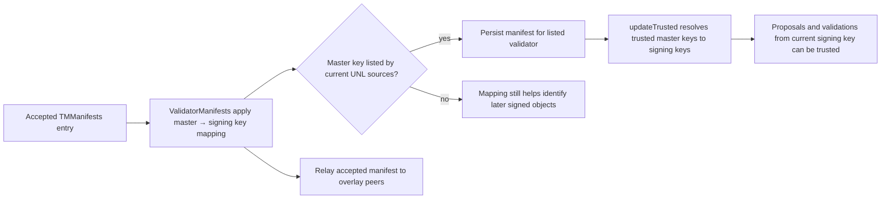
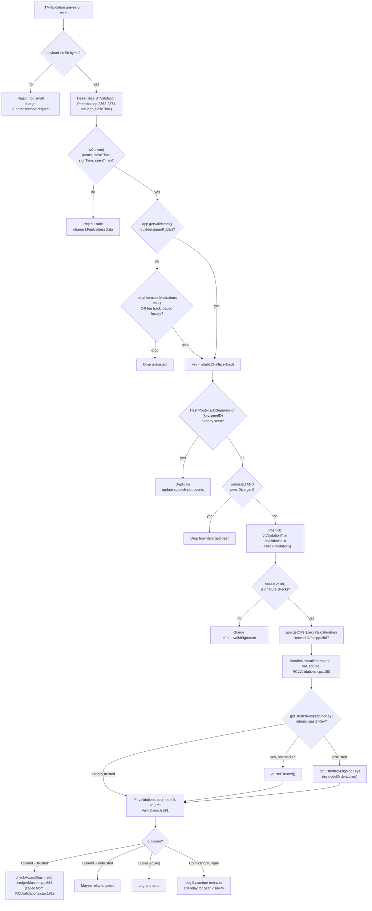
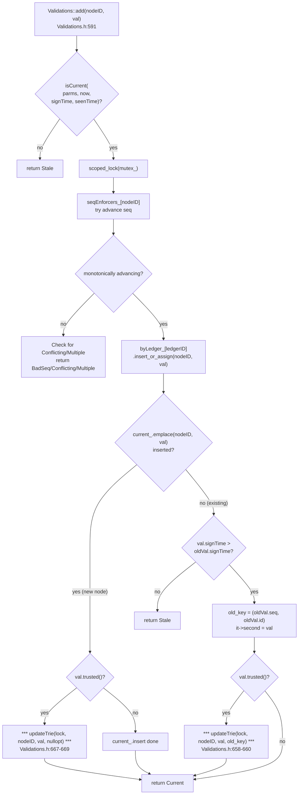
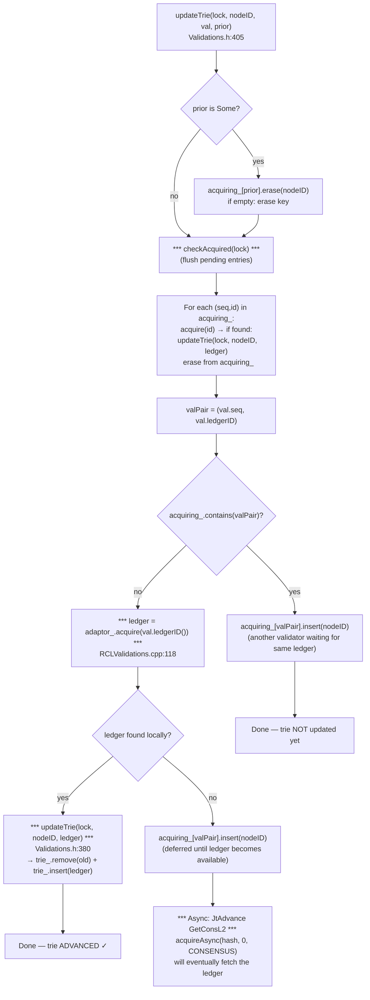
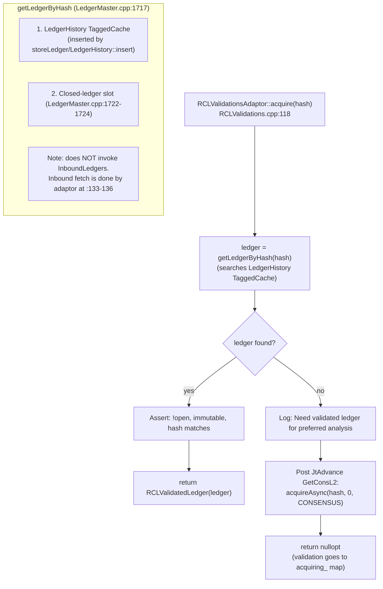
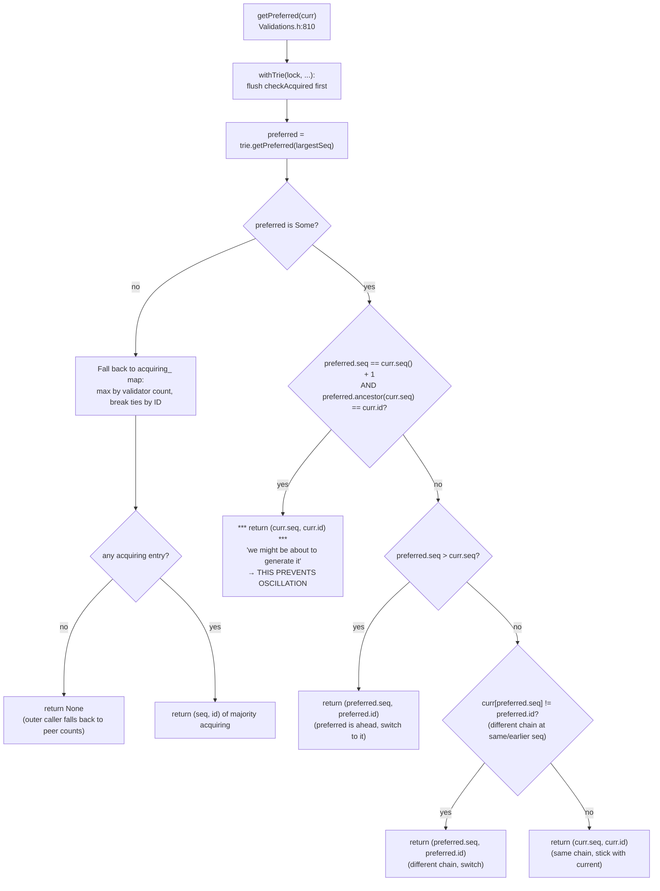

# rippled Complete Lifecycle — Single Connected Flow

```mermaid
flowchart TD
    %% ════════════════════════════════════════════════════════════════
    %% PHASE 1: APPLICATION STARTUP
    %% ════════════════════════════════════════════════════════════════
    
    START([Application::start<br/>Application.cpp:1364-1505]) --> INIT_OVERLAY["makeOverlay(setupOverlay(config))<br/>• peerFinder_ = make_Manager()<br/>• Load sqlite bootcache<br/>• SSL context setup"]
    INIT_OVERLAY --> OVERLAY_START["overlay_->start()<br/>• Timer::asyncWait() — 1s recurring<br/>• ServerHandler listens on peer port"]
    OVERLAY_START --> SET_NNL["setNeedNetworkLedger(true)<br/>NetworkOPs.cpp:984"]
    SET_NNL --> MODE_DISC["mode_ = DISCONNECTED"]
    MODE_DISC --> TIMER_1S

    %% ════════════════════════════════════════════════════════════════
    %% PHASE 2: 1-SECOND OVERLAY TIMER
    %% ════════════════════════════════════════════════════════════════
    
    TIMER_1S["⏱ Timer::onTimer() — every 1s<br/>OverlayImpl.cpp:140-162"]
    TIMER_1S --> PF_TICK["peerFinder_->oncePerSecond()<br/>• Bootcache: age/persist (60s cooldown)<br/>• Livecache: expire stale"]
    PF_TICK --> SEND_ENDPOINTS["sendEndpoints()<br/>• buildEndpointsForPeers()<br/>• peer->sendEndpoints(list)<br/>→ TmEndpoints to each peer"]
    SEND_ENDPOINTS --> AUTO_CONNECT["autoConnect()<br/>• peerFinder_->autoconnect()<br/>• needed = 20 - inFlight<br/>• for each addr: connect(addr)"]
    AUTO_CONNECT --> IDLE_CHECK{"timerCount_ % 4 == 0?"}
    IDLE_CHECK -->|Yes| DEL_IDLE["deleteIdlePeers() — remove > 600s idle"]
    IDLE_CHECK -->|No| TIMER_REARM
    DEL_IDLE --> TIMER_REARM["asyncWait() — rearm 1s"]
    TIMER_REARM -.-> TIMER_1S

    %% ════════════════════════════════════════════════════════════════
    %% PHASE 3: OUTBOUND CONNECTION
    %% ════════════════════════════════════════════════════════════════
    
    AUTO_CONNECT --> CONNECT["OverlayImpl::connect(endpoint)<br/>OverlayImpl.cpp:430-465"]
    CONNECT --> RES_MGR{"resourceManager<br/>.newOutboundEndpoint()<br/>over limit?"}
    RES_MGR -->|Over| CONNECT_ABORT["Return — no connect"]
    RES_MGR -->|OK| PF_SLOT["peerFinder().newOutboundSlot()"]
    PF_SLOT --> SLOT_OK{"slot available?"}
    SLOT_OK -->|No| CONNECT_ABORT
    SLOT_OK -->|Yes| CREATE_CA["ConnectAttempt::new(endpoint, slot, ssl_ctx)"]
    CREATE_CA --> CA_RUN["p->run() — async"]

    CA_RUN --> TCP_CONNECT["TCP connect (15s timeout)"]
    TCP_CONNECT --> TCP_OK{"success?"}
    TCP_OK -->|Fail| CA_FAIL["onFail() → peerFinder.onClosed(slot)"]
    TCP_OK -->|OK| TLS_HS["TLS handshake"]
    TLS_HS --> TLS_OK{"success?"}
    TLS_OK -->|Fail| CA_FAIL
    TLS_OK -->|OK| DERIVE_SV["sharedValue = sha512Half(<br/>sha512(local_finished) XOR sha512(peer_finished))"]

    DERIVE_SV --> BUILD_HTTP["Build HTTP Upgrade Request:<br/>• Session-Signature: sign(nodeKey, sharedValue)<br/>• Public-Key, Network-ID, Network-Time<br/>• Closed-Ledger, Previous-Ledger<br/>• X-Protocol-Ctl: compr=lz4, txrr, vprr<br/>• Upgrade: XRPL/2.2"]
    BUILD_HTTP --> SEND_HTTP["Send request → Read response"]
    SEND_HTTP --> RESP_101{"101 Switching<br/>Protocols?"}
    RESP_101 -->|No/Redirect| CA_FAIL
    RESP_101 -->|Yes| VERIFY_RESP["verifyHandshake(response, sharedValue)<br/>• Verify peer Session-Signature<br/>• Check Network-ID, not-self"]
    VERIFY_RESP --> VER_OK{"valid?"}
    VER_OK -->|Fail| CA_FAIL
    VER_OK -->|OK| NEG_FEAT["Negotiate features from response:<br/>compression, txrr, vprr, protocol version"]
    NEG_FEAT --> CREATE_PEER["Create PeerImp(socket, features, slot)"]
    CREATE_PEER --> ACTIVATE

    %% ════════════════════════════════════════════════════════════════
    %% PHASE 4: PEER ACTIVATION
    %% ════════════════════════════════════════════════════════════════
    
    ACTIVATE["overlay.activate(peer)<br/>OverlayImpl.cpp:637-655<br/>ids_.emplace(peer)"]
    ACTIVATE --> PROTO_START["doProtocolStart()<br/>PeerImp.cpp:882-920"]
    PROTO_START --> READ_START["onReadMessage(0,0) — begin read loop"]
    PROTO_START --> SEND_MANIFESTS["send(getManifestsMessage())"]
    PROTO_START --> PEER_TIMER_START["setTimer() — start 60s per-peer timer"]
    PROTO_START --> MODE_CONNECTED{"peers >= min_peers?"}
    MODE_CONNECTED -->|Yes| SET_CONNECTED["mode_ = CONNECTED"]
    MODE_CONNECTED -->|No| WAIT_PEERS["Wait for more peers"]
    SET_CONNECTED --> CONSENSUS_START

    %% ════════════════════════════════════════════════════════════════
    %% PHASE 5: PER-PEER 60s TIMER
    %% ════════════════════════════════════════════════════════════════
    
    PEER_TIMER_START --> PEER_TIMER["⏱ PeerImp::onTimer() — every 60s<br/>PeerImp.cpp:704-762"]
    PEER_TIMER --> CHK_SENDQ["largeSendq_++"]
    CHK_SENDQ --> SENDQ_OVER{">=4 consecutive<br/>ticks with queue>=128?"}
    SENDQ_OVER -->|Yes| PEER_FAIL_SQ["fail('Large send queue') → close"]
    SENDQ_OVER -->|No| CHK_USEFUL{"outbound AND<br/>tracking != Converged?"}
    CHK_USEFUL -->|No/inbound| CHK_PING
    CHK_USEFUL -->|Yes| CHK_AGE{"Diverged>300s OR<br/>Unknown>600s?"}
    CHK_AGE -->|Yes| PEER_FAIL_NU["peerFinder.onFailure(slot)<br/>fail('Not useful') → close"]
    CHK_AGE -->|No| CHK_PING
    CHK_PING{"lastPingSeq_ set?<br/>(pong not received)"}
    CHK_PING -->|Yes| PEER_FAIL_PT["fail('Ping Timeout') → close"]
    CHK_PING -->|No| SEND_PING["lastPingSeq_=rand<br/>send(TMPing{PING, seq})"]
    SEND_PING --> PEER_TIMER_REARM["setTimer() — rearm 60s"]
    PEER_TIMER_REARM -.-> PEER_TIMER

    %% tracking_ determination (from TMStatusChange)
    PEER_TIMER --> TRACK_NOTE["tracking_ set by checkTracking():<br/>|our_seq - peer_validIndex| < 24 → Converged<br/>|our_seq - peer_validIndex| > 128 → Diverged<br/>Triggered by each TMStatusChange we send"]

    %% ════════════════════════════════════════════════════════════════
    %% PHASE 6: CONSENSUS ROUND
    %% ════════════════════════════════════════════════════════════════
    
    CONSENSUS_START["beginConsensus(networkClosed)<br/>Start consensus round"]
    CONSENSUS_START --> PHASE_OPEN["Phase: OPEN<br/>Collect transactions<br/>Wait for close conditions"]
    PHASE_OPEN --> CLOSE_COND{"close conditions?<br/>• proposers>=75% of prev<br/>• OR idle > closeTime"}
    CLOSE_COND -->|No| PHASE_OPEN
    CLOSE_COND -->|Yes| ON_CLOSE["onClose(prevLedger, now, mode)<br/>RCLConsensus.cpp:308-380"]

    ON_CLOSE --> GET_PREV["getPrevLedger():<br/>netLgr = validations.getPreferred(...)"]
    GET_PREV --> PREF_DIFF{"netLgr != ledgerID<br/>AND mode != WrongLedger?"}
    PREF_DIFF -->|Yes| CONSENSUS_VC["consensusViewChange()<br/>Full/Tracking → CONNECTED"]
    PREF_DIFF -->|No| CLOSE_NOTIFY
    CONSENSUS_VC --> CLOSE_NOTIFY
    CLOSE_NOTIFY["notify(neCLOSING_LEDGER)<br/>→ Broadcast TMStatusChange"]
    CLOSE_NOTIFY --> PHASE_ESTABLISH["Phase: ESTABLISH<br/>Exchange proposals<br/>Converge on tx-set"]
    PHASE_ESTABLISH --> AGREE{"80%+ agree?"}
    AGREE -->|No| PHASE_ESTABLISH
    AGREE -->|Yes| ON_ACCEPT["onAccept(result)<br/>Build new closed ledger<br/>notify(neACCEPTED_LEDGER)"]
    ON_ACCEPT --> END_CONSENSUS

    %% ════════════════════════════════════════════════════════════════
    %% PHASE 7: endConsensus — THE DECISION POINT
    %% ════════════════════════════════════════════════════════════════
    
    END_CONSENSUS["endConsensus()<br/>NetworkOPs.cpp:2180-2235"]
    END_CONSENSUS --> CHECK_LCL["checkLastClosedLedger(peers, &networkClosed)"]
    
    CHECK_LCL --> GET_PREF["preferredLCL = getPreferredLCL(<br/>ourClosed, validIndex, peerCounts)"]
    GET_PREF --> SWITCH{"preferredLCL != ourClosed.hash<br/>AND != prevClosed?"}
    SWITCH -->|No| LEDGER_CHANGE_FALSE["ledgerChange = false<br/>(normal, same LCL)"]
    SWITCH -->|Yes| TRY_GET["consensus = getLedgerByHash(preferred)"]
    
    TRY_GET --> IN_CACHE{"found in cache?"}
    IN_CACHE -->|Yes| VALIDATE_LGR
    IN_CACHE -->|No| DO_ACQUIRE["InboundLedgers.acquire(hash, 0, CONSENSUS)"]
    DO_ACQUIRE --> ACQ_GATE{"HISTORY reason AND<br/>needNetworkLedger?"}
    ACQ_GATE -->|Yes| ACQ_SUPPRESS["return null<br/>(HISTORY suppressed during sync)"]
    ACQ_GATE -->|No| ACQ_DEDUP{"entry exists<br/>in registry?"}
    ACQ_DEDUP -->|"exists+complete"| VALIDATE_LGR
    ACQ_DEDUP -->|"exists+incomplete"| ACQ_NULL["return null (still acquiring)"]
    ACQ_DEDUP -->|"exists+failed"| ACQ_NULL
    ACQ_DEDUP -->|"new"| ACQ_CREATE["Create InboundLedger<br/>init() → trigger() → send first request"]
    ACQ_CREATE --> ACQ_NULL
    
    ACQ_NULL --> NO_CONSENSUS["consensus = null"]
    NO_CONSENSUS --> DEMOTE_IF{"mode >= TRACKING?"}
    DEMOTE_IF -->|Yes| DEMOTE_CONN["setMode(CONNECTED)"]
    DEMOTE_IF -->|No| LEDGER_CHANGE_TRUE
    DEMOTE_CONN --> LEDGER_CHANGE_TRUE["ledgerChange = true"]
    
    VALIDATE_LGR["Validate: canBeCurrent AND isCompatible"]
    VALIDATE_LGR --> COMPAT{"valid?"}
    COMPAT -->|No| LEDGER_CHANGE_FALSE
    COMPAT -->|Yes| DO_SWITCH["switchLastClosedLedger(consensus)"]
    DO_SWITCH --> LEDGER_CHANGE_TRUE

    %% ════════════════════════════════════════════════════════════════
    %% PHASE 8: switchLastClosedLedger — THE CRITICAL MOMENT
    %% ════════════════════════════════════════════════════════════════
    
    DO_SWITCH --> CLEAR_NNL["▶ clearNeedNetworkLedger()<br/>needNetworkLedger_ = false"]
    CLEAR_NNL --> REBUILD_OPEN["openLedger.accept(newLCL, retries, rules)"]
    REBUILD_OPEN --> SWITCH_LCL["ledgerMaster_.switchLCL(newLCL)"]
    SWITCH_LCL --> BCAST_SWITCH["Broadcast TMStatusChange:<br/>event=neSWITCHED_LEDGER<br/>ledger_seq = newLCL.seq (REAL NETWORK SEQ)<br/>→ Peer marks us Converged!"]

    %% ════════════════════════════════════════════════════════════════
    %% PHASE 9: MODE PROMOTION
    %% ════════════════════════════════════════════════════════════════
    
    LEDGER_CHANGE_FALSE --> MODE_PROMO["MODE PROMOTION<br/>(only when !ledgerChange)"]
    MODE_PROMO --> PROMO_TRACK{"mode==CONNECTED|SYNCING<br/>AND !needNetworkLedger_?"}
    PROMO_TRACK -->|Yes| SET_TRACKING["▶ setMode(TRACKING)"]
    PROMO_TRACK -->|No| PROMO_FULL
    SET_TRACKING --> PROMO_FULL
    PROMO_FULL{"mode==CONNECTED|TRACKING<br/>AND now < LCL.parentCloseTime<br/>+ 2×resolution?"}
    PROMO_FULL -->|Yes| SET_FULL["▶ setMode(FULL)<br/>═══════════════"]
    PROMO_FULL -->|No| BEGIN_NEXT
    
    LEDGER_CHANGE_TRUE --> BEGIN_NEXT["beginConsensus(networkClosed)<br/>Start next round"]
    SET_FULL --> BEGIN_NEXT
    BEGIN_NEXT --> PHASE_OPEN

    %% ════════════════════════════════════════════════════════════════
    %% PHASE 10: INBOUND LEDGER ACQUISITION (parallel)
    %% ════════════════════════════════════════════════════════════════
    
    ACQ_CREATE --> IL_TRIGGER["InboundLedger::trigger()<br/>InboundLedger.cpp:543-720"]
    IL_TRIGGER --> IL_HDR{"haveHeader_?"}
    IL_HDR -->|No| IL_REQ_HDR["Send TMGetLedger(liBASE, hash)"]
    IL_REQ_HDR --> IL_WAIT_HDR["Wait for TMLedgerData (header)"]
    IL_WAIT_HDR --> IL_GOT_HDR["haveHeader_ = true<br/>Know: stateHash, txHash, seq<br/>• zero txHash → haveTransactions_=true (no fetch)<br/>• zero accountHash → FATAL (failed_=true)"]
    IL_GOT_HDR --> IL_HDR_YES
    IL_HDR -->|Yes| IL_HDR_YES

    IL_HDR_YES --> IL_STATE{"haveState_?"}
    IL_STATE -->|No| IL_SCAN["getMissingNodes(256) on state tree<br/>Returns up to 256 missing nodes"]
    IL_SCAN --> IL_FILTER["filterNodes(limit):<br/>• Sort: fresh nodes before recent_nodes<br/>• All duplicates? Skip unless Timeout reason<br/>• Cap: limit=12 (timeout/blind/added, depth=0)<br/>        or 128 (reply, depth=1; high-lat reply, depth=2)<br/>• Insert sent nodes into recent_nodes<br/>• Clear recent_nodes on each timeout"]
    IL_FILTER --> IL_SEND_STATE["Send TMGetLedger(liAS_NODE, nodeIds)"]
    IL_SEND_STATE --> IL_RECV_STATE["Receive TMLedgerData from peer"]
    IL_RECV_STATE --> IL_ADD["For each node: addKnownNode()<br/>• Verify hash matches expected<br/>• Attach to tree<br/>• progress_ = true"]
    IL_ADD --> IL_STATE_DONE{"map complete?<br/>(getMissing returns 0)"}
    IL_STATE_DONE -->|No| IL_TIMER_CHECK
    IL_STATE_DONE -->|Yes| IL_STATE_YES["haveState_ = true"]
    IL_STATE_YES --> IL_TX

    IL_STATE -->|Yes| IL_TX{"haveTransactions_?"}
    IL_TX -->|No| IL_TX_SCAN["getMissingNodes(256) on TX tree<br/>Send TMGetLedger(liTX_NODE, nodes)"]
    IL_TX_SCAN --> IL_TX_RECV["Receive + addKnownNode"]
    IL_TX_RECV --> IL_TX_DONE{"TX map complete?"}
    IL_TX_DONE -->|No| IL_TIMER_CHECK
    IL_TX_DONE -->|Yes| IL_TX_YES["haveTransactions_ = true"]
    IL_TX -->|Yes| IL_COMPLETE

    IL_TX_YES --> IL_COMPLETE["ALL MAPS COMPLETE<br/>Verify hashes match header"]
    IL_COMPLETE --> IL_HASH_OK{"stateHash==header.accountHash<br/>txHash==header.txHash?"}
    IL_HASH_OK -->|No| IL_FAILED["failed_ = true ✗"]
    IL_HASH_OK -->|Yes| IL_DONE["done_ = true ✓ (signaled_ one-shot guard)<br/>setImmutable() + storeLedger<br/>Enqueue AcqDone job: checkAccept + tryAdvance"]
    IL_DONE --> IL_NOTIFY["Notify: ledger available for checkLastClosedLedger"]
    IL_NOTIFY -.-> IN_CACHE

    %% ===== TIMER/TIMEOUT =====
    IL_TIMER_CHECK["⏱ Timer fires (3s)"] --> IL_PROGRESS{"progress_?"}
    IL_PROGRESS -->|Yes| IL_RESET_P["progress_=false<br/>trigger(Reply) limit=128 depth=1<br/>(depth=2 if reply peer isHighLatency)"]
    IL_PROGRESS -->|No| IL_INC_TO["timeouts_++"]
    IL_INC_TO --> IL_TO_MAX{"timeouts_ > 6?<br/>(7th no-progress = 21s)"}
    IL_TO_MAX -->|Yes| IL_FAILED
    IL_TO_MAX -->|No| IL_RETRY["trigger(Timeout) limit=12 depth=0<br/>if timeouts>4 AND byHash_:<br/>  broadcast TMGetObjectByHash (4 state + 4 tx hashes)<br/>  byHash_=false (one-shot; re-arm on next no-progress)"]
    IL_RESET_P --> IL_SCAN
    IL_RETRY --> IL_SCAN

    %% ════════════════════════════════════════════════════════════════
    %% PHASE 11: VALIDATION → VALIDATED LEDGER
    %% ════════════════════════════════════════════════════════════════
    
    IL_DONE --> VAL_PATH["Validations accumulate for this ledger"]
    VAL_PATH --> VAL_QUORUM{"trusted count >= quorum?<br/>(ceil(UNL * 0.8))"}
    VAL_QUORUM -->|No| VAL_WAIT["Wait for more validations"]
    VAL_QUORUM -->|Yes| CHECK_ACCEPT["LedgerMaster::checkAccept(hash, seq)"]
    CHECK_ACCEPT --> CA_STALE{"seq <= validatedSeq?"}
    CA_STALE -->|Yes| CA_SKIP["Skip (stale)"]
    CA_STALE -->|No| CA_GET["getLedgerByHash(hash)"]
    CA_GET --> CA_HAVE{"found?"}
    CA_HAVE -->|No| CA_ACQ["acquire(hash, seq, GENERIC)"]
    CA_HAVE -->|Yes| CA_CUR{"canBeCurrent?<br/>quorum still met?"}
    CA_CUR -->|No| CA_SKIP
    CA_CUR -->|Yes| PROMOTE_VAL["═══ PROMOTE TO VALIDATED ═══<br/>ledger.setValidated()<br/>setFullLedger(ledger)<br/>setValidLedger(ledger)<br/>mark complete_ledgers"]
    
    PROMOTE_VAL --> DO_ADVANCE["doAdvance() → find publishable"]
    DO_ADVANCE --> PUB_FOUND{"publishable?"}
    PUB_FOUND -->|Yes| PUBLISH["setFullLedger + setPubLedger + pubLedger"]
    PUBLISH --> CLEAR_NNL2["▶ clearNeedNetworkLedger()<br/>LedgerMaster.cpp:1966"]
    PUB_FOUND -->|No| HISTORY["History fetch if needed"]
    CLEAR_NNL2 -.-> PROMO_TRACK

    %% ════════════════════════════════════════════════════════════════
    %% PHASE 12: SERVING REQUESTS TO OTHER PEERS
    %% ════════════════════════════════════════════════════════════════
    
    subgraph serving["TMGetLedger Serving — PeerImp.cpp:3300-3560"]
        SERVE_RECV["Receive TMGetLedger from peer"] --> SERVE_LOOKUP["Lookup ledger by hash/seq"]
        SERVE_LOOKUP --> SERVE_TYPE{"itype?"}
        SERVE_TYPE -->|liBASE| SERVE_HDR["Send header bytes"]
        SERVE_TYPE -->|liAS_NODE/liTX_NODE| SERVE_NODES["fatLeaves=true<br/>For each nodeId: getNodeFat(depth)<br/>Soft cap: 8192 nodes<br/>Hard cap: 12288 nodes"]
        SERVE_TYPE -->|liTS_CANDIDATE| SERVE_CAND["fatLeaves=false<br/>Serve candidate tx-set"]
    end

    %% ════════════════════════════════════════════════════════════════
    %% FINAL STATE
    %% ════════════════════════════════════════════════════════════════
    
    SET_FULL --> FINAL_STATE["═══════════════════════════════<br/>FINAL STATE: FULL MODE<br/>═══════════════════════════════<br/>• server_state: full<br/>• complete_ledgers: N-N<br/>• validated_ledger: seq=N<br/>• peers: Converged (stable)<br/>• Proposing in consensus<br/>• Publishing validations<br/>• Serving data to network<br/>• History backfill active"]
```




---

## State Machine Diagram



---

## Key Constants & Thresholds

| Constant | Value | File | Purpose |
|----------|-------|------|---------|
| `kPeerTimerInterval` | 60s | PeerImp.cpp:118 | Per-peer health check interval |
| `kSendqIntervals` | 4 | Tuning.h:35 | Consecutive large-queue ticks before disconnect |
| `kTargetSendQueue` | 128 | Tuning.h:45 | Queue size below which largeSendq resets |
| `kDropSendQueue` | 192 | Tuning.h:40 | Drop ledger/object responses above this |
| `kSoftMaxReplyNodes` | 8192 | Tuning.h:25 | Stop processing request node IDs |
| `kHardMaxReplyNodes` | 12288 | Tuning.h:30 | Absolute output cap |
| `kConvergedLedgerLimit` | 24 | Tuning.h:14 | seq diff below which = Converged |
| `kDivergedLedgerLimit` | 128 | Tuning.h:20 | seq diff above which = Diverged |
| `maxDivergedTime` | 300s | Config.h:286 | Diverged outbound peer drop timeout |
| `maxUnknownTime` | 600s | Config.h:290 | Unknown outbound peer drop timeout |
| `kCheckIdlePeers` | 4 | Tuning.h:? | Check idle peers every N timer ticks (4s) |
| `kMissingNodesFind` | 256 | InboundLedger.cpp:64 | State scan discovery cap per scan |
| `kReqNodes` | 12 | InboundLedger.cpp:65 | Blind/timeout request batch size |
| `kReqNodesReply` | 128 | InboundLedger.cpp:66 | Reply-triggered request batch size |
| `kLedgerTimeoutRetriesMax` | 6 | InboundLedger.cpp:61 | Max no-progress timeouts before fail |
| Ledger timer interval | 3s | InboundLedger.cpp:59 | Acquisition timeout check frequency |
| `kMaxConnectAttempts` | 20 | Logic.h | Max concurrent outbound attempts |
| `kWarningThreshold` | 5000 | resource/Tuning.h:12 | Resource charge warning level |
| `kDropThreshold` | 25000 | resource/Tuning.h:15 | Resource charge disconnect level |
| `kDecayWindowSeconds` | 32 | resource/Tuning.h:17 | Resource charge half-life |
| `kFeeTrivialPeer` | 1 | Fees.cpp:19 | Per-message resource charge |
| Bootcache cooldown | 60s | Tuning.h:77-81 | Persist bootcache interval |
| `kMaxQueryDepth` | 3 | PeerImp.cpp | Max getNodeFat depth in requests |
| `kLedgerBecomeAggressiveThreshold` | 4 | InboundLedger.cpp:63 | Timeouts before by-hash aggressive probe |
| `kPeerCountStart` | 5 | InboundLedger.cpp:59 | Initial peer count for acquisition |
| `kPeerCountAdd` | 3 | InboundLedger.cpp:60 | Additional peers added on timeout |
| `kMaxUsefulPeers` | 6 | InboundLedger.cpp:1259 | Max peers sampled for reply targeting |
| Registry sweep idle | 1 min | InboundLedgers.cpp:393 | Remove untouched acquisitions (NOT 5 min!) |
| Registry failure cooldown | 5 min | InboundLedgers.cpp:56 | Block re-acquire of failed hash |
| Query depth: blind/timeout | 0 | InboundLedger.cpp:578 | No child expansion for initial requests |
| Query depth: reply | 1 | InboundLedger.cpp:588 | One level child expansion on data reply |
| Query depth: reply+high-latency | 2 | InboundLedger.cpp:586 | Two levels for slow peers |
| By-hash probe cap | 4+4 | InboundLedger.cpp:1025,1034 | Max 4 state + 4 tx hashes per probe |
| JtLedgerData job limit | 5 | InboundLedger.cpp:82 | Max concurrent acquisition jobs |

---

## End-to-End Sequence Timeline



---

## Critical Path Summary

The minimum path from startup to FULL:

```
START → connect peers → endConsensus → checkLastClosedLedger
  → acquire(preferredLCL) → [STATE DOWNLOAD: ~2M nodes at ~1500/sec]
  → ledger complete → checkLastClosedLedger finds it
  → switchLastClosedLedger → clearNeedNetworkLedger
  → endConsensus → !ledgerChange + !NNL → TRACKING
  → LCL fresh → FULL
  → TMStatusChange(real_seq) → peer Converged → stable
```

**Bottleneck:** State download must complete within peer's 300s Diverged timeout. With 3 peers × ~500 nodes/sec/peer = 1500 nodes/sec, a 2M-node state needs ~1333 seconds (22 min). Since 300s < 1333s, multiple peer-disconnect/reconnect cycles are required. Each cycle preserves acquisition progress (nodes already in NuDB/cache). Eventually the accumulated progress across multiple windows completes the ledger.


---

# Authoritative Corrections and Missing Lifecycle Paths

> **Scope and precedence.** This section was checked against the local `rippled`
> source tree, primarily `OverlayImpl.cpp`, `PeerImp.cpp`, `Message.cpp`,
> `NetworkOPs.cpp`, `RCLConsensus.cpp`, `OpenLedger.cpp`, `TransactionAcquire.cpp`,
> `InboundTransactions.cpp`, `LedgerMaster.cpp`, `ValidatorList.cpp`, and the
> PeerFinder headers. It is an integral part of this reference and **takes
> precedence** if an earlier overview diagram, timeline, constant, or narrative
> conflicts with it. Earlier sections remain useful for orientation; this section
> records the exact branch conditions that the condensed diagrams omit.

## Important Behavioral Notes

These clarify behaviors that the flowchart necessarily simplifies:

| Earlier simplification | Source-verified correction |
| --- | --- |
| The lifecycle only shows an outbound connection. | A peer can be admitted through the independent inbound `OverlayImpl::onHandoff` path; it receives resource admission, an inbound PeerFinder slot, HTTP/TLS handshake checks, activation checks, and then the same `PeerImp` protocol startup. |
| Every status message causes a tracking decision from its advertised `ledger_seq`. | `TMStatusChange` is processed **on receipt**. It calls `checkTracking(ledgerseq, localValidIndex)` only when the local validated-ledger age is under two minutes. Its advertised `firstseq`/`lastseq` also update the peer's serving range. |
| A switched status makes a peer permanently converged. | `Tracking::Converged` is a current classification, not a permanent state. Later status messages can move a peer to `Diverged`; unknown or diverged **outbound** peers can still be removed by the peer timer. |
| Validator quorum is always `ceil(UNL × 0.8)`. | With no explicit command-line quorum, it is `max(ceil(effectiveUNL × 0.8), ceil(originalUNL × 0.6))`. The effective UNL excludes the Negative UNL. Missing enough publisher lists disables quorum by returning `size_t::max()`. |
| State-acquisition throughput and completion time are fixed. | They are not protocol constants. Peer availability, response contents, node-store performance, request routing, load, cache hits, and acquisition state determine them. No fixed nodes/second, completion time, or inevitable reconnect-cycle count should be inferred. |
| `FULL` means peers are stable forever. | `FULL` is an operating mode, and can be demoted by consensus/view changes. Peer usefulness, pings, resource consumption, and slot capacity are maintained independently. |
| The sweep timer is an overlay peer cleanup timer. | Overlay has its own one-second timer and peer timers. `ApplicationImp::doSweep` is a configurable application-wide cache/maintenance sweep; it does not itself decide normal peer liveness. |

## 1. Complete Connection Admission: Inbound and Outbound

### Inbound HTTP upgrade — `OverlayImpl::onHandoff`

An inbound TCP/TLS session reaches `OverlayImpl::onHandoff(stream, request,
remoteEndpoint)` after the server handler has parsed the HTTP request. This is
not the reverse of `ConnectAttempt`; the following admission work is local to
the accepting node:

```mermaid
flowchart TD
    A[Inbound HTTP handoff] --> B{processRequest handled it?}
    B -->|yes| X[Return ordinary handoff result]
    B -->|no| C{is XRPL peer upgrade?}
    C -->|no| X
    C -->|yes| D[Obtain local socket endpoint]
    D --> E[resourceManager.newInboundEndpoint(remote IP)]
    E --> F{Consumer says disconnect?}
    F -->|yes| R0[Reject/return]
    F -->|no| G[peerFinder.newInboundSlot(local, remote)]
    G --> H{Slot allocated?}
    H -->|no: IP limit or duplicate| R1[Refuse; handoff not moved]
    H -->|yes| I{Connect-As includes peer?}
    I -->|no| R2[503 redirect with peer-ips; preserve keep-alive if requested]
    I -->|yes| J{Negotiate Upgrade protocol version}
    J -->|no| R3[onClosed(slot); error response]
    J -->|yes| K[makeSharedValue from TLS finished messages]
    K -->|failure| R4[onClosed(slot); error response]
    K -->|success| L[verifyHandshake: signature, network, endpoint/self checks]
    L --> M{PeerFinder.activate slot/key/reserved succeeds?}
    M -->|no| R5[onClosed(slot); redirect response]
    M -->|yes| N[Create inbound PeerImp; add to peers and lifetime list]
    N --> O[PeerImp.run → doAccept]
    O --> P[Activate peer ID; write HTTP upgrade response]
    P --> Q[After complete response: doProtocolStart]
```

`verifyHandshake` supplies the node public key to the resource consumer.
`PeerFinder::activate` treats a cluster member or a configured peer reservation
as reserved. Inbound admission can therefore fail after the HTTP request has
already been recognized as a peer request: duplicate public key, full inbound
capacity, disabled inbound capacity, or handshake validation all remain possible.

`PeerImp::doAccept` activates the peer ID before writing its HTTP upgrade
response. It begins XRPL protocol reads only after the response write completes.
This avoids interpreting buffered protocol bytes before the upgrade has been
successfully sent.

### Outbound contrast

`OverlayImpl::connect` first creates an outbound resource consumer and calls
`peerFinder().newOutboundSlot(remoteEndpoint)`. `ConnectAttempt` performs TCP
connect, TLS client handshake, `peerFinder().onConnected(slot, localEndpoint)`
(self-connect check and state change), creates/sends the HTTP upgrade request,
reads/verifies the response, activates the PeerFinder slot, and finally hands a
`PeerImp` to `OverlayImpl::addActive`. Both directions converge at
`PeerImp::doProtocolStart`, but only the inbound path writes the HTTP response
inside `PeerImp::doAccept`.

## 2. PeerFinder Slots, Directional Capacity, and Release

PeerFinder distinguishes **attempts**, **accepted-but-unhandshaken inbound
sessions**, **active inbound peers**, and **active outbound peers**. Capacity is
enforced at activation, not merely when a slot object is allocated.

| Item | Implementation behavior |
| --- | --- |
| Default overall peer target | `kDefaultMaxPeers = 21`. |
| Default outbound target | `max(round(maxPeers × 15%), 10)`; for the default target this is 10. |
| Default inbound target | `maxPeers - outPeers` when incoming peers are enabled; normally 11 at the default target. |
| Private/no-listener mode | `wantIncoming == false`; outbound target becomes `maxPeers`, inbound target is zero. A validator key makes peer privacy true after this capacity computation, yielding soft privacy unless the operator explicitly configured peer privacy. |
| Explicit capacities | `[peers_max]` may determine derived capacities, or both inbound and outbound limits must be supplied. Outbound explicit limits must be 10–1000 and inbound limits at most 1000. |
| Attempts | At most `kMaxConnectAttempts = 20` simultaneous outbound attempts. Attempts are not active outbound peers. |
| Per-IP rule | A new inbound connection from a public address is refused when adding it would exceed `ip_limit`; the default starts at 2 and is bounded by half the inbound capacity. |
| Duplicate rules | A duplicate remote endpoint is refused when creating either direction; duplicate public keys are refused at activation. Outbound `onConnected` also detects a self-connect by endpoint. |
| Fixed/reserved peers | Fixed or reserved peers pass `Counts::canActivate` even when normal directional capacity is full. They count as active peers but do not consume the normal inbound/outbound active-slot counters. |

`Counts::canActivate` uses `inActive < inMax` for normal inbound peers and
`outActive < outMax` for normal outbound peers. Thus, a large number of inbound
HTTP handshakes cannot become active merely because outbound capacity is free,
and the reverse is also true.

## 3. Protocol Start and the Manifest Exchange

After the HTTP upgrade has completed, `PeerImp::doProtocolStart` does three
independent things:

1. Starts the framed protocol read loop with `onReadMessage({}, 0)`.
2. For an **inbound** peer that supports validator-list propagation, sends the
   validator-list data already available locally via `ValidatorList::sendValidatorList`.
   The sent list hash is marked in `HashRouter` for that peer so it is not sent
   again through the normal propagation path.
3. Sends `OverlayImpl::getManifestsMessage()` when one exists, then arms the
   60-second peer timer.

### `TMManifests` semantics

`PeerImp::onMessage(TMManifests)` rejects an empty list as useless data, charges
a moderate burden for more than 100 entries, and queues normal processing on
`JtManifest`. `OverlayImpl::onManifests` then:

1. Deserializes each manifest.
2. Applies it to `ValidatorManifests`.
3. Relays only manifests whose disposition is `Accepted`.
4. Publishes accepted manifests locally and persists a manifest if its master
   key is listed by the ValidatorList.

A validator manifest binds a master identity to the current signing key (or
revokes that identity). It is therefore required to resolve a validation or
proposal signer to its master identity. **A manifest alone does not put a node
in the UNL and does not itself make its validation trusted.** Trust comes from
the ValidatorList intersection and its current, non-revoked signing-key set.



## 4. `TMStatusChange`, Ledger Ranges, and Peer Tracking

`PeerImp::onMessage(TMStatusChange)` is both peer-status reporting and local
acquisition metadata. Its detailed behavior is:

1. If `networktime` is absent, it fills it with this node's current network time
   for the published peer-status event.
2. It stores `lastStatus_`. If the incoming message lacks `newstatus`, the prior
   `newstatus` is retained while the rest of the status is replaced.
3. For `neLOST_SYNC`, it clears `closedLedgerHash_` and `previousLedgerHash_`
   (logging only if the former changed), then **returns immediately**. It does
   not apply range or tracking updates from that status.
4. Otherwise, a 32-byte `ledgerhash` becomes `closedLedgerHash_` and is added to
   the bounded recent-ledger collection. A valid 32-byte `ledgerhashprevious`
   does the same for `previousLedgerHash_`. Missing or malformed values clear
   the corresponding stored hash.
5. It updates `minLedger_` and `maxLedger_` only when **both** `firstseq` and
   `lastseq` are present. A zero bound or `lastseq < firstseq` resets both to
   zero. If either field is absent, the prior serving range remains unchanged.
6. If `ledgerseq` is present and the local validated ledger is younger than two
   minutes, it calls `checkTracking(peerLedgerSeq, localValidLedgerIndex)`.
7. It publishes structured peer status/event/range information to subscribers.

The tracking comparison is strict: a difference `< kConvergedLedgerLimit` (24)
sets `Converged`; a difference `> kDivergedLedgerLimit` (128), when not already
diverged, sets `Diverged` and records `trackingTime_`. A difference in the
inclusive middle range changes neither state. The peer's range is also used by
`hasLedger`, `hasRange`, and `checkTracking(validationSeq)` (the latter compares
its `maxLedger_` with a supplied validation sequence).

`PeerImp::cycleStatus()` is distinct from receipt of `TMStatusChange`: while
holding `recentLock_`, it copies `closedLedgerHash_` into
`previousLedgerHash_`, then clears the closed hash. `endConsensus` uses it to
remove obsolete peer LCL claims; see section 10.

## 5. Validator Lists, Trusted Keys, and Quorum

### Loading and activation of trust material

At initialization, `ValidatorList::load` validates configured publisher keys
and explicit validator keys, derives a publisher-list intersection threshold,
and adds the local validator master key as a configured listing when applicable.
The default publisher threshold is 1 for fewer than three configured publishers,
otherwise `floor(publishers / 2) + 1`; an explicit configured threshold is used
when supplied.

Validator-list blobs are accepted only after publisher-manifest handling,
publisher membership, signature verification, supported version, sequence,
effective time, and expiration checks. `applyListsAndBroadcast` can propagate
accepted/current data and clears the UNL-blocked state only when required
publisher lists are available.

At every `NetworkOPsImp::beginConsensus`, rippled first imports the prior
ledger's Negative UNL and calls `ValidatorList::updateTrusted` with current
validator node IDs and the closing ledger's parent close time. That operation:

- rotates eligible future lists into their current versions and removes expired
  publisher lists;
- includes a master key only when it appears in at least `listThreshold_`
  listings and its validator manifest is not revoked;
- calculates trust additions/removals by node ID;
- resolves each trusted master key to its current signing key;
- sends trust changes to the validation subsystem; and
- blocks the UNL if required publisher data expires or if configured sources
  produce no trusted validators.

### Quorum calculation

Without an explicit `--quorum`/minimum-quorum override, the normal value is:

```text
unlSize          = trusted master keys
negativeUNL      = current Negative UNL master keys
 effectiveUnlSize = unlSize - trusted keys on Negative UNL
quorum = max(ceil(effectiveUnlSize × 0.80), ceil(unlSize × 0.60))
```

The 60% floor maintains the Negative-UNL protocol's absolute minimum based on
the original UNL. If enough configured publisher lists are unavailable to make
the list intersection unsafe, `calculateQuorum` returns `size_t::max()` rather
than using an achievable but unsafe quorum. A supplied minimum quorum overrides
this calculation and is explicitly logged as potentially unsafe.

## 6. The Open Ledger Between Closed Ledgers

The open ledger is a mutable `OpenView` rooted at the current closed ledger; it
is not an additional fully closed/validated ledger. `OpenLedger::modify` makes a
copy of the current open view, applies a caller-supplied mutation, and atomically
swaps it in only when that mutation changes the view.

When a new LCL is accepted normally or installed through
`switchLastClosedLedger`, `OpenLedger::accept` creates a fresh open view on the
new closed ledger and, while blocking concurrent `modify` calls, applies work in
this order:

1. optional retry transactions first when `retriesFirst` is selected;
2. transactions from the previous open view, collecting retries;
3. a supplied modifier (for example, TxQ admission);
4. locally held transactions through `TxQ::apply`.

Transactions that survive into the rebuilt open view may be relayed as
**recovered transactions**, but only when `HashRouter::shouldRelay(txID)` permits
it; inner batch transactions are not relayed. Consensus observes whether this
open view is empty and closes it into a candidate transaction set when its close
conditions are met.

## 7. Transaction Relay and `HashRouter` Suppression

An inbound `TMTransaction` is not blindly forwarded. `PeerImp::handleTransaction`
first ignores it from a diverged peer or while `needNetworkLedger` is true, then
deserializes it and obtains its transaction ID. It rejects an inner-batch
transaction at this overlay boundary.

For ordinary relayed transactions it calls:

```text
HashRouter::shouldProcess(txID, peerID, flags, 10 seconds)
```

The router provides short-lived duplicate suppression and flags. A recently seen
known-bad transaction receives a useless-data fee; an ordinary duplicate can
remove the transaction from the peer's reduced-relay queue. New transactions are
queued for signature/transaction checking only while the validated-ledger age
and job-queue limits permit it. Cluster-originated transactions can carry a
trusted optimization flag under the source conditions in `handleTransaction`.

Outbound relay uses `HashRouter::shouldRelay(txID)`, which returns the peer set
to skip when the transaction was recently relayed. This same mechanism is used
for recovered open-ledger transactions and for disputed transactions in
`RCLConsensus::Adaptor::share(RCLCxTx)`. Proposal, manifest, and validator-list
paths use per-peer suppression as well, avoiding reflection loops rather than
merely deduplicating by payload bytes.

## 8. Candidate Transaction Sets: `TMHaveTransactionSet` and `TransactionAcquire`

A `TMHaveTransactionSet` is an availability advertisement, not the set itself.
`PeerImp::onMessage(TMHaveTransactionSet)` validates that `hash` is 256 bits; for
`tsHAVE`, it records a new hash in `recentTxSets_` and charges a duplicate
advertisement as useless data.

When the consensus engine encounters a position whose transaction-set hash is
not local, `RCLConsensus::Adaptor::acquireTxSet` calls
`InboundTransactions::getSet(setId, true)`. The first request creates a
`TransactionAcquire`, registers it by hash, starts with two peers, and returns
no set until it completes. Existing acquisitions are retained and marked as
still needed.

```mermaid
sequenceDiagram
    participant C as Consensus
    participant IT as InboundTransactions
    participant TA as TransactionAcquire
    participant P as Peer with tsHAVE
    participant O as NetworkOPs

    C->>IT: getSet(txSetHash, acquire=true)
    IT->>TA: create once; init(start peers)
    TA->>P: TMGetLedger(liTS_CANDIDATE, root, querydepth=3)
    P-->>TA: TMLedgerData(candidate SHAMap nodes)
    TA->>TA: validate/add root and known nodes
    loop missing nodes remain
        TA->>P: TMGetLedger(liTS_CANDIDATE, up to 256 node IDs)
        P-->>TA: TMLedgerData
    end
    TA->>IT: giveSet(hash, immutable map, fromAcquire=true)
    IT->>O: mapComplete(map, true)
    O->>P: broadcast TMHaveTransactionSet(tsHAVE)
    O->>C: consensus.gotTxSet(now, set)
```

`TransactionAcquire` uses a 250 ms timer. After four normal timeouts it can
issue indirect requests, continually adds a peer, and fails after more than 20
timeouts. It validates the root against the target hash and validates every
known-node insertion. A completed map is immutable before it is passed back.
`Consensus::gotTxSet` caches a new set; if the current result exists, it updates
disputes for every current peer position that proposed that set.

A peer serves `liTS_CANDIDATE` through `TMGetLedger` using its local inbound
transaction-set map. If it lacks the set and the request is indirect, it may
route the request to a peer known to have the tree rather than inventing a reply.

## 9. Ledger History Backfill After Synchronization

Validation/publishing and historical backfill are separate responsibilities.
`LedgerMaster::doAdvance` first tries to find consecutive ledgers that can be
published from `pubLedgerSeq_ + 1` through the validated ledger. Missing
intermediate ledgers are acquired (subject to `ledgerFetchSize_`) so publication
remains ordered.

When there is no publishable next ledger, the node can fetch history only when
all of these conditions hold: not standalone, not locally loaded, fewer than ten
`JtPuboldledger` jobs, validated and published sequences equal, validated ledger
age below the acquisition maximum, and node-store write load below the
acquisition maximum. It finds a previous missing sequence from
`completeLedgers_`, applies `shouldAcquire`, then calls `fetchForHistory` with
reason `HISTORY`.

`fetchForHistory` resolves the historical hash via skip-list/history traversal,
uses `InboundLedgers::acquire`, requests a fetch pack when appropriate, marks an
acquired historical ledger full, and prefetches up to `ledgerFetchSize_` older
ledgers when the requested one is still absent. It may start `tryFill` when the
relational database already joins to the acquired ledger's parent. If history
cannot be fetched under the guards, `histLedger_` is reset; being `FULL` does
not mean history fetches run unconditionally.

## 10. Exact `endConsensus` Ordering and Obsolete Peer Positions

The post-accept `NetworkOPsImp::endConsensus` flow is:

```mermaid
flowchart TD
    A[Consensus adaptor calls NetworkOPs.endConsensus] --> B[deadLedger = local closed ledger parent hash]
    B --> C[For every active peer whose closed hash == deadLedger: cycleStatus]
    C --> D[checkLastClosedLedger(active peers, networkClosed)]
    D --> E{networkClosed is zero?}
    E -->|yes| F[Log and return; do not begin next round]
    E -->|no| G{CONNECTED or SYNCING; no ledger change; needNetworkLedger false?}
    G -->|yes| H[setMode TRACKING]
    G -->|no| I{CONNECTED or TRACKING; no ledger change; current parent close time fresh enough?}
    H --> I
    I -->|yes| J[setMode FULL]
    I -->|no| K[beginConsensus networkClosed]
    J --> K
```

The obsolete-position step is significant. `deadLedger` is the parent hash of
our current closed ledger. Any peer reporting that obsolete LCL has
`cycleStatus()` invoked: its closed hash is shifted to `previousLedgerHash_` and
its closed hash is cleared **before** peer LCL counts are calculated. This keeps
old peer reports from biasing preferred-LCL selection.

`checkLastClosedLedger` builds `peerCounts` from nonzero active-peer closed
hashes; when local mode is at least `TRACKING`, it adds one count for the local
closed ledger. Trusted validations determine the preferred LCL, with peer counts
as fallback input when trusted validation information is absent. On a different
preferred LCL it obtains the ledger locally or begins a consensus-reason inbound
acquisition, checks `canBeCurrent` and compatibility, demotes `FULL`/`TRACKING`
to `CONNECTED`, and calls `switchLastClosedLedger` only when the ledger is
available. It returns `ledgerChange == true` even while acquisition is pending,
which blocks the normal mode-promotion branches.

`switchLastClosedLedger` clears `needNetworkLedger`, rebuilds the open ledger,
switches the LedgerMaster LCL, and broadcasts `neSWITCHED_LEDGER` with the new
LCL sequence, current network time, parent hash, and LCL hash. It is an abnormal
jump/recovery path, not the ordinary ledger-close operation.

## 11. `TMProposeSet`: Verification, Relay Control, and Position Tracking

Incoming proposals enter `PeerImp::onMessage(TMProposeSet)` before consensus
sees them. The handler:

1. Requires a 64–72 byte DER signature and a secp256k1 node public key.
2. Requires 256-bit `currenttxhash` and `previousledger`.
3. Determines whether the sender's signing key is trusted through
   `ValidatorList`/manifest resolution.
4. May drop untrusted proposals immediately when `relayUntrustedProposals == -1`.
5. Builds a suppression ID from position hash, previous ledger, proposal
   sequence, close time, public key, and signature; duplicate suppression may
   trigger reduced-relay slot squelching and ends processing.
6. Drops otherwise acceptable untrusted proposals from diverged peers or during
   local load (unless the peer is in the cluster).
7. Builds `RCLCxPeerPos` and queues `checkPropose` on `JtProposalT` or
   `JtProposalUt`.

The queued check validates the proposal signature before handing trusted
positions to `NetworkOPsImp::processTrustedProposal`; that method rejects the
local validator key (or its master key) and otherwise calls
`consensus_.peerProposal(now, peerPos)`. The generic `Consensus` object stores
current positions by validator `NodeID` in `currPeerPositions_`, retains recent
positions across transitions in `recentPeerPositions_`, and tracks bowed-out
nodes in `deadNodes_`. A proposal is therefore not “counted” merely because it
arrived on a socket: it must survive parsing, trust/relay policy, suppression,
and signature checking.

When a local validator proposes, `RCLConsensus::Adaptor::propose` signs the
proposal, inserts its suppression ID locally, and broadcasts it. Relayed peer
positions use the same suppression-ID mechanism.

## 12. Resource Charging: Baseline and Non-Baseline Charges

The resource model is outcome-sensitive, not a static one-fee-per-message
lookup. `PeerImp::onMessageBegin` starts **every framed message** with
`kFeeTrivialPeer` and a context equal to the protocol message name;
`onMessageEnd` charges the final `fee_` through the peer's resource consumer.
A `Drop` disposition that also requires disconnect posts `fail("charge: Resources")`
once, guarded against duplicate queued disconnects.

The following matrix records the important handler overrides in the audited
path. It is intentionally phrased by condition, because a valid message of each
type normally retains only the trivial baseline fee.

| Message/path | Additional or replacement resource charge |
| --- | --- |
| `TMManifests` | Empty list: `kFeeUselessData`; more than 100 entries: `kFeeModerateBurdenPeer`. |
| `TMPing` | A ping request receives `kFeeModerateBurdenPeer`; a valid pong only clears the matching ping cookie. |
| `TMCluster` | From a non-cluster peer: `kFeeUselessData`. |
| `TMEndpoints` | 1024+ endpoints: `kFeeUselessData`; each malformed endpoint adds `kFeeInvalidData`. Endpoints are ignored outright unless the peer is converged and message version is 2. |
| `TMTransaction` | Inner batch transaction: moderate burden; duplicate known-bad transaction: useless data. Ordinary duplicate suppression is measured but need not add a special fee. |
| `TMGetLedger` | Invalid type/hash/sequence/query fields: invalid data; bad node ID: invalid data; more than soft reply-node limit: moderate burden; a non-relay request: moderate burden. |
| Proof-path requests/responses | Disabled feature: malformed request; request accepted for work: moderate burden; malformed/no-result worker outcomes use malformed-request or request-no-reply charges; invalid response: invalid data. |
| Replay delta request/response | Disabled feature: malformed request; accepted request sets moderate burden; malformed/no-result worker outcomes use malformed-request or request-no-reply charges; invalid response: invalid data. |
| `TMProposeSet` | Malformed signature/key: invalid signature; malformed 256-bit hashes: malformed request. Duplicate messages are suppressed and counted as duplicate traffic. |
| `TMHaveTransactionSet` | Bad hash: malformed request; duplicate `tsHAVE`: useless data. |
| Validator-list messages | No blobs: heavy burden; duplicate input: useless data; unsupported peer/feature: useless data; bad version/data: invalid data. Apply disposition additionally charges duplicate known/same sequence as useless, stale as invalid data, untrusted as useless, invalid signatures as invalid signature, and unsupported version as invalid data. |
| `TMValidation` | Too short: malformed request; not current: useless data; later parsing/signature validity paths may replace the baseline according to their failure. |
| `TMGetObjectByHash` | Malformed ledger hash, bad type, or oversized request: malformed/invalid data; accepted request: moderate burden at admission; worker errors/no reply are charged as request-no-reply. |
| Inbound `TMLedgerData` for a transaction-set acquisition | Invalid node data/ID/map insertion: invalid data; unexpected or non-useful data: useless data. |

Serving a data-heavy request can also use direct `peer->charge(...)` from its
asynchronous job, so the final charge can be incurred after the I/O dispatch
has completed. Resource accounting should therefore be described by handler
outcome, rather than assuming all work is charged synchronously in
`onMessageEnd`.

## 13. Validation Trie: Receipt → updateTrie → acquire → getPreferred

This section covers the complete chain that keeps the validation trie advancing
and enables `getPreferred()` to return the correct preferred ledger. A stalled
trie causes mode oscillation (Full → Connected every consensus round).

### 13.1 TMValidation Receipt Chain



### 13.2 Validations::add → updateTrie Decision



### 13.3 updateTrie: The Trie Insertion Gate



### 13.4 adaptor_.acquire(): What Makes a Ledger Findable



**KEY INSIGHT:** `getLedgerByHash` succeeds for consensus-built ledgers because
`consensusBuilt()` calls `ledgerHistory_.insert(ledger, false)` (at line 1094)
which stores the ledger in the TaggedCache. (`builtLedger` at line 1095 only
records consensus metadata, not the ledger itself.) A caught-up node always has
its own LCL in the history cache, so `acquire()` succeeds immediately and the
trie advances every round.

### 13.5 getPreferred(): Trie → Preferred LCL



**CRITICAL FOR STABILITY:** When a caught-up node's trie has the NEXT ledger as
preferred (because validators are validating N+1 while we're still on N), the
`PARENT_CHECK` at line 836-837 returns OUR CURRENT LCL. This means
`preferred == LCL` in `get_prev_ledger` → NO `consensusViewChange` → stays at Full.

If the trie is STALE (stuck at old seq), `getPreferred` returns that old seq
which differs from our current LCL → demotion every round.

### 13.6 Steady-State Trie Advancement

For a caught-up node building ledger N via consensus:

```
1. doAccept → consensusBuilt → ledgerHistory_.insert(N, false) [line 1094]
   → Ledger N is in LedgerHistory TaggedCache
   (builtLedger at line 1095 records metadata only, not the ledger itself)

2. Trusted validation for N arrives from network
   → handleNewValidation → validations.add(nodeID, val)
   → val.trusted() → updateTrie(lock, nodeID, val, prior)
   → checkAcquired (flush any pending)
   → acquire(N.hash) → getLedgerByHash → FOUND (from step 1)
   → trie_.insert(N) — TRIE ADVANCES TO N

3. Next consensus round: get_prev_ledger
   → getPreferred(curr=N)
   → trie returns N+1 as preferred (next tip, IF trusted support exists)
   → PARENT_CHECK: N+1 == N.seq+1 AND ancestor(N)==N.id → TRUE
   → return (N.seq, N.id) = our LCL
   → preferred == LCL → NO DEMOTION → STAYS AT FULL ✓

Note: If trie preferred is at an earlier/same seq ON THE SAME CHAIN,
getPreferred also returns curr (lines 845-851). Demotion only occurs
when preferred is on a DIFFERENT chain or strictly ahead without being
our immediate child.
```

## 14. The Application Sweep Timer (`doSweep`)

`ApplicationImp::setSweepTimer` schedules a wait for the configured
`sweepInterval` (or its node-size default). On success it enqueues a `JtSweep`
job running `doSweep`; unexpected timer errors are logged and rescheduled.
`doSweep` checks relational-database space for a non-standalone node and asks
the application to stop if the transaction database is full. It then sweeps:

- NodeFamily FullBelow and tree-node caches;
- master transaction cache;
- NodeStore caches;
- LedgerMaster's ledger-history and fetch-pack caches;
- temporary SHAMap node cache;
- validation current, sequence-enforcer, by-ledger, and by-sequence caches;
- InboundLedgers;
- LedgerReplayer tasks, deltas, and skip lists;
- accepted-ledger and cached-SLE caches; and
- allocator state through `mallocTrim`.

It finally rearms itself. `InboundLedgers::sweep` removes acquisitions whose last
action is more than one minute old and expires recent acquisition failures;
recently active acquisitions are touched instead. This maintenance is separate
from the one-second Overlay timer (endpoint exchange/autoconnect/idle reduction)
and from the 60-second per-peer timer (send queue, usefulness, and ping checks).

## 15. Compression: Negotiation, Eligibility, and Framing

Compression is negotiated through the peer feature headers. `PeerImp` enables
compression only when both the negotiated peer feature `compr=lz4` and local
`config().compression` permit it. On write, `Message::getBuffer(Compressed::On)`
calculates a compressed representation once; if compression is unavailable or
not beneficial, it writes the original uncompressed buffer.

A message is considered only when its protobuf payload is **strictly greater
than 70 bytes**. The eligible types are:

```text
TMManifests                  TMEndpoints
TMTransaction                TMGetLedger
TMLedgerData                 TMGetObjectByHash
TMValidatorList              TMValidatorListCollection
TMReplayDeltaResponse        TMTransactions
```

`TMPing`, `TMCluster`, `TMProposeSet`, `TMStatusChange`,
`TMHaveTransactionSet`, `TMValidation`, proof-path request/response,
replay-delta request, and `TMHaveTransactions` are deliberately not in this
compressible set. Even an eligible payload remains uncompressed unless LZ4 makes
it smaller than the uncompressed payload after accounting for the larger
compressed header.

Uncompressed frames have a six-byte header. LZ4-compressed frames have a
10-byte header containing compressed payload size/type plus the uncompressed
size. The parser rejects invalid algorithms, malformed sizes, oversized
uncompressed messages, and compressed frames received when compression was not
negotiated.

## 16. Peer Deactivation and Cleanup

`PeerImp::close` is idempotent on its strand: it marks the deprecated detaching
flag, cancels the peer timer, closes the socket, increments peer-disconnect
metrics, and logs the closure. Failures from reads, writes, timers, pings,
resource charging, or explicit administrative actions funnel into this close
path. A clean read EOF attempts a graceful TLS shutdown before the final close.

The peer object may remain alive until outstanding asynchronous callbacks release
their `shared_ptr`, but its destructor performs the structural cleanup in this
order:

1. `overlay_.deletePeer(id_)` — schedules reduced-relay slot deletion/squelch
   cleanup on the overlay strand.
2. `overlay_.onPeerDeactivate(id_)` — removes the peer ID from the active-ID
   map.
3. `overlay_.peerFinder().onClosed(slot_)` — removes the PeerFinder slot,
   releases its directional/attempt counters and public-key tracking, and
   updates peer-discovery state.
4. `overlay_.remove(slot_)` — removes the peer from the overlay's slot-to-peer
   map.

The resource consumer is owned by the peer and is released with it. Inbound and
outbound capacity is therefore restored when the slot is closed, while protocol
maps are cleaned only after the peer object's final ownership is gone. This
separation prevents a late callback from reactivating a closed socket or leaving
a live PeerFinder slot behind.

## Source Map for This Supplement

| Concern | Primary implementation |
| --- | --- |
| Inbound/outbound handshake and overlay membership | `src/xrpld/overlay/detail/OverlayImpl.cpp`, `ConnectAttempt.cpp`, `PeerImp.cpp` |
| Slot maxima and activation accounting | `src/libxrpl/peerfinder/Config.cpp`, `include/xrpl/peerfinder/detail/{Counts,Logic,Tuning}.h` |
| Status, manifests, proposals, routing, charges | `src/xrpld/overlay/detail/PeerImp.cpp`, `Message.cpp` |
| Consensus adapter and proposal/tx-set transitions | `src/xrpld/app/consensus/RCLConsensus.cpp`, `include/xrpl/consensus/Consensus.h` |
| LCL selection and round completion | `src/xrpld/app/misc/NetworkOPs.cpp` |
| Open ledger and transaction-set acquisition | `src/xrpld/app/ledger/detail/{OpenLedger,TransactionAcquire,InboundTransactions}.cpp` |
| Validator trust and quorum | `src/xrpld/app/misc/detail/ValidatorList.cpp` |
| Publishing, history acquisition, and cache maintenance | `src/xrpld/app/ledger/detail/LedgerMaster.cpp`, `InboundLedgers.cpp`, `src/xrpld/app/main/Application.cpp` |
