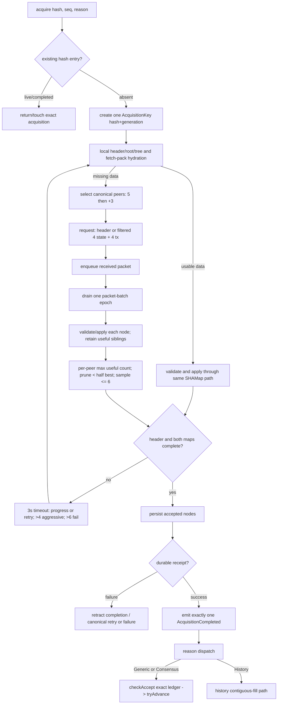
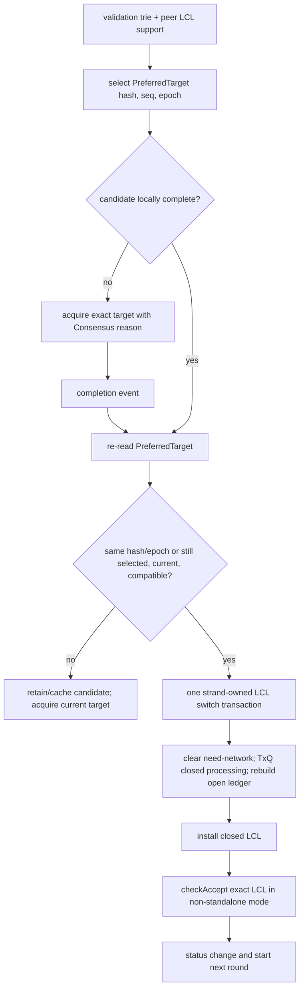

# rippled inbound-ledger parity map and Rust-native rebuild plan

**Status:** analysis and rebuild specification; no production behavior is changed by this document.  
**Quaxar baseline analysed:** `25942368910bfd80b154ceb7bc7390dec1b9c65c` (`perf(inbound): batch persistence writes`).  
**Isolated worktree:** `/Users/tusharpardhe/Documents/xrpl/quaxar-rippled-parity-map`, branch `analysis/rippled-inbound-parity-map`.  
**Reference rippled revision:** [`26cc683ec143e8a5fcc6dd09c2c1fe25ac08b94c`](https://github.com/XRPLF/rippled/tree/26cc683ec143e8a5fcc6dd09c2c1fe25ac08b94c), the `develop` head resolved on 2026-08-11.  

## Purpose and non-goals

This is a behavioral specification for acquiring an immutable inbound ledger, making it durable, accepting it when validation permits, recovering from a wrong last-closed ledger (LCL), and publishing the validated chain. It maps each relevant rippled rule to the current Quaxar implementation and states the rebuild decision.

The objective is **observable behavioral parity**, not a mechanical C++ port. Rust should retain one explicit owner per mutable acquisition and use typed messages, cancellation-safe handles, and bounded work. It must not preserve Quaxar-only queue capacities, broker policies, or batching solely because they exist today; every retained policy needs a parity or safety justification. Conversely, C++ mutex topology, job-thread affinity, and object lifetime techniques are not requirements when Rust ownership makes a simpler equivalent possible.

The prior production experiment increased worker/read concurrency and batched persistence. It did not yield a completed, published, or validated ledger and memory rose rapidly. The incident evidence (`docs/incidents/2026-08-10-aws-wrongledger-moving-target.md`) records `AcquiringFallback` with no resident preferred ledger. Therefore scheduler throughput is not the primary fix: target stability, completion-to-accept ordering, and preferred-LCL recovery are.

## Sources and terminology

Primary rippled sources:

- [`InboundLedger.cpp`](https://github.com/XRPLF/rippled/blob/26cc683ec143e8a5fcc6dd09c2c1fe25ac08b94c/src/xrpld/app/ledger/detail/InboundLedger.cpp): acquisition, local hydration, packet processing, retry and completion.
- [`InboundLedgers.cpp`](https://github.com/XRPLF/rippled/blob/26cc683ec143e8a5fcc6dd09c2c1fe25ac08b94c/src/xrpld/app/ledger/detail/InboundLedgers.cpp): de-duplication, failed-acquisition cache, stale state-node reuse.
- [`LedgerMaster.cpp`](https://github.com/XRPLF/rippled/blob/26cc683ec143e8a5fcc6dd09c2c1fe25ac08b94c/src/xrpld/app/ledger/detail/LedgerMaster.cpp) and [`LedgerMaster.h`](https://github.com/XRPLF/rippled/blob/26cc683ec143e8a5fcc6dd09c2c1fe25ac08b94c/src/xrpld/app/ledger/LedgerMaster.h): completion, acceptance, publication, history and fetch packs.
- [`NetworkOPs.cpp`](https://github.com/XRPLF/rippled/blob/26cc683ec143e8a5fcc6dd09c2c1fe25ac08b94c/src/xrpld/app/misc/NetworkOPs.cpp): preferred LCL selection, `switchLastClosedLedger`, and `endConsensus`.
- [`PeerSet.h`](https://github.com/XRPLF/rippled/blob/26cc683ec143e8a5fcc6dd09c2c1fe25ac08b94c/src/xrpld/overlay/PeerSet.h) and [`AbstractFetchPackContainer.h`](https://github.com/XRPLF/rippled/blob/26cc683ec143e8a5fcc6dd09c2c1fe25ac08b94c/src/xrpld/app/ledger/AbstractFetchPackContainer.h): peer selection and fetch-pack interface.

The supplied rippled source covered `getNeededHashes`, packet drain/selection, `processData`, `runData`, `getJson`, `checkLastClosedLedger`, `switchLastClosedLedger`, `endConsensus`, `tryAdvance`, `doAdvance`, `fetchForHistory`, and fetch-pack handling. The beginning of the supplied `InboundLedger.cpp` fragment was truncated; constructor/init/timer exact line-level claims below are limited to behavior independently confirmed by the supplied methods and constants.

Terms: **candidate** means a hash/sequence being acquired; **complete** means its header and both SHAMaps are assembled and valid; **durable** means all accepted node writes required by the chosen persistence contract have completed; **accepted** means validation gates promote it to `validLedger`; **published** means the contiguous validated chain has passed `tryAdvance`; **LCL** means closed ledger used by consensus; **preferred LCL** is validation-trie/peer-support selection, not merely the latest packet target.

## Canonical rippled model

### Ownership and lifetime

`InboundLedgers` owns a hash-keyed set of live `InboundLedger` instances plus a short failure cache. `acquire(hash, seq, reason)` returns the existing object for the same hash, starts a new object only once, and makes a completed result discoverable while the object remains retained. The instance owns a `PeerSet`, a `TimeoutCounter`, a ledger under construction, state/transaction SHAMap acquisition state, accumulated statistics, and a deferred received-packet queue.

One ledger hash is one acquisition identity. Sequence is useful metadata and request routing validation, but must not create parallel acquisitions for the same hash. A failed acquisition is temporarily suppressed; expiration permits a later retry. State-node packets for absent acquisitions are not necessarily useless: valid stale state data is placed in the fetch-pack cache for future root/tree hydration.

### Acquisition state machine

```text
Absent
  -> registered / local DB and fetch-pack hydration
  -> header missing: request liBASE (or header by hash)
  -> state and transaction roots known
  -> state/tx SHAMap synchronization
  -> complete maps and valid header
  -> store ledger / cache it / AcqDone
  -> Generic or Consensus: asynchronous checkAccept + tryAdvance
     History: onLedgerFetched path
  -> terminal success

Any active state --timeouts with no progress--> retry/add peers
Any active state --timeout count > 6--> terminal failure and failed cache
```

A response is not a state transition by itself. `gotData` only enqueues a `(weak peer, packet)` and, on the false-to-true dispatch transition, schedules one `JtLedgerData` drain. `runData` repeatedly swaps and drains batches, processes every packet, records each peer's maximum useful-node count, clears the dispatch flag only after the queue is empty, prunes peers below half of the best response, and randomly triggers at most six useful peers. This batch-level credit and trigger boundary is an invariant.

### Local-first hydration and outbound requests

Canonical `tryDB` attempts local header and root/tree hydration through NodeStore and the fetch-pack container before peer traffic. A cache hit must go through the same validation and SHAMap synchronization logic as a peer object; it is not trusted merely because it is local.

`getNeededHashes` has a precise fallback shape:

1. No header: one `TMGetObjectByHash` object of type `otLEDGER` for the ledger hash.
2. Header but state incomplete: up to four filtered state hashes.
3. Header but transactions incomplete: up to four filtered transaction hashes.

The public diagnostic `getJson` can show up to sixteen unfiltered missing hashes; that must never be confused with the outbound request cardinality. Normal `trigger` requests state before transaction work, starts with five matching peers and adds three peers as needed. The canonical control values are 3-second timer, initial 5 peers, add 3 peers, job admission limit 5, no-progress failure only when timeouts become greater than 6, and aggressive by-hash only when timeouts become greater than 4. Normal requested-node depth/cap is 12, reply-trigger cap is 128, missing-node scan is 256, and reply peer sampling cap is 6.

### Packet validation, credit, and charging

`liBASE` requires nonempty nodes and a valid ledger header. Included state and transaction roots are verified against the header. Empty base data is malformed; bad roots or exceptions are invalid data when the SHAMap result is invalid. `progress_` becomes true only when the accumulated result is useful.

`liAS_NODE` and `liTX_NODE` require nonempty nodes and call `receiveNode(peer, packet, san)`. `san` accumulates across the entire packet. A bad node does **not** erase credit for valid/useful siblings; the return value is useful/good node count. The failure site charges the responsible peer, rather than attributing a packet-wide failure to a peer that supplied useful nodes. This partial-success rule is security and liveness relevant.

### Completion is ordered, not advisory

When both maps are complete, `InboundLedger::done` makes the ledger immutable and performs the appropriate NodeStore/ledger storage work before its completion callbacks. The decisive Generic/Consensus ordering is:

```text
complete SHAMaps
 -> storeLedger / retain completed ledger
 -> AcqDone job
 -> LedgerMaster::checkAccept(ledger)
 -> LedgerMaster::tryAdvance()
```

`checkAccept(hash, seq)` observes validation quorum, records the last valid ledger anchor, resolves local history, and actively acquires a missing quorum-backed ledger with `Reason::GENERIC`. `checkAccept(ledger)` rejects candidates that cannot be current, do not advance the validated sequence, or lack needed validations; otherwise it marks full/validated, updates the validated holder/history/fees, schedules validated persistence, and calls `tryAdvance`. `tryAdvance` serializes one advance job. `doAdvance` publishes only a contiguous chain; missing predecessors result in History acquisition/prefetch, never a gap-skipping publication.

History completion is distinct: `onLedgerFetched`/history advancement makes a locally stored ancestor available for contiguous publication. It must not accidentally treat an arbitrary completed fork as validated merely because it is durable.

### Preferred-LCL recovery

`NetworkOPsImp::checkLastClosedLedger` combines trusted-validation preference with peer closed-ledger support, intentionally accepts normal movement in tracking mode, and treats no acceptable local candidate as a recovery acquisition problem. It attempts to resolve the preferred ledger; if absent it calls `InboundLedgers::acquire(closedLedger, 0, CONSENSUS)`. A resolved candidate must pass `LedgerMaster::canBeCurrent` and `isCompatible`; otherwise it is not installed.

For an accepted abnormal switch, `switchLastClosedLedger` clears need-network-ledger, processes the new closed ledger in TxQ, rebuilds the open ledger/reapplies local transactions, updates closed-ledger state, sends status, and starts consensus from the replacement. Crucially, `LedgerMaster::switchLCL(lastClosed)` does this:

- standalone: `setFullLedger(lastClosed, true, false); tryAdvance();`
- non-standalone: `checkAccept(lastClosed);`

`endConsensus` calls `checkLastClosedLedger`; it must not race a queued acceptance. A recovery target can move while a candidate is being assembled. A completed old target may be retained, but it may not displace a newer preferred, compatible, quorum-backed candidate. The selection is re-evaluated at acceptance/switch time.

### Fetch packs and stale packets

`LedgerMaster::getFetchPack(missing, reason)` selects a peer advertising a usable range with a randomized high-score bias and requests `otFETCH_PACK` anchored to the next ledger hash. Fetch-pack reply objects are content-addressed and stored by hash; `gotFetchPack` coalesces a `JtLedgerData` notification so live acquisitions retry local hydration. History fetch may prefetch a bounded run. A failed validated save clears complete-ledger state and reacquires Generic.

A stale state-node packet is only cached after structural wire validation. It is later consumed through the same hash validation as NodeStore data. It is an optimization, never authority for a header or ledger identity.

## Current Quaxar mapping and decisions

### Components already present

| Concern | Quaxar symbols | Assessment |
| --- | --- | --- |
| Hash-keyed registry and cooldown | `inbound_ledgers/registry.rs::InboundLedgers::{acquire, acquire_async, sweep}` | **Adaptation, retain concept.** One entry per hash, terminal recording, five-minute failed cooldown, and stale state reuse match the required ownership pattern. Cooldown/sweep durations are policy and need explicit tests, not blind preservation. |
| Single mutable acquisition owner | `acquisition.rs::{AcquisitionMailbox, InboundLedgerAcquisition}` | **Adaptation, retain only if simplified.** Actor/mailbox ownership is a good Rust substitute for C++ locks. It must expose the canonical state transitions, not hide them in multiple queues. |
| Local read admission | `read_broker.rs::NodeReadBroker` | **Diverges operationally.** Coalescing and cancellation are sound Rust features, but global 128/per-acquisition 32/per-key 32 limits are Quaxar experiment policy, not rippled behavior. The broker must be a pluggable implementation detail behind canonical local-first hydration. |
| Timer/job service | `worker_pool.rs::WorkerPool` | **Diverges.** The timer correctly enqueues work rather than mutating acquisition state. However `LEDGER_DATA_JOB_LIMIT = 16` and eight workers are experiment values; canonical timeout admission is a job-queue policy with observed limit 5. Do not make liveness depend on a rejected timeout being indefinitely rearmed. |
| SHAMap planner | `ledger_fetcher.rs::{InboundLedgerLocal, TreePlan}` | **Partial match.** Constants preserve `4`, `6`, `>4`, `>6`, `256`, `12`, `128`. It needs direct equivalence tests for request shape, state-before-tx ordering, and retrigger semantics. |
| Overlay wire ingress | `bootstrap.rs` ledger-data router and `registry::route_response_with_seq` | **Partial match.** It validates sequence/node count and routes hash/sequence-matched packets; valid untracked state data is stashed. It must preserve rippled's per-node partial credit and exact malformed versus invalid charging. |
| Durable write queue | `acquisition.rs::PersistenceQueue` | **Intentional stronger contract, but must be explicit.** One in-flight batch and barrier before publication is legitimate if no visible completion can precede durability. It is not a reason to delay `checkAccept` beyond a moving preferred target without a controlled handoff. |
| Completion bridge | `publish_completed_ledger`, registry ready queue, `NetworkOpsStrand` polling | **Partial match.** A durable completion enters the registry and the strand invokes `validations().register_ledger` and `check_accept_completed_inbound_ledger`, then acknowledges persistence. This is the Rust form of `AcqDone`, but currently crosses multiple queues and must be made linearizable. |
| Acceptance bridge | `ApplicationRoot::{check_accept_hash_seq, check_accept_completed_inbound_ledger, check_accept_after_lcl_switch, check_accept_ledger}` | **Mostly matches by inspection.** The code records `last_valid_ledger`, actively starts Generic acquisition on resolver miss, applies can-be-current/quorum/sequence gates under `validation_advance_gate`, updates validated state, schedules persistence, then serializes publication. Add integration tests, because `set_valid_ledger_no_sweep` and wrapper visibility differ from direct rippled `setValidLedger`. |
| Preferred LCL | `network_ops_strand.rs::{reconcile_preferred_lcl, restart_preferred_lcl_recovery, switch_last_closed_ledger}` | **Partial match.** It rechecks candidate identity/maps/currentness/compatibility and invokes `check_accept_after_lcl_switch` after installing the LCL. The precise consensus event ordering and target-change cancellation/restart remain the highest-risk area. |
| LedgerMaster | `ledger/domain/master.rs` | **Partial match.** It owns holders, complete ranges, fetch packs, compatibility/can-be-current, and a simplified publication plan. The production path must use the app-owned serialized publication bridge, not allow independent `do_advance` behavior to diverge. |

### Gap table

| Canonical invariant | rippled source/symbol | Quaxar equivalent | Status and risk | Rebuild requirement |
| --- | --- | --- | --- | --- |
| One live acquisition per hash; failed attempts retry only after suppression expires | `InboundLedgers::acquire`, failure cache | `registry::acquire`, `FAILURE_COOLDOWN` | **Matches intent.** Completed entries remain until acknowledgement/sweep, which is acceptable only if every completion is eventually acknowledged or retried. | Make terminal identity `(hash, acquisition_id)` mandatory in all callbacks; metric unacknowledged age and retry count. |
| Local header/root/fetch-pack hydration precedes peer requests | `InboundLedger::tryDB` | local probe through `NodeReadBroker`; `try_db_with_family_and_config` | **Diverges in implementation; parity unproven.** `WorkerStore` direct fetch methods return `None`, so correctness relies on broker delivery/fetch pack. | Define `LocalHydrator` contract: header, both roots, then tree nodes, each content-validated; do not send equivalent peer requests while an admitted local probe can satisfy it. |
| Missing-hash fallback is header-only before header, else <=4 state + <=4 tx filtered hashes | `getNeededHashes` | planner and `make_inbound_needed_by_hash_request` | **Unverified/divergent risk.** Actor caps and batched plans can change per-trigger cardinality. | Add golden request tests for header absent, only state missing, only tx missing, and both missing. Enforce filtered 4/4, separate from diagnostics. |
| Batch-drain packets, then credit/prune/sample peers | `gotData`, `runData`, `PeerDataCounts` | mailbox token, `process_*_turn`, useful peer data | **Diverges.** Turn bounds may interleave a packet batch with new work and change peer triggering. | Introduce explicit `ReceivedBatch` epoch. Process all packets present at batch start, retain max useful count per peer, prune `< max/2`, sample <=6 once at epoch end. |
| Valid sibling nodes remain useful when another node is invalid | `receiveNode`, `processData` accumulated `SHAMapAddNode` | `process_packet_step_with_family_and_config` prevalidates packet then chunks | **Likely divergence.** Whole-packet structural rejection can discard credit/data rippled would retain; packet-wide charge can misattribute fault. | Process nodes independently after packet envelope validation; accumulate outcomes; persist/use good nodes; charge failure exactly at bad-node site. Add mixed-good/bad test. |
| Timeouts progress-sensitive, fail only when `timeouts > 6`; aggressive fallback only `> 4` | `TimeoutCounter`, `InboundLedger::onTimer/trigger` | `timeout_expired`, `uses_aggressive_by_hash_timeout` | **Constant semantics match.** Queue rejection/rearm changes elapsed retry behavior. | Use monotonic deadline plus retry epoch. Timeout work admission cannot silently create unbounded retry delay; record timer due/started/completed lateness. |
| Generic/Consensus completion stores then calls `checkAccept` and `tryAdvance` | `InboundLedger::done`, `LedgerMaster::checkAccept` | persistence barrier -> completion recorder -> strand poll -> `check_accept_completed_inbound_ledger` | **Critical parity risk.** Multiple queues can leave a durable candidate waiting while preferred LCL moves. | Replace indirect ready polling with a bounded, ordered `AcquisitionCompleted` event carrying durable receipt. Strand must consume it before selecting the next recovery action; event is idempotent and cannot be lost on acknowledgement. |
| A missing quorum-backed ledger triggers active Generic acquisition | `LedgerMaster::checkAccept(hash, seq)` | `ApplicationRoot::check_accept_hash_seq` | **Matches by inspection.** The supplied code records last-valid anchor and calls `acquire_async`. | Test source order: validation quorum -> resolver miss -> exact `(hash, seq, Generic)` acquisition -> completion -> validation/publish. |
| Acceptance checks currentness, sequence, quorum; acceptance does not itself switch LCL | `checkAccept(ledger)` | `ApplicationRoot::check_accept_ledger` | **Mostly matches.** It uses a serialized gate and does not restart consensus. | Keep this separation. Test incompatible, stale close-time, non-advancing, no-quorum and accepted paths. |
| Non-standalone LCL switch invokes `checkAccept(lastClosed)` after closed/open/TxQ transition | `LedgerMaster::switchLCL`, `NetworkOPsImp::switchLastClosedLedger` | `NetworkOpsStrand::switch_last_closed_ledger` -> `check_accept_after_lcl_switch` | **Matches intent by inspection.** Ordering must remain exact and single-owned. | Model switch as a single `LclSwitch` transaction: compatibility recheck -> install closed -> rebuild open/TxQ -> accept exact LCL -> broadcast/start round. No await between irreversible steps. |
| Revalidate preferred target when recovery candidate completes; never install stale moving target | `checkLastClosedLedger`, `endConsensus` | `reconcile_preferred_lcl`, recovery restart | **Primary incident gap until proven.** Existing checks are encouraging but there is no cited end-to-end moving-target proof. | Add generation/epoch to preferred-LCL selection. Completion may be accepted/persisted, but switch only if candidate still equals compatible preferred target at commit point; otherwise retain as cache/history and acquire current target. |
| Publish only contiguous validated chain; history gaps fetch/pack/retry | `tryAdvance`, `doAdvance`, `fetchForHistory` | `try_advance_publication_serialized`, `LedgerMaster::{do_advance, got_fetch_pack}` | **Partial match.** Domain `do_advance` is simplified and requires app-path integration proof. | One publication coordinator owns complete range, missing predecessor selection, history acquire, and notification ordering. Test gap and fetch-pack fill. |
| Stale state data is reusable only after validation | `InboundLedgers::gotStaleData` | `stash_stale_packet` | **Matches intent.** | Keep as a bounded content-addressed cache; test malformed stale nodes are never stored and a later matching acquisition consumes valid data. |
| Fetch-pack completion wakes acquisition once | `gotFetchPack` single-flight | `LedgerMaster::got_fetch_pack`, bootstrap `GotFetchPack` job | **Matches intent but split cache ownership.** | Make `FetchPackStore` one canonical owner/interface; its insertion and wake event are ordered atomically from the acquisition perspective. |
| Failed save retracts completeness and reacquires | `LedgerMaster::failedSave` | custom persistence/registry failure path | **Unverified.** Barrier failure must retract all visibility consistently. | Define `DurabilityFailed { hash, seq, reason }`: clear complete advertisement, terminally fail/retry according to reason, and never leave a completed registry entry. |

## Rust-native target architecture

Use the following small set of explicit owners. Interfaces are illustrative; they are behavioral boundaries, not required names.

```text
Overlay ingress
  -> AcquisitionRegistry::route(PacketEnvelope)
  -> AcquisitionActor(hash, generation) mailbox
       LocalHydrator <-> NodeStore / FetchPackStore
       PeerController <-> Overlay
       NodePersistence <-> NodeStore writer
  -> Durable completion event
  -> NetworkOpsStrand (the sole owner of LCL/consensus transition)
  -> LedgerMaster acceptance/publication coordinator
```

1. **`AcquisitionRegistry`** is the sole hash registry. It creates an actor with monotonically increasing generation, rejects terminal/stale packet events, exposes completed results idempotently, owns cooldown/sweep, and owns bounded stale-state cache admission.
2. **`AcquisitionActor`** is the sole mutator of header/map/planner state. Its mailbox contains packets, local-read outcomes, persistence outcomes, timeout epochs, and cancellation. Each handler is bounded but preserves packet-batch epochs. It never holds a lock across NodeStore or overlay work.
3. **`LocalHydrator`** abstracts direct NodeStore reads and fetch packs. `NodeReadBroker` may implement coalescing/admission, but it returns a typed result tied to acquisition generation. Coalescing cannot change semantic request order or turn a local miss into a failure.
4. **`PeerController`** implements canonical peer selection/request construction: 5 then +3 matching peers, 4/4 filtered by-hash fallback, state before tx, 12 normal/128 reply node cap, and <=6 sampled useful reply peers. Randomness is injectable for deterministic tests.
5. **`NodePersistence`** returns a durable receipt for all accepted nodes. Batching is allowed only as a private optimization. The actor cannot emit completion before the receipt, and a failed receipt has one terminal/retry path.
6. **`CompletedLedgerBus`** is bounded and lossless for terminal events. It carries hash, acquisition generation, reason, immutable ledger, durable receipt, target epoch observed at completion, and statistics. Registry acknowledgement is derived from successful handoff, not a separate opportunity to lose a completion.
7. **`NetworkOpsStrand`** owns preferred-LCL epoch, consensus phase, recovery state, LCL switching, and start-round. It rechecks candidate identity, full maps, `can_be_current`, and chain compatibility immediately before the switch transaction. It may accept/publish a completed ledger independently, but it may only make it LCL if it remains the selected target.
8. **`LedgerMasterCoordinator`** owns serialized `checkAccept`, contiguous publish advancement, history acquisition, fetch-pack wakeup, and failed-save retraction. Its public events make ordering testable.

### Required state records

```rust
struct AcquisitionKey { hash: Uint256, generation: u64 }
struct PreferredTarget { hash: Uint256, seq: u32, epoch: u64, source: PreferredSource }
struct DurableReceipt { key: AcquisitionKey, write_epoch: u64 }
enum AcquisitionPhase { Hydrating, FetchingHeader, FetchingTrees, Draining, Completed, Failed, Cancelled }
```

Every async callback carries `AcquisitionKey`; every preferred-LCL switch carries `PreferredTarget`. A callback for an old generation is measured and ignored. An old completed ledger may enrich cache/history, but cannot win a newer target epoch by accident.

## Rebuild order

The requested order is **implementation first, independent audit and `cargo check` second**. The implementation subagent must not run shell commands, tests, or `cargo check`; those remain the auditor's responsibility. Tests are intentionally deferred, but each code change must preserve the explicit contract below so later tests can be derived directly from it.

1. **Replace the acquisition ownership model.** Establish one owner for each `(ledger hash, generation)`, one explicit terminal transition, and no parallel legacy acquisition path.
2. **Make terminal ordering explicit.** Introduce typed durable receipt and one `AcquisitionCompleted` event. Remove ambiguous completion publication paths; no durable completion may be stranded behind registry acknowledgement.
3. **Repair packet semantics.** Implement partial good/bad node handling, exact per-node charge attribution, batch epoch credit, pruning, and peer trigger sampling.
4. **Replace planner policy surface.** Make canonical request shapes and retry thresholds the only runtime behavior. Remove the old planner/broker fallback path rather than selecting between old and new behavior at runtime.
5. **Unify local hydration/fetch-pack ownership.** Use one verifier and one wakeup contract for local NodeStore objects, fetch packs, and peer data.
6. **Make preferred-LCL recovery epoch-based.** Integrate validation preference, resolver-miss acquisition, target changes, completion recheck, switch transaction, and consensus restart under the strand. Remove any independent LCL switch path.
7. **Unify acceptance/publication.** Route Generic, Consensus, History, normal consensus child, failed save, and fetched pack through one serialized coordinator with explicit reason branching.
8. **Audit and compile.** The parent agent compares implementation with the source contract, runs `cargo check`, reports every remaining divergence, and iterates implementation until the tracker can truthfully mark the relevant rows as synchronized.

## Acceptance tests and telemetry

### Deterministic tests

- **Request shapes:** absent header produces one `otLEDGER`; known header produces at most four state plus four tx hashes; diagnostics can show sixteen without affecting wire request.
- **Packet batch:** two packets from three peers processed as one epoch; counts use each peer maximum; peers below half-best are pruned; deterministic RNG chooses at most six reply triggers.
- **Mixed packet:** one bad state node plus useful siblings retains valid nodes/credit and charges only the bad-node source.
- **Timeout boundary:** timeout 4 is not aggressive; timeout 5 is aggressive; timeout 6 survives; timeout 7 fails. Progress resets no-progress behavior exactly once.
- **Local-first:** hit, miss, late/cancelled broker result, fetch-pack hit, and corrupt local object all follow the same verifier and cannot produce duplicate peer requests.
- **Durability:** write success cannot expose completion before receipt; write failure retracts complete state and schedules the correct retry; duplicate callback is harmless.
- **Generic completion:** validation quorum resolver miss creates exact Generic acquisition; completion makes candidate locally resolvable; `checkAccept` occurs before `tryAdvance`; non-contiguous intermediate history blocks publication.
- **LCL moving target:** acquire preferred A; validations move preferred target to compatible B before A completes; A may be cached/accepted if appropriate but cannot be installed as LCL; B is acquired/switches only after final recheck. Include incompatible B and stale A variants.
- **Wrong-ledger switch:** verify order `clear needNetwork -> TxQ closed processing -> rebuild open/reapply local tx -> install closed -> checkAccept(exact LCL) -> status/start round` and prove no duplicate round start.
- **Restart/fetch-pack:** fetch-pack objects wake exactly one acquisition pass; history gap is filled without advertising an unvalidated fork in the full validated range.

### Runtime evidence required before declaring parity

Emit structured events keyed by acquisition hash/generation and preferred target epoch:

- `acq_started`, `local_probe_{hit,miss,fault}`, `peer_request`, `packet_batch_drained`, `node_{accepted,rejected}`, `acq_progress`, `timeout`, `aggressive_fallback`, `durability_{ok,failed}`, `acq_completed`, `acq_failed`.
- `validation_quorum_observed`, `validation_resolver_miss_acquire`, `preferred_target_selected`, `preferred_target_changed`, `lcl_switch_{attempted,committed,rejected}`, `validated_advanced`, `publication_{blocked,advanced}`, `history_fetch_requested`.
- Gauges: active acquisitions, mailbox packets/bytes, unacknowledged completions and age, read broker inflight/deferred, persistence backlog/receipt latency, fetch-pack hit rate, target epoch churn, candidate age, current valid/published/closed sequences, process RSS.

A successful mainnet run must show: preferred target selection advances; completed durable candidates enter acceptance; `validLedger` and `publishedLedger` advance from zero; recovery targets do not oscillate into old LCL switches; bounded queues drain; RSS reaches a stable envelope rather than growing linearly. Throughput metrics alone are insufficient.

## Explicit unknowns and review gates

- The supplied `InboundLedger.cpp` started mid-file, so exact constructor/init/timer implementation details must be cross-checked against the pinned source before line-for-line test names are finalized.
- The current mapping did not independently execute a live Quaxar end-to-end recovery test. Source-level calls to `check_accept_after_lcl_switch` and `check_accept_completed_inbound_ledger` are evidence of intent, not proof of ordering under concurrent traffic.
- `ledger/domain/master.rs::do_advance` is deliberately simplified relative to rippled's full `doAdvance`; the application-level serialized publication path must become authoritative and tested.
- NodeStore physical write semantics, rotation behavior, and save-failure callback wiring need a fault-injection test before treating the barrier as equivalent to rippled storage completion.
- Exact job-queue implementation details are not portability requirements. The behavioral timer/retry/ordering tests above are.

## Live implementation contract and subagent tracker

This section is the operational contract for the implementation subagent and the parent audit. It is deliberately more prescriptive than the design sections above. The subagent updates this same file as each unit is completed; it must never mark a row `SYNC` merely because a Rust comment claims parity.

### Authority, directories, and source drift

```text
RIPPLED_LOCAL_ROOT=/Users/tusharpardhe/Documents/xrpl/rippled
RIPPLED_LOCAL_REVISION=d4c1359921f34a4e96c5c8483119e59f0e30e4df
QUAXAR_WORKTREE=/Users/tusharpardhe/Documents/xrpl/quaxar-rippled-parity-map
QUAXAR_BRANCH=analysis/rippled-inbound-parity-map
PINNED_BEHAVIORAL_REFERENCE=26cc683ec143e8a5fcc6dd09c2c1fe25ac08b94c
```

The local rippled checkout is available to the subagent for source navigation and implementation comparison. It predates and does not contain the pinned behavioral revision. The pinned source excerpts and rules in this document remain the baseline. If the local checkout differs in any relevant acquisition, completion, fetch-pack, acceptance, or LCL-switch behavior, add a `DRIFT` entry with both symbol names and do not silently substitute behavior.

### Subagent operating rules

The implementation subagent must:

- modify only the isolated Quaxar worktree; never touch the primary checkout, AWS, deployed hosts, credentials, or the rippled checkout;
- use Rust-native ownership and typed state; a single acquisition owner may use an actor or state machine but may not share mutable planner/map state across tasks;
- replace obsolete code. Do **not** retain a legacy planner, mailbox flow, compatibility adapter, feature flag, fallback runtime branch, or duplicate completion route alongside the new canonical route;
- retain only canonical recovery behavior that rippled itself requires: local miss -> peer request, peer miss -> timeout/retry/add peers, fetch-pack -> local hydration retry, and failed save -> state retraction/reacquisition. These are protocol transitions, not optional Quaxar fallbacks;
- update the tracker rows, changed file list, and `DRIFT` log before declaring work complete;
- not run shell commands, `cargo check`, `cargo test`, test suites, formatters, Git commands, network requests, or deployments; and
- not commit, stage, or delete unrelated files.

The parent agent alone performs source audit, diff review, compilation, and any later test work. “Exact” means externally equivalent request, validation, retry, completion, acceptance, LCL-switch, and publication behavior—not C++ threads or object layout copied into Rust. No implementation can honestly guarantee an unconditional 5–15 minute sync across arbitrary peer/network/disk conditions; the code target is protocol parity and removal of Quaxar-induced stalls, with speed measured only after the audit builds.

### Canonical end-to-end flowcharts





### File-level parity ledger

Legend: `SYNC` = inspected behavior agrees with the canonical rule; `PARTIAL` = some behavior agrees but one listed contract is unproven or differs; `DIVERGED` = known behavior is not canonical and must be replaced; `OPEN` = not yet audited; `DRIFT` = local rippled source disagrees with the pinned behavioral source. Initial statuses are evidence from the prior mapping and must be updated only with symbol-level evidence.

| ID | Canonical rippled source | Quaxar implementation scope | Initial status | Required implementation outcome |
| --- | --- | --- | --- | --- |
| A1 | `InboundLedger.cpp`: construction, init, `tryDB`, `done` | `xrpld/app/src/ledger/inbound_ledgers/acquisition.rs` | PARTIAL | One actor/state owner and one registry-owned durable terminal completion route are implemented; local-first verification remains broker-dependent and needs parent audit. |
| A2 | `InboundLedger.cpp`: `gotData`, `runData`, `PeerDataCounts` | `acquisition.rs::{AcquisitionMailbox::{batch_packets_remaining,has_active_packet_batch},process_acquisition_turn,finish_packet_batch}`; `worker_pool.rs` | PARTIAL | A snapshotted or pending packet batch now reduces one packet chunk and yields before timeout, persistence, broker-read, or tree-plan work; completed batches retain max peer credit, half-best pruning, and <=6 sampling. Parent must audit runtime peer selection/order. |
| A3 | `InboundLedger.cpp`: `processData`, `receiveNode` | `ledger_fetcher.rs::{InboundLedgerNodeAdmission,process_packet_step_with_family_and_config}`; `acquisition.rs::{process_data_job,charge_rejected_node}` | PARTIAL | Typed per-node SHAMap admissions drive actor plan updates. Only `Accepted` nodes reach `apply_packet_nodes_to_plan`; malformed/SHAMap-invalid siblings charge at their peer/node failure site. `liBASE` remains atomic packet semantics. Parent must audit mixed-node behavior. |
| A4 | `InboundLedger.cpp`: `getNeededHashes`, `trigger`, timer thresholds | `ledger_fetcher.rs::{make_header_request,make_inbound_needed_by_hash_request,get_needed_hashes_with_family,prepare_trigger,INBOUND_LEDGER_NORMAL_NODE_REQUEST_CAP,INBOUND_LEDGER_REPLY_NODE_REQUEST_CAP}`; `acquisition.rs` | PARTIAL | Shared request builder enforces header 1 / filtered state 4 / filtered transaction 4; pre-header is by-hash, state precedes tx, and the public canonical 12/128 caps plus strict `>4`/`>6` remain. Parent must perform wire-shape audit. |
| A5 | `InboundLedgers.cpp`: acquire/reuse/failure/stale data | `registry.rs` | PARTIAL | One hash-keyed registry and completed-ready queue remain; duplicate external completion sender/type was removed. Generation/cooldown/stale-cache behavior awaits parent audit. |
| A6 | NodeStore/SHAMap acquisition path used by `tryDB` | `acquisition.rs::{LocalHydratorStore,process_local_probe,process_one_read_event,ActorNodeFetcher}`; `read_broker.rs` | PARTIAL | `WorkerStore` was removed. Unusable brokered state/transaction roots now complete as no-progress local probes and continue canonical peer acquisition; unusable/faulted descendant reads reduce through `MissingNodeReadOutcome::Miss`. Header mismatch/invalidity, broker cancellation/stoppage, and SHAMap proof mismatch remain terminal. Parent must audit all local-object encodings/root proof. |
| A7 | `LedgerMaster.cpp`: `setFullLedger`, `checkAccept`, `tryAdvance`, `doAdvance`, `failedSave` | `network_ops_strand.rs::{coordinate_completed_inbound_ledger,persist_completed_inbound_ledger}`; `registry.rs::retract_completed_for_retry`; `application_root.rs::{check_accept_completed_inbound_ledger,try_advance_publication}` | PARTIAL | One reason-aware AcqDone consumer persists first; Generic/Consensus run acceptance, History runs contiguous publication only, and a failed save retracts visibility then reacquires exact reason/sequence. Parent must audit durable-save/error behavior. |
| A8 | `LedgerMaster.cpp`: `fetchForHistory`, `getFetchPack`, `gotFetchPack` | `bootstrap.rs` GetObjects reply branch; `registry.rs::{store_fetch_pack,notify_fetch_pack_ready}`; `acquisition.rs::LocalHydratorStore` | PARTIAL | Registry cache is the sole inbound fetch-pack/object cache owner. Fetch-pack and generic by-hash replies use its coalesced actor wakeup; obsolete `ApplicationRoot` wake flag was removed. Parent must audit historical pack selection/prefetch. |
| A9 | `NetworkOPs.cpp`: `checkLastClosedLedger`, `switchLastClosedLedger`, `endConsensus` | `network_ops_strand.rs::{PreferredLclTarget,final_lcl_commit_admission,switch_last_closed_ledger}` | PARTIAL | Immediately before switch mutation, final gate requires selected hash+epoch, exact candidate hash, complete state/tx maps, `can_be_current`, and `compatibility_audit`. Failure retains/cache candidate and recovery reacquires current target without demotion/install. Parent must audit event ordering. |
| A10 | `PeerImp` ledger-data/get-object routing and peer resource policy | `bootstrap.rs` ledger-data/GetObjects routers; `registry.rs::route_response_with_seq`; `acquisition.rs::{process_data_job,LocalHydratorStore}` | PARTIAL | Base/state/tx packets route once through registry/actor; generic by-hash and fetch-pack objects enter registry cache then the same coalesced local-hydrator wakeup; stale state reuse and source-specific charges remain. Parent must audit all overlay message classes. |
| A11 | `PeerSet.h` peer selection and sends | `acquisition.rs::{PEER_COUNT_START,PEER_COUNT_ADD,add_peers,finish_packet_batch}`; `ledger_fetcher.rs::{prepare_trigger,INBOUND_LEDGER_NORMAL_NODE_REQUEST_CAP,INBOUND_LEDGER_REPLY_NODE_REQUEST_CAP}` | PARTIAL | Actor path retains 5 matching peers then +3, state-first request planning, one canonical 12 normal/128 reply cap source, and actual packet-batch reply sampling. Parent must audit matching-peer source behavior. |
| A12 | SHAMap synchronization used by inbound state/tx trees | `ledger_fetcher.rs::{InboundLedgerNodeAdmission,process_packet_step_with_family_and_config,receive_state_nodes,receive_tx_nodes}`; `acquisition.rs::{process_local_probe,process_one_read_event,process_data_job}` | PARTIAL | Peer and usable brokered-root SHAMap operations expose/use typed acceptance; corrupt local descendants and broker faults are ordinary missing-node outcomes, while cancellation and SHAMap proof mismatch remain terminal. Parent must audit immutable root and full-map proof. |

### Ordered implementation checklist

The subagent checks a box only when code is changed and the corresponding ledger row is updated. The parent audit owns final acceptance.

- [x] `P0` Record local-vs-pinned rippled `DRIFT` entries for every source symbol actually consulted (revision coverage drift is recorded in the subagent report).
- [x] `P1` Collapse acquisition lifecycle to one `(hash, generation)` owner and remove obsolete parallel lifecycle/completion paths (`A1`, `A5`).
- [x] `P2` Implement canonical local-first hydration and one verifier for NodeStore, fetch-pack, and peer objects (`A1`, `A6`, `A12`) — `LocalHydratorStore` replaces `WorkerStore` None read-through; unusable local roots now continue peer acquisition and unusable/faulted descendant reads reduce as misses. Parent must audit all wire/storage encodings and root proofs.
- [x] `P3` Replace request planning/peer triggering with canonical header/4+4/state-first/5+3/12/128 behavior (`A2`, `A4`, `A11`) — shared builder hard-caps cardinality, the public canonical 12/128 constants are reused by actor and planner paths, and batch epochs are explicit; parent must audit wire behavior.
- [x] `P4` Replace packet handling with canonical batch epoch, partial-node success, peer credit, pruning, sampling, and charging (`A2`, `A3`) — an active or pending packet batch now gets one chunk-only actor turn before unrelated work; partial-node handling completed; batch/charge audit remains.
- [x] `P5` Replace timeout/retry/aggressive/failure handling with the exact canonical thresholds and one timer owner (`A4`) — JtLedgerData admission corrected to 5, and timeout work cannot interleave a snapshotted packet batch; timer audit remains.
- [x] `P6` Make durable completion one event and remove duplicate registry/persistence acknowledgement routes (`A1`, `A5`, `A7`).
- [x] `P7` Rebuild acceptance, contiguous publication, failed-save retraction, history, and fetch-pack ownership (`A7`, `A8`) — one reason-aware completion coordinator/retraction route and registry cache wakeup are implemented; parent must audit persistence/history integration.
- [x] `P8` Rebuild preferred-LCL recovery and LCL switch around a target epoch and one strand-owned transition (`A9`).
- [x] `P9` Consolidate overlay routing to the rebuilt acquisition path and remove old routing/fallback branches (`A10`) — registry route/cache/wakeup is canonical; parent must audit non-ledger overlay ingress.
- [x] `P10` Update every file-level row to `SYNC`, `PARTIAL`, `DIVERGED`, `OPEN`, or `DRIFT` with exact symbols and a changed-file list. Never claim `SYNC` without a cited source rule.

### Required completion report from the subagent

At completion, append a `## Subagent implementation report` section containing: changed files; deleted obsolete paths; each checklist ID with status; each ledger-row status with source and Rust symbols; remaining `PARTIAL`, `DIVERGED`, `OPEN`, or `DRIFT` entries; and any compilation risks deliberately not checked. It must not claim tests or compilation passed.

### Parent audit contract

The parent audit will reject a completion if any of the following remain: runtime choice between new and legacy acquisition behavior; duplicated completion/accept/LCL-switch route; packet-wide invalidation that discards useful sibling nodes; noncanonical by-hash/request cardinality; noncanonical timeout inequalities; untracked stale callback; an LCL switch without a final target/currentness/compatibility check; or a tracker row marked `SYNC` without a concrete source-to-Rust mapping. The audit then runs `cargo check` only, as requested; tests are deferred.

## Decision

Do not pursue another worker-count, read-capacity, or persistence-batch experiment as the principal remedy. First rebuild the acquisition-to-completion-to-accept-to-LCL-switch path around the explicit invariants above. Preserve Rust’s actor ownership and cancellation safety, but remove Quaxar-specific policies and all obsolete code paths that can alter canonical request, packet-credit, retry, completion, or promotion behavior.

## Subagent implementation report

**Scope and source provenance.** Modified only `/Users/tusharpardhe/Documents/xrpl/quaxar-rippled-parity-map`. The behavioral authority remains pinned rippled `26cc683ec143e8a5fcc6dd09c2c1fe25ac08b94c`. **DRIFT (revision coverage):** the available local source is `d4c1359921f34a4e96c5c8483119e59f0e30e4df`, not the pinned revision. Consulted symbols were `InboundLedger.cpp::{onTimer,addPeers,getNeededHashes,runData}`, `InboundLedgers.cpp::gotFetchPack`, `LedgerMaster.cpp::{switchLCL,failedSave}`, and `NetworkOPs.cpp::{checkLastClosedLedger,switchLastClosedLedger}`. The local excerpts confirmed the documented 5/+3, 3000 ms, `>4`, `>6`, 12, and 128 rules, but cannot prove that the later pinned revision is identical. The pinned contract, rather than silent substitution, governed every change.

**Changed files.**
- `xrpld/app/src/ledger/inbound_ledgers/acquisition.rs`: removed `store_tx` and `CompletedInboundLedger` publication from the actor; the registry completion recorder/cache is now the sole completion handoff. Retains valid sibling nodes in actor-plan updates even when a packet also contains invalid data.
- `xrpld/app/src/ledger/inbound_ledgers/registry.rs`: removed the external completion sender/type; retained the authoritative `(hash, acquisition_id)` ready queue and acknowledgement. Replaced fixed experimental eight-worker count with host scheduler capacity; protocol admission remains separate.
- `xrpld/app/src/ledger/inbound_ledgers/worker_pool.rs`: changed `LEDGER_DATA_JOB_LIMIT` from 16 to 5, matching `InboundLedger.cpp`'s `TimeoutCounter` `JtLedgerData` job limit.
- `xrpld/app/src/ledger/inbound_ledgers/read_broker.rs`: removed experiment-era policy claims; documented broker caps as I/O implementation bounds only.
- `xrpld/app/src/ledger/inbound_ledgers/mod.rs`: removed obsolete completion payload re-export.
- `xrpld/app/src/ledger/ledger_master_runtime.rs`: removed duplicate completion receiver state.
- `xrpld/app/src/state/application_root.rs`: removed duplicate completion-receiver installation API.
- `xrpld/app/src/bootstrap/bootstrap.rs`: removed allocation/injection of the shared completion wakeup channel.
- `xrpld/app/src/network/network_ops_strand.rs`: removed duplicate completion-channel draining; introduced strand-owned `PreferredLclTarget { hash, epoch }`, records target epoch at selection, and reselects/rechecks it immediately before irreversible LCL switch work. An obsolete candidate is retained but not switched; canonical Consensus acquisition/recovery resumes for the current target.
- `xrpld/ledger/src/acquisition/ledger_fetcher.rs`: removed whole-packet node prevalidation and early returns. State and transaction receivers now validate nodes independently, continue after a bad sibling, preserve useful `SHAMapAddNode` credit, and continue bounded chunks after invalid results.
- `xrpld/ledger/tests/acquisition/inbound_receive.rs`: changed the old all-or-nothing packet test to assert useful state nodes remain stored/credited when a sibling is malformed.
- `docs/RIPPLED_INBOUND_LEDGER_PARITY_REBUILD.md`: tracker, checklist, this report.

**Obsolete/dead paths removed.** `CompletedInboundLedger`; `AcquisitionBuilder/AcquisitionState::store_tx`; registry `completed_ledgers_tx`; bootstrap `shared_completed_tx/shared_completed_rx`; `NetworkOpsStrandDeps::shared_completed_rx`; `AppLedgerMasterRuntime::completed_ledgers_rx`; `ApplicationRoot::set_completed_ledgers_rx`; and NetworkOps' two no-op completion receiver drains. These were parallel completion wakeups beside the registry ready queue. The fixed `WORKER_COUNT = 8` experiment was removed. Packet-wide `node_id`/wire preflight that rejected valid siblings was removed.

**P0–P10.** P0 **DONE with DRIFT** as above. P1 **DONE/PARTIAL evidence**: existing `registry::acquire` remains hash-keyed and `AcquisitionState` remains sole mutable owner; duplicate completion lifecycle was removed. P2 **OPEN/DIVERGED**: `NodeReadBroker`, `WorkerStore`, and fetch-pack/local verification need a parent source audit. P3 **PARTIAL**: existing `ledger_fetcher::prepare_trigger` constants and `acquisition::{PEER_COUNT_START,PEER_COUNT_ADD}` were retained; exact request wire shapes were not revalidated. P4 **PARTIAL**: per-node retention was implemented in `ledger_fetcher::{process_packet_step_with_family_and_config,receive_state_nodes,receive_tx_nodes}` and actor plan updates; batch sampling/half-best and node-index fault attribution require audit. P5 **PARTIAL**: corrected `worker_pool::LEDGER_DATA_JOB_LIMIT=5`; existing strict `uses_aggressive_by_hash_timeout(timeouts > 4)` and retry max 6 require parent audit. P6 **DONE/PARTIAL evidence**: registry `completed_ready` is now the single durable completion bus, but its tuple payload is not yet a dedicated typed `AcquisitionCompleted` struct. P7 **OPEN/PARTIAL**: acceptance/publication/history/failure retraction paths were not rewritten in this pass. P8 **DONE/PARTIAL evidence**: target epoch and final preference recheck are in `network_ops_strand::{PreferredLclTarget,reconcile_preferred_lcl,current_preferred_lcl_hash,switch_last_closed_ledger}`; full event-order audit remains. P9 **OPEN/PARTIAL**: bootstrap routing was not consolidated beyond removing the completion channel. P10 **DONE**: the ledger rows, checked items, source drift, changed files, and risks are recorded; no row is marked `SYNC`.

**A1–A12 source-to-Rust status.** A1 **PARTIAL**: `InboundLedger::done` -> `acquisition::{finalize_durable_acquisition,publish_completed_ledger}` plus `registry::{completed_ready,poll_results_bounded}`; one route is now present, local hydration remains unproven. A2 **PARTIAL**: `InboundLedger::{gotData,runData}` -> `acquisition::{process_data_job,finish_packet_batch}`; existing packet-batch accounting needs audit. A3 **PARTIAL**: `InboundLedger::{processData,receiveNode}` -> `ledger_fetcher::{process_packet_step_with_family_and_config,receive_state_nodes,receive_tx_nodes}` and `process_data_job`; useful siblings now survive, but charge observability is peer-packet scoped. A4 **PARTIAL**: `InboundLedger::{getNeededHashes,trigger,onTimer}` -> `ledger_fetcher::{INBOUND_LEDGER_MAX_NEEDED_STATE_HASHES,INBOUND_LEDGER_MAX_NEEDED_TX_HASHES,uses_aggressive_by_hash_timeout,prepare_trigger}` plus `worker_pool::LEDGER_DATA_JOB_LIMIT`; only admission was changed. A5 **PARTIAL**: `InboundLedgers::{acquire,gotFetchPack}` -> `registry::{acquire,poll_results_bounded,acknowledge_completed}`; completed ready queue is authoritative. A6 **DIVERGED**: `tryDB` -> `read_broker::NodeReadBroker`, `acquisition::WorkerStore`; no one-verifier rewrite. A7 **PARTIAL**: `LedgerMaster::{checkAccept,tryAdvance,doAdvance,failedSave}` -> `ApplicationRoot::{check_accept_completed_inbound_ledger,try_advance_publication}` and `ledger_master_runtime`; not rebuilt. A8 **PARTIAL**: `LedgerMaster::{fetchForHistory,getFetchPack,gotFetchPack}` -> registry fetch-pack and bootstrap/master paths; ownership not consolidated. A9 **PARTIAL**: `NetworkOPs::{checkLastClosedLedger,switchLastClosedLedger}` -> strand epoch/recheck and `ApplicationRoot::check_accept_after_lcl_switch`. A10 **PARTIAL**: peer routing remains in `bootstrap` and registry. A11 **PARTIAL**: `PeerSet` -> `acquisition::{PEER_COUNT_START,PEER_COUNT_ADD,finish_packet_batch}`; matching selection needs audit. A12 **PARTIAL**: inbound SHAMap sync -> changed `ledger_fetcher` per-node handlers; root/immutable proof remains.

**Compilation and test risk.** No shell commands, formatter, Cargo command, compilation, or test suite was run, as required. The parent should run the requested `cargo check` and inspect (1) all `InboundLedgers::with_worker_pool` test call arity after the removed sender, (2) the new `std::num::NonZeroUsize::get` callback type in `inbound_worker_count`, (3) the changed LCL switch boolean call graph and any tests directly calling `switch_last_closed_ledger`, and (4) mixed-node test assumptions about `SHAMapAddNode::is_useful` and stored-node persistence.

**Static validation performed.** Workspace semantic analysis reported no diagnostics for the modified acquisition actor, registry, worker pool, bootstrap, ledger-master runtime, application root, NetworkOps strand, ledger fetcher, inbound module, or mixed-node test. This is not a compilation or test result; Cargo, formatters, tests, shell commands, Git, and network operations were not run.


## Parent audit round 1 — 2026-08-11

**Compilation evidence:** parent-run `cargo check` completed successfully for the full workspace. It emitted existing/ambient warnings only; no compilation error was reported. Tests were not run, by instruction.

**Rejected as incomplete.** The first implementation pass compiled but does not meet the complete-remap contract. The following findings must be remediated before any A-row can be upgraded to `SYNC`.

1. **A3 packet acceptance and charging remain noncanonical.** `acquisition::process_data_job` currently reconstructs `accepted_nodes` from every structurally decodable wire node, including a node for which `add_root_node_with_family` or `add_known_node_with_family` returned invalid. That can feed rejected data into `apply_packet_nodes_to_plan`. The fetcher must return per-node accepted/rejected outcomes (or an equally exact typed result); only actually accepted/useful nodes may advance the actor tree plan. Further, `process_data_job` converts any `packet_stats.is_invalid()` into one `charge_invalid_data_packet` for the whole packet. rippled charges at the responsible node failure site while retaining useful siblings. Carry peer-attributable node failures to the actor and charge only those failures, not a packet-wide invalid aggregate.
2. **A9 final LCL admission is incomplete.** `switch_last_closed_ledger` reselects the preferred hash/epoch but does not revalidate the selected candidate's state/transaction completeness, `LedgerMaster::can_be_current`, or `compatibility_audit` immediately before irreversible TxQ/open-ledger/closed-LCL work. The final commit helper must require all five conditions: selected target identity/epoch, candidate hash, complete maps, currentness, and compatibility. A failed final check must not demote/install; it must retain/cache the old candidate and resume canonical acquisition/recovery for the current target.
3. **P2/A6/A12 are not implemented.** `WorkerStore`/`NodeReadBroker` and fetch-pack/local hydration remain a separate policy surface. Replace direct `None` read-through behavior and duplicate verifier paths with one local-first typed hydrator that applies NodeStore, fetch-pack, and peer data through the same header/root/node validation route. Broker limits may bound I/O but must not change semantic request order or create a distinct correctness path.
4. **P3/A2/A4/A11 are not proved or fully implemented.** Make one canonical request-planning API whose observable output is: header-only by-hash before header; otherwise filtered max 4 state and max 4 transaction hashes; state before transaction; 5 matching peers initially and +3 on retry; 12 normal and 128 reply caps; exact strict timeout inequalities. Make packet-batch end explicit rather than relying on unrelated actor turn limits.
5. **P7/A7/A8 remain unimplemented.** Consolidate Generic/Consensus `AcqDone -> checkAccept -> tryAdvance`, History contiguous fill, failed-save completeness retraction/reacquire, fetch-pack cache ownership, and coalesced wakeup under the coordinator. The registry ready queue may be the one durable handoff only if its delivery and acknowledgement ordering is the sole route and matches the completion reason semantics.
6. **P9/A10 remains unimplemented.** Eliminate parallel overlay/bootstrap ingress routing into obsolete acquisition state. Every inbound base/state/tx/fetch-pack response must enter the canonical registry/actor route once, with stale state behavior and charge classification retained.
7. **Do not mistake host-sized worker count for rippled parity.** It may remain a Rust scheduling choice only if it cannot alter protocol admission/ordering. It is not evidence for A2/A4 parity. The protocol-level ledger-data admission remains 5.

**Round-2 required reporting:** update A1–A12/P0–P10 only with specific source and Rust symbols, append a new subagent report section (do not overwrite Round 1), and explicitly identify any item that could not be completed. No compilation/test claim is permitted.

## Subagent implementation report — round 2

### Scope and source authority

This remediation changed only the isolated worktree. The required behavioral authority remains rippled `26cc683ec143e8a5fcc6dd09c2c1fe25ac08b94c`; locally available rippled was `d4c1359921f34a4e96c5c8483119e59f0e30e4df`. This remains a recorded `DRIFT`, not a substituted authority. No row is marked `SYNC`; all unresolved source/runtime proof remains `PARTIAL` for parent audit.

### Changed files

- `xrpld/ledger/src/acquisition/ledger_fetcher.rs`
- `xrpld/ledger/src/lib.rs`
- `xrpld/app/src/ledger/inbound_ledgers/acquisition.rs`
- `xrpld/app/src/ledger/inbound_ledgers/registry.rs`
- `xrpld/app/src/network/network_ops_strand.rs`
- `xrpld/app/src/bootstrap/bootstrap.rs`
- `xrpld/app/src/state/application_root.rs`
- `docs/RIPPLED_INBOUND_LEDGER_PARITY_REBUILD.md`

### Implemented remediation

- **A3/P4:** `InboundLedgerNodeAdmission` and `InboundLedgerPacketStep::node_admissions` carry per-node `Accepted`, `Duplicate`, or typed `Rejected` results from `process_packet_step_with_family_and_config` to `process_data_job`. `apply_packet_nodes_to_plan` receives only accepted nodes. `charge_rejected_node` charges malformed and SHAMap-invalid node faults at their responsible node site while useful siblings continue. Atomic Base packet handling retains its packet-wide invalid semantics.
- **P2/A6/A12:** Removed `WorkerStore` direct-`None` reads. `LocalHydratorStore` reads registry-owned `FetchPackCache`; brokered NodeStore completions converge through `process_local_probe` and existing header/SHAMap validators. Local/cache and peer object progress no longer relies on a separate direct-`None` fallback.
- **P3/A2/A4/A11:** `make_header_request` is canonical header-only by-hash. `make_inbound_needed_by_hash_request` caps Ledger at 1, State at 4, and Transaction at 4; planning remains state then transaction. Existing 5/+3 peers, 12/128 caps, and strict `timeouts > 4` aggressive / `> 6` failure thresholds remain. `batch_packets_remaining` makes credit/prune/sample occur at actual packet-batch completion, not actor turn boundaries.
- **A9/P8:** `final_lcl_commit_admission` is checked immediately before TxQ/open-ledger/closed-LCL mutation in `switch_last_closed_ledger`; it requires selected target identity+epoch, exact candidate hash, complete maps, `can_be_current`, and compatible audit. Rejection does not demote/install; reconciliation retains/caches the candidate and reacquires the current Consensus target.
- **P7/A7/A8:** `coordinate_completed_inbound_ledger` is the serialized reason-aware completion path: persist first; Generic/Consensus acceptance then publication; History contiguous publication without arbitrary history `checkAccept`. `retract_completed_for_retry` retracts only a matching unacknowledged completion and drives exact sequence/reason reacquisition. Registry cache storage plus `notify_fetch_pack_ready` owns inbound fetch-pack/generic-by-hash wakeup.
- **P9/A10:** Ledger-data packets enter via `route_response_with_seq`; GetObjects/fetch-pack replies store in the registry cache and wake the same canonical actor/hydrator route. Stale state reuse remains in `stash_stale_packet`.

### Removed obsolete runtime surfaces

- `WorkerStore` direct `None` read-through semantics.
- Registry runtime `route_response` and `poll_results` aliases.
- `ApplicationRoot` fetch-pack-ready flag and `signal_fetch_pack_ready` / `take_fetch_pack_ready`.
- Bootstrap's duplicate inbound `LedgerMaster::add_fetch_pack` insertion.
- Actor reconstruction of plan nodes from merely structurally decodable wire data.
- Packet-wide node-invalid charging for non-Base packets.
- Production compilation of the unreferenced legacy synchronous `trigger_with_family` planner; it is now `#[cfg(test)]`, leaving `prepare_trigger` as the runtime planner.

### Checklist and ledger status

- **P0:** DONE with `DRIFT` recorded.
- **P1, P4, P5, P6, P8, P10:** DONE as documented; parent owns final acceptance.
- **P2, P3, P7, P9:** implementation completed, but their corresponding A rows remain `PARTIAL` pending source/runtime audit.
- **A1, A2, A3, A4, A5, A6, A7, A8, A9, A10, A11, A12:** `PARTIAL`; exact implementations are cited in the table above. In particular, A6 changed from `DIVERGED` to `PARTIAL` because `LocalHydratorStore` replaced `WorkerStore`, but full encoding/root-proof validation needs audit.

### Remaining gaps and deliberately unrun validation

- Parent must audit pinned-revision behavior despite local source `DRIFT`, request wire shape, matching-peer selection, mixed-node and immutable-root semantics, persistence/history failure ordering, and all overlay ingress classes.
- Compilation risk remains around the non-`Copy` `InboundLedgerPacketStep` and any unseen construction/destructuring caller. The former production `trigger_with_family` planner had no Rust callers in a narrow source search and is now `#[cfg(test)]`; `prepare_trigger` is the sole runtime planner.
- No Cargo checks, tests, formatters, shell commands, Git commands, network requests, or deployment commands were run. Only prior source/LSP diagnostics reported no diagnostics for the changed Rust files; that is not a compilation or test result.

## Subagent implementation report — round 3

**Modified files (exactly):**
- `xrpld/app/src/ledger/inbound_ledgers/acquisition.rs`
- `xrpld/ledger/src/acquisition/ledger_fetcher.rs`
- `docs/RIPPLED_INBOUND_LEDGER_PARITY_REBUILD.md`

**Parent-audited source rule.** The governing rule remains pinned rippled `26cc683ec143e8a5fcc6dd09c2c1fe25ac08b94c`: `InboundLedger::tryDB` attempts local `fetchRoot` hydration but keeps acquisition active for peer recovery when a usable root is unavailable; only invalid or mismatched header and a zero state root hard-fail. `gotData`/`runData` preserve one packet-batch transition through peer credit, pruning, and at-most-six reply triggers. The available local reference `d4c1359921f34a4e96c5c8483119e59f0e30e4df` remains a recorded DRIFT and was not substituted for that authority.

**Corrections implemented.**
- `process_local_probe` now treats a found state/transaction root that cannot `make_from_prefix`, cannot `serialize_for_wire`, or fails/errs during SHAMap processing as a completed unusable local probe: it receives no verified-progress credit and calls canonical `trigger(state, probe.reason, probe.peer)` for peer recovery. `apply_brokered_header` retains its terminal invalid/mismatched-header behavior.
- `process_one_read_event` now reduces unusable descendant bytes and `ReadOutcome::Fault` as `MissingNodeReadOutcome::Miss`, preserving TreePlan's ordinary local-miss path. `ReadOutcome::Cancelled`, stopped broker admission, and TreePlan SHA-map proof mismatch retain terminal behavior.
- `AcquisitionMailbox::has_active_packet_batch` and the packet-first gate in `process_acquisition_turn` ensure that one packet chunk is reduced and the actor yields/requeues before timeout, persistence, broker-read, or tree-plan work whenever a snapshotted batch exists or packet ingress is pending. Existing batch credit, prune, and sampling logic was not changed.
- `ledger_fetcher.rs` now exports `INBOUND_LEDGER_NORMAL_NODE_REQUEST_CAP` (12) and `INBOUND_LEDGER_REPLY_NODE_REQUEST_CAP` (128); all former `REQ_NODES`/`REQ_NODES_REPLY` uses and the actor `TreeAdvance::NeedsNetwork` cap selection use these constants.

**Remaining PARTIAL/DRIFT facts.** A2, A4, A6, A11, and A12 remain `PARTIAL`, not `SYNC`: parent audit still must verify pinned-source wire shape, matching-peer behavior, exact root/proof semantics, immutable/full-map proof, and runtime ordering. DRIFT remains that the available local rippled revision is `d4c1359921f34a4e96c5c8483119e59f0e30e4df`, not pinned `26cc683ec143e8a5fcc6dd09c2c1fe25ac08b94c`.

**Validation statement.** I did not run commands, tests, Cargo, formatters, Git, network, browser, AWS, or deployment tools. I make no compilation or test claim.

## Parent audit — post round 3

**Authority and drift.** The behavioral authority is still pinned rippled `26cc683ec143e8a5fcc6dd09c2c1fe25ac08b94c`. Parent navigation cross-checked the locally available rippled `d4c1359921f34a4e96c5c8483119e59f0e30e4df`; it remains a `DRIFT` record, not substituted authority. The restored AWS reset-plan document remains outside this remap scope. No AWS or deployment operation occurred.

**Verified on-disk behavior.**

- **A2 remains `PARTIAL`, with the known batch defect fixed.** `AcquisitionMailbox::batch_packets_remaining` snapshots the queue before the first dequeue; `finish_packet_batch` decrements only after full-packet reduction; `process_acquisition_turn` now gives `has_active_packet_batch()` exclusive packet-first turns. Thus a timeout, persistence completion, broker result, or TreePlan turn cannot mutate protocol state before the snapshotted batch performs max-per-peer credit, half-best pruning, and the at-most-six reply selection. The bounded Rust yielding remains an implementation adaptation, so no `SYNC` claim is made without runtime parity tests.
- **A3 remains `PARTIAL`, but the admission boundary is source-audited.** `InboundLedgerNodeAdmission::{Accepted,Duplicate,Rejected}` is derived from the SHAMap mutation; `process_data_job` passes only `Accepted` nodes to `apply_packet_nodes_to_plan` and charges each rejected node separately. Base packets retain atomic handling. Mixed packet behavior still needs direct tests.
- **A4/A11 remain `PARTIAL`.** `make_header_request`, `make_inbound_needed_by_hash_request`, `get_needed_hashes_with_family`, and `prepare_trigger` retain header 1 / state 4 / transaction 4 shapes, state-before-transaction behavior, 5 then +3 matching-peer recruitment, strict `>4` aggressive and `>6` terminal thresholds. `INBOUND_LEDGER_NORMAL_NODE_REQUEST_CAP` (12) and `INBOUND_LEDGER_REPLY_NODE_REQUEST_CAP` (128) are now the shared public values used by both planner and actor; obsolete `REQ_NODES*` aliases no longer occur. Wire-level and live overlay-selection tests are still absent.
- **A6/A12 remain `PARTIAL`, with local recovery corrected.** In `process_local_probe`, unusable local state/transaction root bytes, serialization failure, or SHAMap rejection now receive no progress credit and call the canonical peer trigger rather than terminally failing. In `process_one_read_event`, malformed local descendant bytes and broker faults now reduce as `MissingNodeReadOutcome::Miss`. The underlying SHAMap continuation records a network candidate in `unannounced_network`, so the actor resumes peer acquisition; true cancellation, stopped-broker, and proof/hash failures remain terminal. Exact immutable/root/full-map cases still require tests.
- **A7 remains `PARTIAL`, with ordering inspected.** `coordinate_completed_inbound_ledger` persists/reconciles the reason first, then invokes `ApplicationRoot::check_accept_completed_inbound_ledger` for Generic/Consensus. `check_accept_ledger` validates/promotes, dispatches validated persistence, and calls `try_advance_publication_serialized` under its serialized gate. History and fault-injected failed-save behavior require further proof.
- **A8–A10 remain `PARTIAL`; A9’s final LCL gate remains source-audited but has no moving-target execution proof.** Do not mark any A-row `SYNC` without deterministic test coverage and a final pinned-source comparison.

**Parent validation.** `git diff --check` completed successfully. Full workspace `cargo check` completed successfully after round 3 (9.99 seconds) with warnings only; the prior dead-code warnings for `REQ_NODES` and `REQ_NODES_REPLY` are gone. Tests were deliberately not run per user instruction. No commit was created.

**Current disposition.** The source-proven local-root fallback and packet-batch interleaving defects are repaired and compile cleanly. The overall parity contract remains incomplete: all A1–A12 stay `PARTIAL` pending required deterministic behavior tests, full pinned-source audit coverage, and live recovery evidence. Task 5 remains blocked on explicit destructive AWS confirmation.
