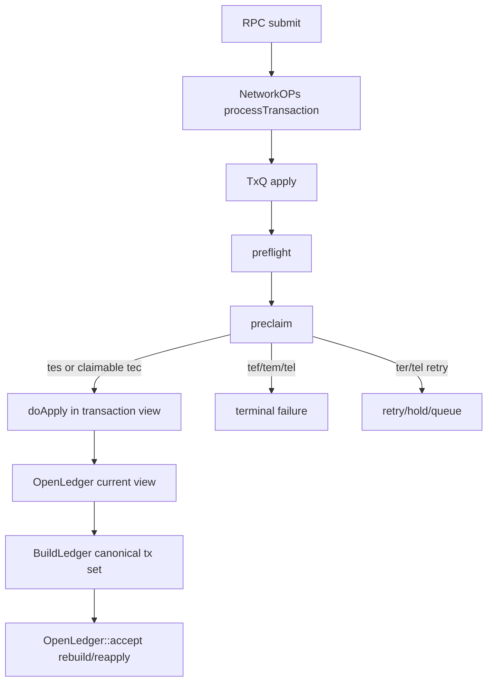
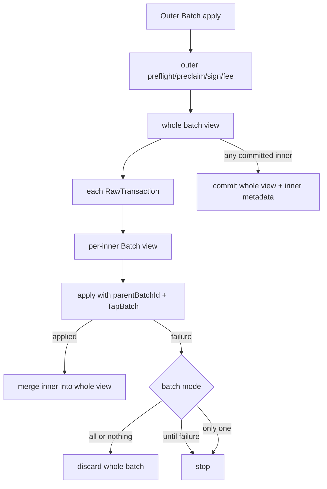
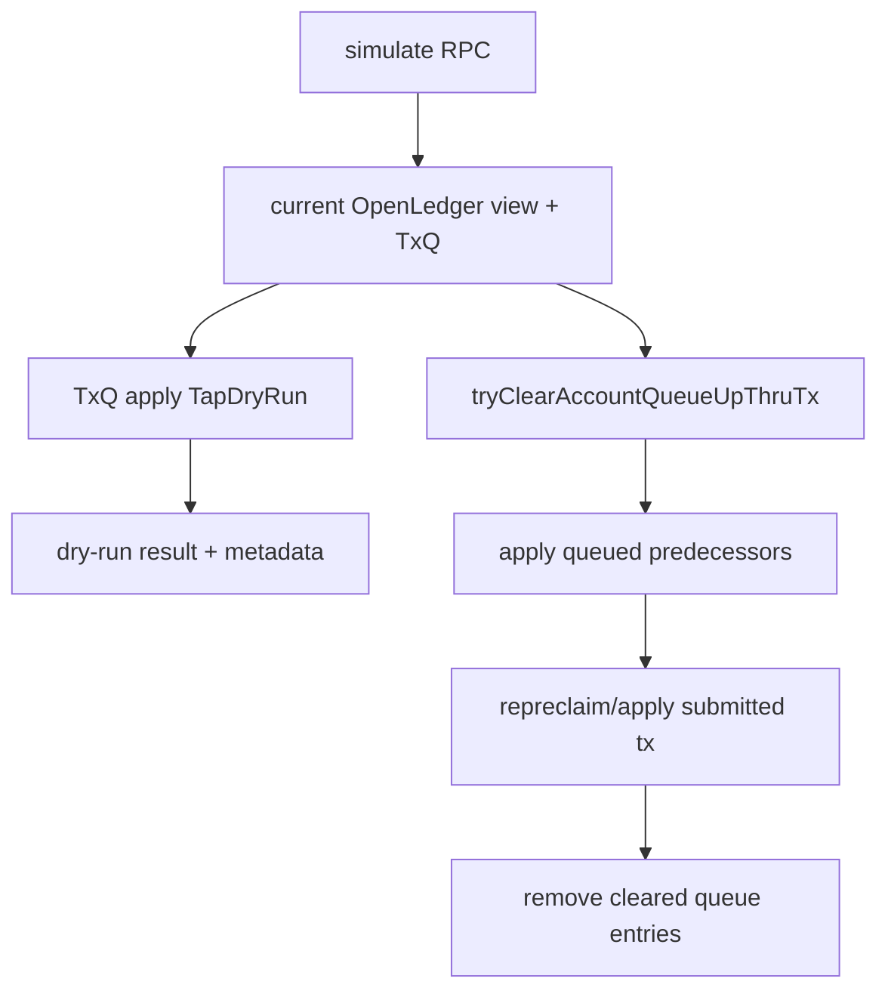
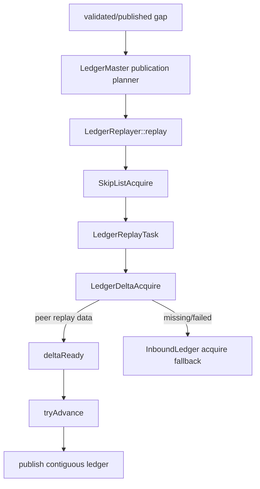
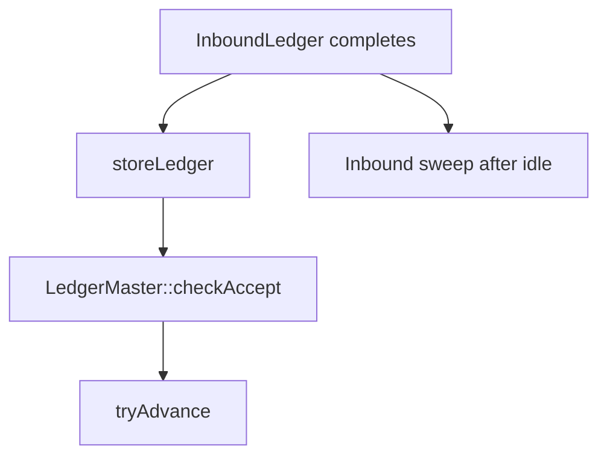

# Rippled parity execution graph

This document is the mandatory implementation contract for transaction, ledger, replay, and NetworkOps parity. A future change must identify an edge below and state whether it changes a `MATCH`, closes a `DIVERGENT` edge, or implements an `ABSENT` edge.

Reference tree: `../rippled`.
Implementation tree: `xrpld/{app,tx,ledger}`.

## 1. Generic transaction path

### rippled source anchors
- `src/xrpld/app/misc/NetworkOPs.cpp`
- `src/xrpld/app/misc/detail/TxQ.cpp`
- `src/libxrpl/tx/apply.cpp`
- `src/libxrpl/tx/applySteps.cpp::invokePreclaim`
- `src/libxrpl/tx/Transactor.cpp`
- `src/xrpld/app/ledger/detail/BuildLedger.cpp::applyTransactions`
- `src/xrpld/app/ledger/detail/OpenLedger.cpp`

### Quaxar seams
| Edge | Quaxar owner | Status |
|---|---|---|
| preflight → preclaim → apply | `state/invoke_preclaim.rs`, `state/application_root.rs` | MATCH target; audit required after every change |
| canonical retry passes | `ApplicationRoot::accept_ledger_with_txns_outcome_on_parent` | MATCH target |
| open ledger reapply | `ApplicationRoot::reapply_open_ledger_record` | MATCH target |
| live TxQ clear-ahead | `AppOpenLedgerTxQApplyRuntime::run_try_clear` | **DIVERGENT: currently returns `terQUEUED`** |

## 2. Batch path

### rippled anchors
- `src/libxrpl/tx/apply.cpp::applyBatchTransactions`
- `src/libxrpl/tx/transactors/system/Batch.cpp`

### Quaxar seams
| Edge | Owner | Status |
|---|---|---|
| ParentBatchID/TapBatch inner admission | `apply_submit_batch_followup` | MATCH target |
| per-inner + whole view atomicity | `FlowSandbox` batch views | MATCH target |
| inner metadata staging | accepted ledger transaction staging | MATCH target |

## 3. Simulate and TxQ clear

### rippled anchors
- `src/xrpld/rpc/handlers/transaction/Simulate.cpp`
- `src/xrpld/app/misc/detail/TxQ.cpp::tryClearAccountQueueUpThruTx`

### Quaxar seams
| Edge | Owner | Status |
|---|---|---|
| simulate current view/TxQ dry-run | `ApplicationRoot::simulate_transaction` | MATCH target |
| Batch simulation | RPC simulate handler | MATCH target: reject as not supported |
| clear-ahead execution | `run_try_clear` | **DIVERGENT/ABSENT production edge** |

## 4. Replay and publication gap

### rippled anchors
- `src/xrpld/app/ledger/detail/LedgerMaster.cpp::findNewLedgersToPublish`
- `src/xrpld/app/ledger/detail/LedgerReplayer.cpp`
- `src/xrpld/app/ledger/detail/LedgerReplayTask.cpp`
- `src/xrpld/app/ledger/detail/LedgerDeltaAcquire.cpp`

### Quaxar seams
| Edge | Owner | Status |
|---|---|---|
| publication-gap proof/range planning | `AppLedgerMasterRuntime::plan_publication_replay` | MATCH target |
| create skip-list/task/deltas | `history_runtime/replayer.rs` | MATCH target |
| peer replay response → `got_replay_delta` | overlay/replayer bridge | **ABSENT** |
| delta/task trigger → `tryAdvance` | replay runtime driver | **ABSENT** |

## 5. Inbound completion / NetworkOps ownership

### rippled anchors
- `src/xrpld/app/ledger/detail/InboundLedger.cpp`
- `src/xrpld/app/ledger/detail/InboundLedgers.cpp`
- `src/xrpld/app/ledger/detail/LedgerMaster.cpp`

### Quaxar seams
| Edge | Owner | Status |
|---|---|---|
| completed registry polling/persist/checkAccept/ack | `network_ops_strand.rs` | MATCH target |
| completion receiver ownership | NetworkOps strand only | MATCH target |
| sweep full-ledger release | `inbound_ledgers/registry.rs` | MATCH target |

## Required graph gates
1. Never patch a path that is not attached to a graph node/edge.
2. Every change must cite rippled source and a graph edge.
3. `ABSENT` production edges must be implemented or explicitly removed from claimed capability.
4. `DIVERGENT` edges require a regression reproducing the reference branch.
5. Final certification requires independent review of every table row and no remaining BLOCKER/MAJOR finding.
