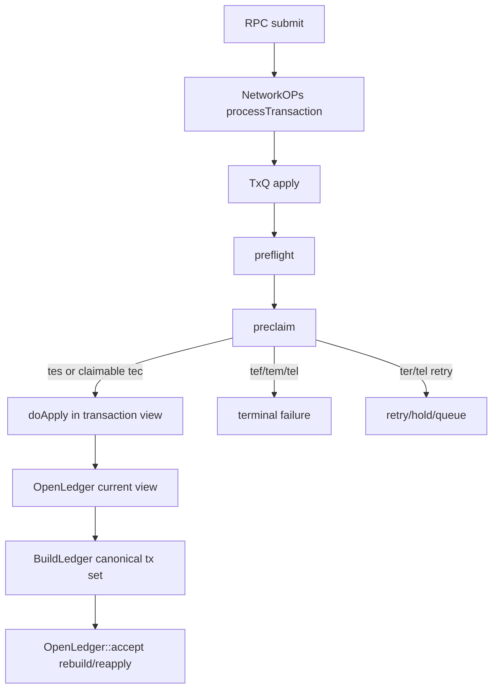
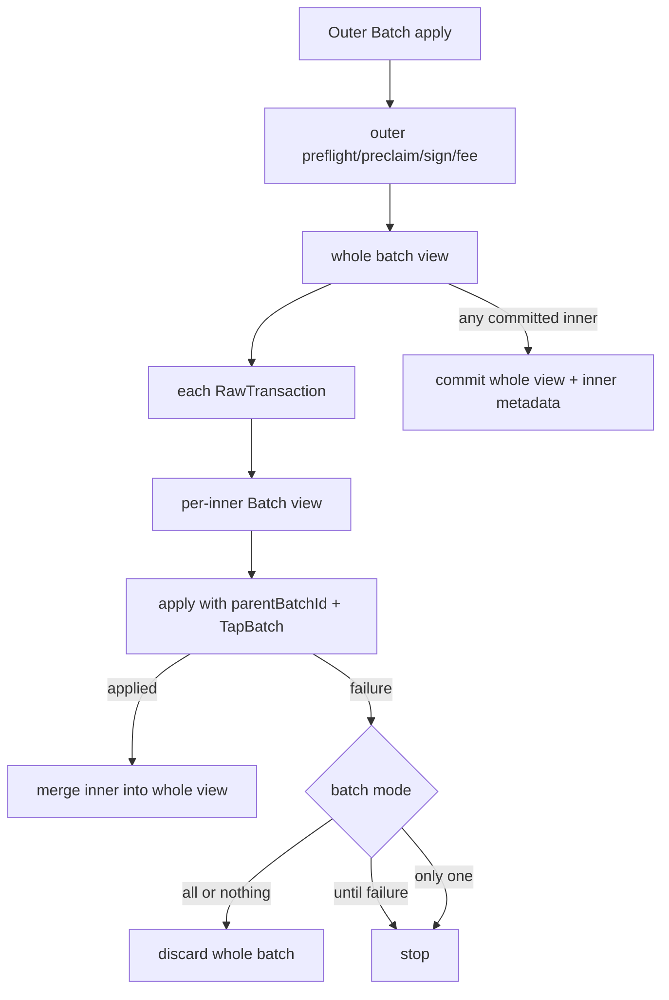
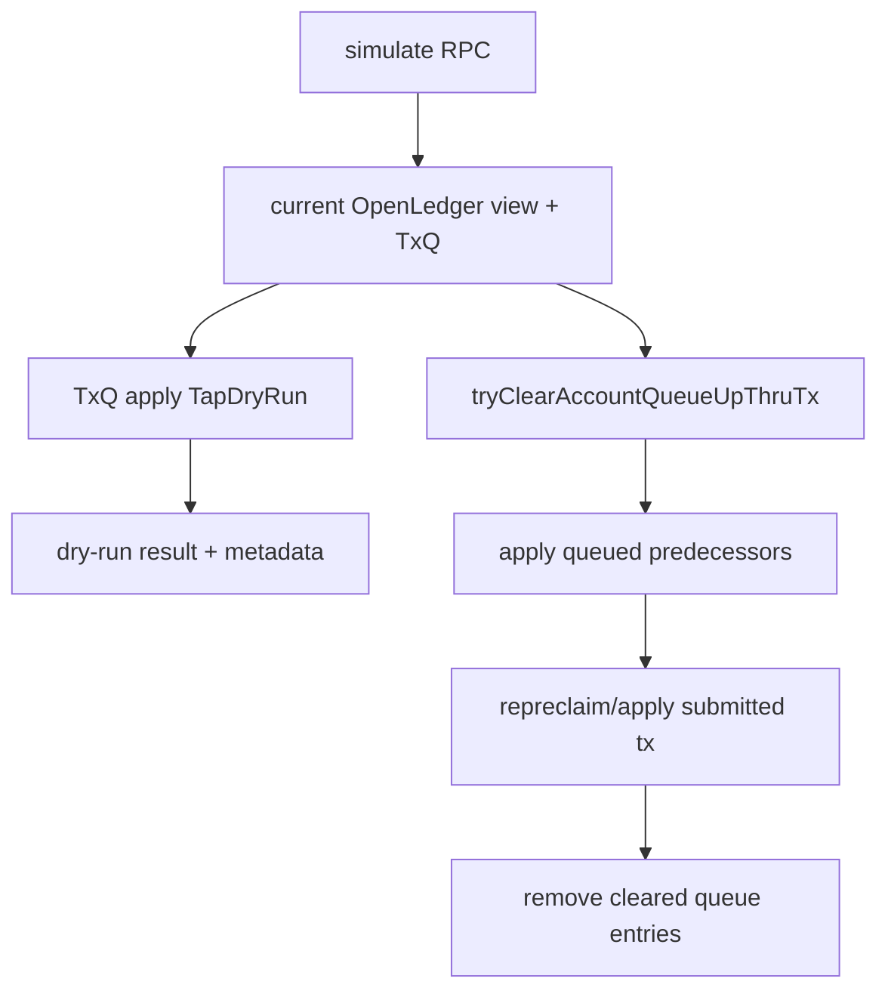
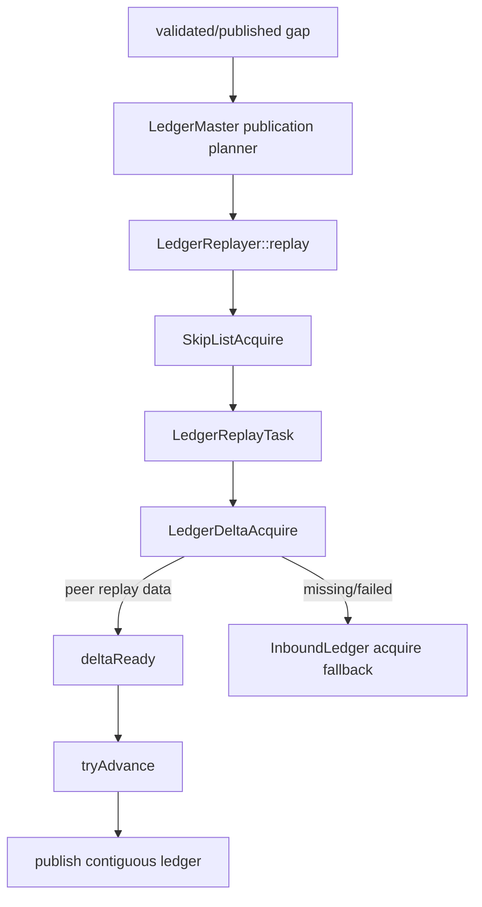
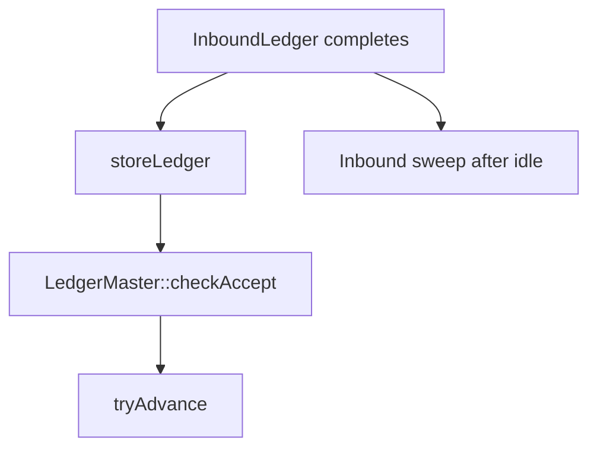

# Rippled parity execution graph

This document is the mandatory implementation contract for transaction, ledger, replay, and NetworkOps parity. A future change must identify an edge below and state whether it changes a `MATCH`, closes a `DIVERGENT` edge, or implements an `ABSENT` edge.

Reference tree: `../rippled`.
Implementation tree: `xrpld/{app,tx,ledger}`.

## 1. Generic transaction path

### rippled source anchors
- `src/xrpld/app/misc/NetworkOPs.cpp`
- `src/xrpld/app/misc/detail/TxQ.cpp`
- `src/libxrpl/tx/apply.cpp`
- `src/libxrpl/tx/applySteps.cpp::invokePreclaim`
- `src/libxrpl/tx/Transactor.cpp`
- `src/xrpld/app/ledger/detail/BuildLedger.cpp::applyTransactions`
- `src/xrpld/app/ledger/detail/OpenLedger.cpp`

### Quaxar seams
| Edge | Quaxar owner | Status |
|---|---|---|
| preflight → preclaim → apply | `state/invoke_preclaim.rs`, `state/application_root.rs` | MATCH target; audit required after every change |
| canonical retry passes | `ApplicationRoot::accept_ledger_with_txns_outcome_on_parent` | MATCH target |
| open ledger reapply | `ApplicationRoot::reapply_open_ledger_record` | MATCH target |
| live TxQ clear-ahead | `AppOpenLedgerTxQApplyRuntime::run_try_clear` | **MATCH**: applies queued predecessors and the current transaction in one `FlowSandbox`, commits only after all apply, then removes cleared queue entries. Source: `TxQ.cpp::tryClearAccountQueueUpThruTx` (517-609); Quaxar `xrpld/app/src/state/application_root.rs::run_try_clear`. |

## 2. Batch path

### rippled anchors
- `src/libxrpl/tx/apply.cpp::applyBatchTransactions`
- `src/libxrpl/tx/transactors/system/Batch.cpp`

### Quaxar seams
| Edge | Owner | Status |
|---|---|---|
| ParentBatchID/TapBatch inner admission | `apply_submit_batch_followup` | MATCH target |
| per-inner + whole view atomicity | `FlowSandbox` batch views | MATCH target |
| inner metadata staging | accepted ledger transaction staging | MATCH target |

## 3. Simulate and TxQ clear

### rippled anchors
- `src/xrpld/rpc/handlers/transaction/Simulate.cpp`
- `src/xrpld/app/misc/detail/TxQ.cpp::tryClearAccountQueueUpThruTx`

### Quaxar seams
| Edge | Owner | Status |
|---|---|---|
| simulate current view/TxQ dry-run | `ApplicationRoot::simulate_transaction` | MATCH target |
| Batch simulation | RPC simulate handler | MATCH target: reject as not supported |
| clear-ahead execution | `run_try_clear` | **MATCH**: production TxQ owner runs predecessor replay, current repreclaim/apply, atomic sandbox commit, and queue cleanup. Source: `TxQ.cpp::tryClearAccountQueueUpThruTx`; Quaxar `xrpld/app/src/state/application_root.rs::run_try_clear`. |

## 4. Replay and publication gap

### rippled anchors
- `src/xrpld/app/ledger/detail/LedgerMaster.cpp::findNewLedgersToPublish`
- `src/xrpld/app/ledger/detail/LedgerReplayer.cpp`
- `src/xrpld/app/ledger/detail/LedgerReplayTask.cpp`
- `src/xrpld/app/ledger/detail/LedgerDeltaAcquire.cpp`

### Quaxar seams
| Edge | Owner | Status |
|---|---|---|
| publication-gap proof/range planning | `AppLedgerMasterRuntime::plan_publication_replay` | MATCH target |
| create skip-list/task/deltas | `history_runtime/replayer.rs` | MATCH target |
| peer replay response → `got_replay_delta` | `ApplicationRoot::on_replay_delta_response` and bootstrap inbound router | **MATCH**: validates the response before owner delivery, then advances, stores, checks accept, and advances publication. Source: `LedgerReplayMsgHandler.cpp::processReplayDeltaResponse`, `LedgerReplayTask.cpp::deltaReady`; Quaxar `xrpld/app/src/state/application_root/replay_callback_impl.rs` and `xrpld/app/src/bootstrap/bootstrap.rs`. |
| skip-list/delta/task timer → retry/fallback → `tryAdvance` | `ReplayTimerRuntime` → `ApplicationRoot::drive_ledger_replay_timers` → `LedgerReplayer::drive_timeouts` | **MATCH**: managed runtime polls due 250/500/1000 ms owner timers, queues `JtReplayTask`, retries replay peers, falls back to inbound acquisition, and stores/publishes completed replay. Source: `LedgerReplayTask.cpp::onTimer`, `LedgerDeltaAcquire.cpp::onTimer`, `SkipListAcquire.cpp::onTimer`; Quaxar `xrpld/app/src/runtime/component_runtime.rs`, `xrpld/app/src/state/application_root.rs`, and `xrpld/ledger/src/history_runtime/replayer.rs`. |

## 5. Inbound completion / NetworkOps ownership

### rippled anchors
- `src/xrpld/app/ledger/detail/InboundLedger.cpp`
- `src/xrpld/app/ledger/detail/InboundLedgers.cpp`
- `src/xrpld/app/ledger/detail/LedgerMaster.cpp`

### Quaxar seams
| Edge | Owner | Status |
|---|---|---|
| completed registry polling/persist/checkAccept/ack | `network_ops_strand.rs` | MATCH target |
| completion receiver ownership | NetworkOps strand only | MATCH target |
| sweep full-ledger release | `inbound_ledgers/registry.rs` | MATCH target |

## Quaxar-only fail-closed extension: Confidential-MPT

`ConfidentialMPTConvert`, `ConfidentialMPTMergeInbox`, `ConfidentialMPTConvertBack`, `ConfidentialMPTSend`, and `ConfidentialMPTClawback` are Quaxar-only typed dispatch extensions. The audited local `../rippled` tree has no corresponding transactors. They are therefore deliberately fail-closed as `TEM_UNKNOWN`, never promoted to `tesSUCCESS` and never directly applied. Source check: Quaxar `xrpld/app/src/state/application_root.rs::typed_preclaim_route` and `xrpld/app/src/state/transactor_dispatcher.rs::confidential_mpt_direct_apply_ter`; reference comparison: no Confidential-MPT implementation under `../rippled/src/libxrpl/tx/transactors`.

### Read-only audit rule

Auditors must not change implementation or status during certification. They must inspect the exact Quaxar paths and rippled anchors cited in each table row, record source paths/function names, and reject a `MATCH` claim if the concrete production owner or regression is absent. For replay timer certification, run and inspect `xrpld/app/tests/state/application_root.rs::production_replay_scheduler_timer_tick_retries_and_falls_back_to_inbound`; it starts the managed `AppLedgerRuntime`, schedules normal `JtReplayTask` work, asserts skip-list/delta/task timer ticks, and proves skip-list and delta inbound fallback without directly invoking a timer method.

## Required graph gates
1. Never patch a path that is not attached to a graph node/edge.
2. Every change must cite rippled source and a graph edge.
3. `ABSENT` production edges must be implemented or explicitly removed from claimed capability.
4. `DIVERGENT` edges require a regression reproducing the reference branch.
5. Final certification requires independent review of every table row and no remaining BLOCKER/MAJOR finding.
